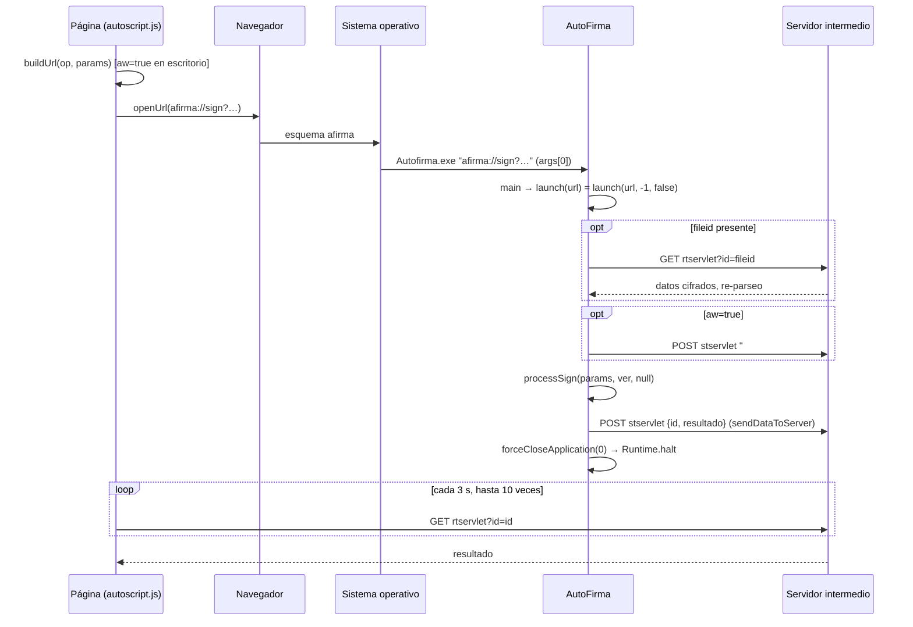
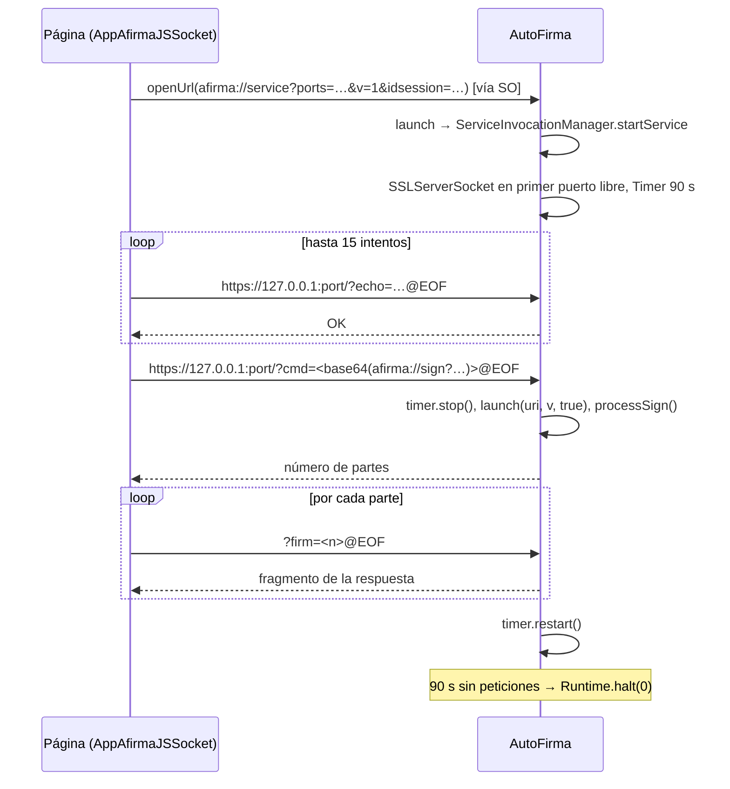
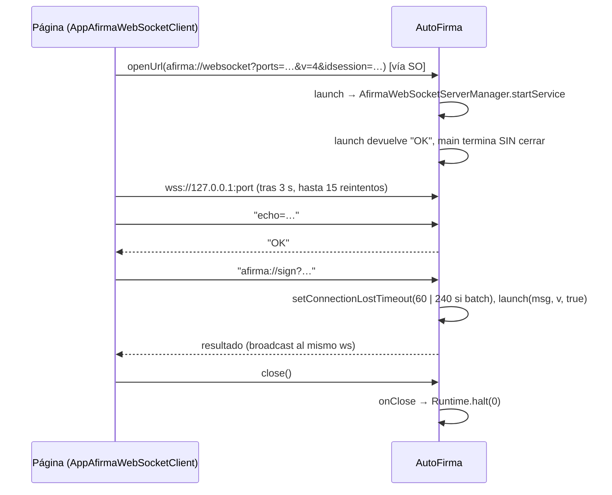

# 01. Visión general

Este capítulo sitúa el protocolo `afirma://` de AutoFirma 1.9.2: quién
participa, cómo llega una URI hasta el código Java que la despacha, qué
transportes existen para devolver el resultado, y cuándo vive y muere el
proceso. Todas las citas son al código de `clienteafirma` en el tag `v1.9.2`
(commit `b4fe147c3`), con rutas relativas a la raíz de ese repositorio.

Los detalles de cada transporte, de cada operación y del cliente JavaScript
son de sus capítulos; aquí solo se da el flujo y el punto de decisión.

---

## 1. Actores

| Actor | Qué hace | Dónde está en el código |
|---|---|---|
| Página web de la sede | Incluye `autoscript.js`, construye la URI `afirma://<op>?…`, elige el transporte y recoge el resultado. | `afirma-ui-miniapplet-deploy/src/main/webapp/js/autoscript.js` |
| Navegador | Abre la URI: por redirección (`document.location = url`) en Chrome, iOS y Firefox‑Android, o por un `iframe` en el resto (`autoscript.js:793-843`). | `autoscript.js:793-843` |
| Sistema operativo | Tiene registrado `afirma` como esquema de URI y lanza el ejecutable de AutoFirma pasándole la URI como argumento. | `afirma-simple-installer/` (ver §1.1) |
| AutoFirma (aplicación de escritorio) | Recibe la URI en `args[0]`, la despacha a la operación pedida, ejecuta la firma o el diálogo, y devuelve el resultado por el transporte que corresponda. | `afirma-simple/src/main/java/es/gob/afirma/standalone/SimpleAfirma.java:855-1080`, `afirma-simple/src/main/java/es/gob/afirma/standalone/protocol/ProtocolInvocationLauncher.java:153-843` |
| Servidor intermedio (opcional) | Dos servlets HTTP a los que la aplicación sube el resultado (`stservlet`) y de los que baja los datos cuando no caben en la URI (`rtservlet`). Solo interviene en el transporte por servidor intermedio. | `afirma-signature-storage`, `afirma-signature-retriever` (ver capítulo 03) |

### 1.1 Registro del esquema `afirma://` por sistema operativo

**Windows (NSIS).** El instalador escribe en `HKEY_CLASSES_ROOT\afirma` el
valor por defecto `URL:Afirma Protocol`, el valor `URL Protocol` vacío que
marca la clave como manejador de protocolo, y la orden de apertura:

```
'$INSTDIR\$PATH\Autofirma.exe "%1"'
```

(`afirma-simple-installer/Autofirma_NSIS_project_EXE_64.nsi:311-315`; el mismo
bloque en `Autofirma_NSIS_project_EXE_32.nsi:303-305`,
`Autofirma_NSIS_project_MSI_64.nsi:250-252` y
`Autofirma_NSIS_project_MSI_32.nsi:247-249`). El desinstalador borra la clave
(`Autofirma_NSIS_project_EXE_64.nsi:1177`). El ejecutable recibe **un solo
argumento**: la URI completa entre comillas.

**Linux (deb).** El paquete instala `afirma.desktop` con
`Exec=/usr/bin/autofirma %u` y `MimeType=x-scheme-handler/afirma;`
(`afirma-simple-installer/linux/instalador_deb/src/usr/share/applications/afirma.desktop:8,12`).
El script `/usr/bin/autofirma` es una línea:

```
java -Djdk.tls.maxHandshakeMessageSize=65536 -jar /usr/lib/Autofirma/autofirma.jar "$@"
```

(`afirma-simple-installer/linux/instalador_deb/src/usr/bin/autofirma:2`). La
asociación manual por `xdg-mime` en el script `postinst` está deliberadamente
**comentada** (`afirma-simple-installer/linux/instalador_deb/src/DEBIAN/postinst:46-47`):
su comentario razona que no es necesaria porque el tipo MIME queda registrado
en el fichero `.desktop`, delegando la actualización a los disparadores estándar
de `update-desktop-database` del empaquetado del sistema operativo.

**Linux (rpm, Fedora y SUSE).** El spec genera el `.desktop` con
`Exec=java -Djdk.tls.maxHandshakeMessageSize=65536 -jar %{_libdir}/%{name}/%{name}.jar %u`
y `MimeType=x-scheme-handler/afirma`
(`afirma-simple-installer/linux/instalador_rpm_fedora/rpmbuild/SPECS/autofirma.spec:35,40`),
añade una preferencia de Firefox `network.protocol-handler.app.afirma`
(`…/autofirma.spec:43-46`), y en `%post` añade
`x-scheme-handler/afirma=autofirma.desktop` a
`/usr/share/applications/mimeapps.list` (`…/autofirma.spec:117-121`). El spec de
SUSE hace lo mismo sobre cuatro ficheros `mimeapps.list`
(`afirma-simple-installer/linux/instalador_rpm_suse/rpmbuild/SPECS/autofirma.spec:110-129`).

**macOS.** El bundle declara el esquema en `Info.plist`
(`CFBundleURLTypes` → `CFBundleURLSchemes` → `afirma`,
`afirma-simple-installer/macos/Lanzador/Autofirma para macOS/Info.plist:27-36`)
y es un agente sin Dock (`LSUIElement` = `true`, `Info.plist:41-42`). El
lanzador nativo en Objective‑C registra un manejador para el Apple Event
`kAEGetURL` (`…/AppDelegate.m:46`); al recibirlo, `handleGetURLEvent` extrae la
URL y llama a `launch()` (`AppDelegate.m:50-56`), que arranca un `NSTask` con el
`java` embebido del bundle, `-jar …/autofirma.jar` y **la URI como último
argumento** (`AppDelegate.m:84-115`), duerme 5 segundos y termina el propio
lanzador (`AppDelegate.m:117-118`). Por tanto en macOS cada URI produce una
JVM nueva, y la JVM la recibe igual que en los demás sistemas: como `args[0]`.
No hay en `SimpleAfirma` ningún manejador `OpenURI` de `com.apple.eawt`; la
única referencia a esa clase es para el icono del Dock (`SimpleAfirma.java:1085`).

---

## 2. Cómo llega la URI a la aplicación

### 2.1 `SimpleAfirma.main`

`main` (`SimpleAfirma.java:855`) hace, en este orden y **antes** de mirar la URI:
configura el log, el *look and feel* y el proxy (`855-873`); aplica las
preferencias de conexiones seguras y dominios (`877-897`); y comprueba
actualizaciones si están habilitadas (`945-952`). Solo después decide qué hacer
con `args`:

| Condición | Rama | Cita |
|---|---|---|
| `args[0]` no empieza por `afirma://` (sin distinguir mayúsculas), o la JVM es *headless* (`java.awt.headless`) | `CommandLineLauncher.main(args)` y `return` | `904-907`, `1277`, `1297-1299` |
| `args[0].toLowerCase().startsWith("afirma://")` | `ProtocolInvocationLauncher.launch(args[0])` | `957-962` |
| Sin argumentos | Modo escritorio, con comprobación de instancia única | `984-1067` |

Solo se examina `args[0]`: la aplicación asume que la URI viaja íntegra en el
primer argumento. Si la llamada del sistema operativo fragmenta la orden en
múltiples argumentos (por ejemplo, si la URI contiene espacios sin codificar en
porcentaje y el ejecutable se invocó sin comillas), **los argumentos posteriores
`args[1..]` se descartan silenciosamente** (`957`, `962`), lo que provoca que
`args[0]` se procese truncada y falle en el análisis sintáctico de parámetros.
No hay ningún tratamiento especial de la URI para macOS en `main`: la única
lógica específica es el icono del Dock y un parche de PC/SC (`910-932`).

Tras volver de `launch`, `main` cierra el proceso con `forceCloseApplication(0)`
**salvo** que `args[0]` empiece por `afirma://websocket` (`978-980`); el
comentario del código explica los tres casos (`963-977`): con servidor
intermedio se llega aquí al acabar la operación; con socket no se llega nunca
porque `launch` se queda en un bucle; con WebSocket se llega inmediatamente y
la aplicación debe seguir viva hasta que se cierre el socket.

Si `launch` lanza una `HeadlessException`, se reintenta como línea de comandos
(`1069-1072`). Cualquier otra excepción se registra, y solo si la URI era de
`websocket` se llama a `forceCloseApplication(-1)` (`1073-1078`).

### 2.2 `ProtocolInvocationLauncher.launch`

Hay dos sobrecargas. La de un argumento, que es la que llama `main`, delega en
`launch(urlString, -1, false)`: versión de protocolo desconocida y **sin
socket**, es decir, servidor intermedio (`ProtocolInvocationLauncher.java:136-138`).
La de tres argumentos (`153`) hace lo siguiente antes de despachar:

1. En macOS instala el manejador de «Acerca de…» (`154-164`).
2. Si `urlString == null` → `SAF_01` (`166-171`); si no empieza por
   `afirma://` **estrictamente con minúsculas** → `SAF_02` (`172-178`). Aunque
   `SimpleAfirma.main` permite detectar la llamada ignorando mayúsculas
   (`args[0].toLowerCase().startsWith("afirma://")`), el despachador `launch`
   exige el prefijo en minúsculas exactas. Una invocación con esquema en
   mayúsculas (como `AFIRMA://`) muestra el diálogo modal de error `SAF_02`
   (`ERROR_UNSUPPORTED_PROTOCOL`) y el proceso finaliza con código 0.
3. Configura JMulticard según preferencias (`180-184`).
4. `requestedProtocolVersion = protocolVersion` (`189`).
5. Extrae los parámetros con `extractParams` (`192`, `946-966`): toma todo lo
   que sigue al **primer** `?`, separa por `&`, y de cada trozo con `=` guarda
   clave y valor decodificado con `URLDecoder` UTF‑8; un trozo sin `=` se
   descarta (`953-955`).
6. Lee `jvc` (versión del JavaScript); si no es entero vale `1`; si es menor
   que `MIN_JAVASCRIPT_VERSION_CODE_NEEDED` (= 1) muestra un aviso modal
   (`64-66`, `196-214`).

Después viene la cadena `if / else if` por prefijo. **Cada prefijo se acepta
en dos formas**, `afirma://op?` y `afirma://op/?`, y no hay ninguna otra
diferencia entre ambas: `extractParams` busca el primer `?` y la barra queda
fuera del análisis (`946-950`). El cliente JavaScript siempre construye la
forma sin barra (`autoscript.js:2081`, `2878`, `4381`).

| Prefijo(s) aceptado(s) | Línea del `startsWith` | Qué hace |
|---|---|---|
| `afirma://websocket?`, `afirma://websocket/?` | `225` | Lee `v` (`getVersion`, por defecto 1) y `ports`/`idsession` (`getChannelInfo`); sin `ports` usa `63117` (`87`, `232-235`); arranca `AfirmaWebSocketServerManager.startService` (`238`). Versión no soportada → `SAF_21` y `halt(0)` (`240-245`); ningún puerto libre → `SAF_45` y `halt(0)` (`246-251`). Devuelve `"OK"` (`260`). |
| `afirma://service?`, `afirma://service/?` | `264` | Igual, pero `ports` es obligatorio: sin él, `SAF_03` (`270-277`). Arranca `ServiceInvocationManager.startService` (`280`); versión no soportada → `SAF_21` (`281-288`). Devuelve `"OK"` (`290`), aunque en la práctica `startService` no retorna (ver §4). |
| `afirma://batch?`, `afirma://batch/?` | `293` | `ProtocolInvocationLauncherBatch.processBatch` (`345`). |
| `afirma://selectcert?`, `afirma://selectcert/?` | `370` | `ProtocolInvocationLauncherSelectCert.processSelectCert` (`413-416`). |
| `afirma://save?`, `afirma://save/?` | `443` | `ProtocolInvocationLauncherSave.processSave` (`490`). |
| `afirma://signandsave?`, `afirma://signandsave/?` | `532` | `ProtocolInvocationLauncherSignAndSave.processSignAndSave` (`579-583`). |
| `afirma://sign?`, `afirma://sign/?`, `afirma://cosign?`, `afirma://cosign/?`, `afirma://countersign?`, `afirma://countersign/?` | `643-645` | Una sola rama para las tres; `ProtocolInvocationLauncherSign.processSign` (`690`). La operación concreta la decide el parámetro `op` dentro de los parámetros de firma (ver capítulo 06). |
| `afirma://load?`, `afirma://load/?` | `753` | `ProtocolInvocationLauncherLoad.processLoad` (`797`). |
| Cualquier otro | — | Se registra un `severe` con los 30 primeros caracteres de la URI, se muestra `SAF_04` (`ERROR_UNSUPPORTED_OPERATION`) y se devuelve su mensaje (`837-842`). |

No hay más prefijos en `launch`. El `op` del JavaScript y el prefijo coinciden
porque el JS usa `paramsObject.op.value` como *host* de la URI
(`autoscript.js:2080-2081`). Los prefijos `AFIRMA2`/`AFIRMA3` de
`CommandProcessorThread` (`service?`, `service/?`) sirven solo para
**rechazar** que llegue una URI de arranque por dentro del canal ya abierto
(`CommandProcessorThread.java:62-63`, `327`).

### 2.3 Patrón común de las ocho ramas de operación

Todas las ramas de operación siguen el mismo esqueleto (tomando `sign` como
ejemplo, `643-752`):

1. Parsear con `ProtocolInvocationUriParserUtil.getParametersTo<Op>(urlParams, !bySocket)`
   (`651`): el segundo argumento, `servicesRequired`, exige `stservlet`
   cuando se viene por servidor intermedio (§6). `load` es la excepción: su
   parser no recibe la bandera (`757-758`,
   `afirma-core/src/main/java/es/gob/afirma/core/misc/protocol/ProtocolInvocationUriParserUtil.java:78`).
2. Si `requestedProtocolVersion == -1` (invocación directa) se toma de
   `params.getMinimumProtocolVersion()` con `parseProtocolVersion`, que
   devuelve `1` si no es un entero (`653-655`, `907-915`).
3. Si hay `fileid`, se descargan los datos de `rtservlet` y **se vuelve a
   parsear** la operación a partir del XML descargado (`660-677`; para `batch`
   puede ser JSON, `329-333`). Fallos → `SAF_16` o `SAF_15`.
4. Si `!bySocket && params.isActiveWaiting()` → `requestWait` (`683-685`, §4.3).
5. Llamar al `process<Op>`. Devolver la cadena resultante; si `!bySocket`,
   antes subirla al `stservlet` con `sendDataToServer` (`719-724`).
6. Errores de parámetros: `ParameterNeedsUpdatedVersionException` → `SAF_14` (nadie la lanza; ver [15](15-errores.md) §4.7),
   `ParameterLocalAccessRequestedException` → `SAF_13`, `ParameterException` →
   `SAF_03`, cualquier otra → `SAF_03` (`726-750`).

---

## 3. Los tres transportes

### 3.1 Cuándo elige cada uno el cliente JavaScript

La decisión está en `cargarAppAfirma` (`autoscript.js:883-935`) y es una cadena
de cuatro `if`:

| Orden | Condición | Cliente | Versión de protocolo que declara |
|---|---|---|---|
| 1 | `forceWSMode` **o** iOS **o** Android | `AppAfirmaJSWebService` (servidor intermedio) | `3` (`autoscript.js:3715`) |
| 2 | `isWebSocketsSupported()` y no es Internet Explorer y no es Firefox ≤ 60 | `AppAfirmaWebSocketClient` | `4` (`1747`) |
| 3 | No es IE ≤ 10 y no es Safari 10 | `AppAfirmaJSSocket` (socket local) | `1` (`2621`) |
| 4 | Resto | `AppAfirmaJSWebService` | `3` |

* `isWebSocketsSupported()` comprueba `'WebSocket' in window || 'MozWebSocket' in window` (`197-199`).
* `setForceWSMode(force)` pone la variable `forceWSMode` (`156`, `329-331`);
  es la forma en que la sede fuerza el servidor intermedio. «WS» aquí es
  *web service*, no WebSocket.
* `needNativeAppInstalled()` está marcada `DEPRECADO` y devuelve siempre
  `true` (`341-347`).
* `execAppIntent` es una variable del ámbito exterior (`174`) que **cada
  cliente reasigna** con su propia implementación (`2094`, `2887`, `4337`); las
  funciones públicas de firma llaman a `execAppIntent(buildUrl(requestData), …)`
  (`1821-1917`).
* Ningún cliente degrada a otro transporte si el suyo falla: el cliente
  WebSocket, tras agotar los `AUTOFIRMA_CONNECTION_RETRIES` (= 15, `152`) con
  `AUTOFIRMA_LAUNCHING_TIME` (= 2000 ms, `149`) entre intentos, muestra el
  diálogo `ERROR_CONNECTING_AFIRMA` con la opción de reintentar o devuelve
  `es.gob.afirma.standalone.ApplicationNotFoundException` al `errorCB`
  (`2162-2184`).

El detalle del JavaScript es del capítulo 16.

### 3.2 Transporte A: invocación directa con servidor intermedio

El navegador abre una URI `afirma://<op>?…` con todos los parámetros de la
operación. AutoFirma arranca, ejecuta la operación y **sube el resultado al
`stservlet`** con el `id` de la petición; el JavaScript, mientras tanto,
pregunta al `rtservlet` por ese `id` hasta recibirlo. Si la URI supera
`MAX_LONG_GENERAL_URL` (= 2000 caracteres, `autoscript.js:3712`, `4215-4217`),
el JS sube primero los datos al servidor y la URI solo lleva `fileid` +
`rtservlet` (capítulo 03). El JS añade `aw=true` en escritorio, no en móvil
(`3795`, `3883`, `3955`, `4018`, `4073`, `4124`).

Ejemplo construido, a partir de `buildUrl` (`autoscript.js:4360-4385`):

```
afirma://sign?jvc=3&op=sign&format=PAdES&algorithm=SHA256withRSA&dat=…&id=…&stservlet=https://sede/afirma/StorageService&key=…&aw=true
```



(Las cadencias de sondeo del JS, `WAITING_CYCLE_MILLIS` y
`NUM_MAX_ITERATIONS`, están en `autoscript.js:3718-3722`; su detalle es del
capítulo 16.) En este transporte **la aplicación se cierra tras cada
operación** (`SimpleAfirma.java:978-980`).

### 3.3 Transporte B: socket local (`afirma://service?`)

El JS elige puertos aleatorios y un `idsession`, y abre
`afirma://service?ports=<p1,p2,p3>&v=1&jvc=3&idsession=<id>`
(`autoscript.js:2930-2934`). AutoFirma abre un `SSLServerSocket` en el primer
puerto libre (`ServiceInvocationManager.java:108-113`) y entra en un
`while (true)` que crea un `CommandProcessorThread` por cada conexión
aceptada (`136-143`). El JS habla HTTP sobre TLS con ese puerto: `echo=` para
saber que está vivo, `cmd=` con la URI de operación en Base64, `fragment=` y
`send=` para trocear, `firm=` para pedir cada parte de la respuesta
(`CommandProcessorThread.java:56-60`; capítulo 04). Cada `cmd=` acaba en
`ProtocolInvocationLauncher.launch(cmdUri, protocolVersion, true)`
(`CommandProcessorThread.java:334`, `350`).



### 3.4 Transporte C: WebSocket (`afirma://websocket?`)

Igual arranque, con `afirma://websocket?ports=…&v=4&jvc=3&idsession=…`
(`autoscript.js:2153-2156`). AutoFirma abre un servidor WebSocket con TLS en
el primer puerto libre (`AfirmaWebSocketServerManager.java:64-93`), eligiendo
`AfirmaWebSocketServerV4` si `v` = 4 y `AfirmaWebSocketServer` en otro caso
(`69-77`); solo admite las versiones 3 y 4 (`36`). El JS espera 3 s
(`autoscript.js:2115`), conecta y envía cada URI de operación **como un
mensaje de texto**; el servidor responde `OK` a `echo=` y, a todo lo demás,
con `ProtocolInvocationLauncher.launch(message, protocolVersion, true)`
(`AfirmaWebSocketServer.java:99-114`; `AfirmaWebSocketServerV4.java:57-92`).



En los transportes B y C, dentro de una sesión pueden encadenarse varias
operaciones sobre la misma instancia; en el A, cada operación es un proceso.

---

## 4. Ciclo de vida del proceso

### 4.1 Cierre

Hay dos formas de cerrar. `closeApplication(exitCode)` es de instancia: hace
`window.dispose()` si hay ventana y `System.exit` (`SimpleAfirma.java:441-446`).
`forceCloseApplication(exitCode)` es estática y llama a
`Runtime.getRuntime().halt(exitCode)` (`454-456`); existe una copia idéntica
en `ProtocolInvocationLauncher.java:1022-1024`. Toda la invocación por
protocolo cierra con `halt`, es decir, **sin ejecutar *shutdown hooks* ni
liberar la ventana**.

| Transporte | Cuándo se cierra | Cita |
|---|---|---|
| Servidor intermedio | Al volver `launch`, siempre, con código 0, sea cual sea el resultado | `SimpleAfirma.java:978-980` |
| Socket | Cuando el `Timer` de `SOCKET_TIMEOUT` (= 90 000 ms) vence sin peticiones; en macOS antes cierra el servicio con `MacUtils.closeMacService` | `ServiceInvocationManager.java:39`, `127-134` |
| WebSocket | En `onClose`, si el socket cerrado es el primero que se abrió (`wsClient`) o no hay ninguno registrado; también en errores de arranque (`SAF_21`, `SAF_45`) | `AfirmaWebSocketServer.java:82-91`; `ProtocolInvocationLauncher.java:240-251` |

El temporizador del socket se para al empezar a procesar una petición válida
(`CommandProcessorThread.java:262`, `279`, `331`) y se reinicia al enviar la
respuesta **solo si estaba parado**; el comentario lo justifica como defensa
frente a peticiones inválidas que buscasen mantener viva la aplicación
(`452-458`).

### 4.2 Ventana principal

En la rama de protocolo `main` no llama a `initGUI` ni construye
`SimpleAfirma`: eso ocurre solo en la rama de escritorio (`SimpleAfirma.java:998`,
`1059`). Por tanto **no hay ventana principal** en una invocación por
protocolo; la única interfaz son los diálogos que abre cada operación
(selección de certificado, guardado, errores). En macOS, `launch` instala el
manejador de «Acerca de…» del sistema para que el menú exista también en este
modo (`ProtocolInvocationLauncher.java:154-164`).

### 4.3 Espera activa: el parámetro `aw`

`aw` se lee en `UrlParameters.setCommonParameters` como
`Boolean.parseBoolean(params.get("aw"))` (`afirma-core/src/main/java/es/gob/afirma/core/misc/protocol/UrlParameters.java:70`,
`257-258`). Solo tiene efecto con `bySocket == false`: entonces cada rama de
operación llama a `requestWait(stservlet, id)`
(`ProtocolInvocationLauncher.java:337-339`, `407-409`, `483-485`, `573-575`,
`683-685`, `790-792`), que arranca un `ActiveWaitingThread`
(`855-862`). Ese hilo sube la cadena `#WAIT` al `stservlet` con el `id` de la
petición cada `SLEEP_PERIOD` = 10 000 ms hasta que se le interrumpe
(`ActiveWaitingThread.java:15-16`, `37-62`); la interrupción la hace
`sendDataToServer` justo antes de subir el resultado, y ambas subidas se
serializan con el semáforo de `IntermediateServerUtil` (`870-889`). El hilo
solo existe como campo estático `activeWaitingThread` (`96`), accesible por
`getActiveWaitingThread()` (`896-898`).

### 4.4 Instancia única y varias invocaciones seguidas

La comprobación de instancia única existe, pero **solo en modo escritorio**:
`isSimpleAfirmaAlreadyRunning()` intenta un `FileLock` sobre
`APPLICATION_HOME/.lock` y, si no lo consigue, muestra un aviso y cierra
(`SimpleAfirma.java:984`, `1063-1068`, `1103-1131`). La rama de protocolo
(`957-981`) no pasa por ella. Consecuencias que se leen directamente del
código:

* Dos URIs directas seguidas producen dos procesos independientes, cada uno
  con su ciclo completo y su `halt`.
* Una URI de `service`/`websocket` mientras ya hay una instancia escuchando
  produce una segunda instancia que intentará abrir sus propios puertos; el
  JS del transporte WebSocket evita reabrir la aplicación si ya tiene una
  conexión (`isAppOpened`, `autoscript.js:2105-2129`), y el de socket si ya
  tiene puerto calculado (`2889-2912`).
* Dentro de una sesión de socket o WebSocket, varias operaciones encadenadas
  comparten el estado estático de `ProtocolInvocationLauncher`:
  `requestedProtocolVersion` (`101`), `activeWaitingThread` (`96`) y
  `stickyKeyEntry`, el certificado pegajoso de `sticky`/`resetsticky`
  (`90`, `109-121`; capítulo 13).

---

## 5. Mapa de ficheros del protocolo

### 5.1 `afirma-core/src/main/java/es/gob/afirma/core/misc/protocol/`

| Fichero | Qué hace |
|---|---|
| `ProtocolConstants.java` | Constantes de nombres de parámetro, empezando por `op` (`13-16`). |
| `ProtocolVersion.java` | Enumeración `VERSION_0`…`VERSION_4`; `support(x)` es `this.version >= x` (`8-19`, `38-49`). |
| `ProtocolInvocationUriParser.java` | Fachada pública: parsea una URI completa o el XML descargado del servidor intermedio y devuelve el `UrlParameters*` de la operación (`20`, `43-111`). |
| `ProtocolInvocationUriParserUtil.java` | Construye cada `UrlParameters*` a partir del `Map` de parámetros ya extraído; recibe `servicesRequired` salvo para `load` (`28`, `46-175`). |
| `UrlParameters.java` | Clase base con los parámetros comunes (`dat`, `fileid`, `rtservlet`, `stservlet`, `key`, `aw`, `mcv`, `id`…) y su validación (`26`, `43-70`, `253-340`). |
| `UrlParametersToSign.java` | Parámetros de `sign`/`cosign`/`countersign`; exige `stservlet` si `servicesRequired` (`25`, `256-262`). |
| `UrlParametersToSignAndSave.java` | Parámetros de `signandsave` (`26`, `247`). |
| `UrlParametersToSave.java` | Parámetros de `save`; exige `stservlet` si `servicesRequired` y hay `id` (`18`, `178-198`). |
| `UrlParametersToLoad.java` | Parámetros de `load`; no tiene bandera `servicesRequired` (`15`). |
| `UrlParametersToSelectCert.java` | Parámetros de `selectcert` (`21`, `162`). |
| `UrlParametersForBatch.java` | Parámetros de `batch`; aquí `dat` es la definición del lote (`22`, `263-269`). |
| `ParameterException.java` | Error de parámetro incorrecto o ausente → `SAF_03` (`13`). |
| `ParameterLocalAccessRequestedException.java` | Un servlet apuntaba a `localhost`/`127.0.0.1` → `SAF_13` (`14`). |
| `ParameterNeedsUpdatedVersionException.java` | La petición necesita una versión más nueva de la aplicación → `SAF_14` (`14`). Su constructor es de paquete y nadie la instancia (`18`). |
| `ProtocoloMessages.java` | Acceso al *bundle* de mensajes de este paquete (`15`). |
| `package-info.java` | Documentación del paquete. |

### 5.2 `afirma-simple/src/main/java/es/gob/afirma/standalone/protocol/`

| Fichero | Qué hace |
|---|---|
| `ProtocolInvocationLauncher.java` | Punto de entrada: valida la URI, despacha por prefijo, gestiona espera activa y subida al servidor intermedio (`56`, `153-843`). |
| `ProtocolInvocationLauncherSign.java` | `processSign`: firma, cofirma y contrafirma; devuelve el resultado como `StringBuilder` (`102`, `124-209`). |
| `ProtocolInvocationLauncherSignAndSave.java` | `processSignAndSave`: firma y guarda en disco (`101`, `121`). |
| `ProtocolInvocationLauncherSave.java` | `processSave`: diálogo de guardado de `dat` (`24`, `44-46`). |
| `ProtocolInvocationLauncherLoad.java` | `processLoad`: diálogo de carga de uno o varios ficheros (`29`, `55-57`). |
| `ProtocolInvocationLauncherSelectCert.java` | `processSelectCert`: selección de certificado sin firmar (`41`, `60-62`). |
| `ProtocolInvocationLauncherBatch.java` | `processBatch`: lotes XML/JSON, locales o trifásicos (`52`, `72-74`). |
| `ProtocolInvocationLauncherUtil.java` | Utilidades compartidas, entre ellas `getDataFromRetrieveServlet` (`26`). |
| `ProtocolInvocationLauncherErrorManager.java` | Códigos `SAF_nn`, sus mensajes y los diálogos de error (`23`, `32-76`). |
| `ProtocolMessages.java` | *Bundle* de mensajes de este paquete (`15`). |
| `ServiceInvocationManager.java` | Servidor de socket TLS: abre puerto, temporizador de 90 s, un hilo por conexión (`33`, `103-165`). |
| `CommandProcessorThread.java` | Un hilo por conexión de socket: gramática `echo=`/`cmd=`/`fragment=`/`send=`/`firm=`, fragmentación y respuesta (`20`, `56-65`). |
| `AfirmaWebSocketServerManager.java` | Elige e inicia el servidor WebSocket según `v` (3 o 4) sobre la lista de puertos (`22`, `52-93`). |
| `AfirmaWebSocketServer.java` | Servidor WebSocket versión 3: `echo=`, despacho a `launch`, cierre con `halt` en `onClose` (`25`, `73-120`). |
| `AfirmaWebSocketServerV4.java` | Servidor WebSocket versión 4: añade la comprobación de `idsession` en cada mensaje (`21`, `57-125`). |
| `ChannelInfo.java` | Par `idsession` + lista de `ports` extraído de la URI de arranque (`7`). |
| `SecureSocketUtils.java` | Contexto SSL para socket y WebSocket (`17`). |
| `IntermediateServerUtil.java` | `sendData` al `stservlet` y el semáforo único que serializa las subidas (`20`). |
| `ActiveWaitingThread.java` | Hilo que sube `#WAIT` cada 10 s mientras dura la operación (`12`). |
| `SocketOperationException.java` | Excepción con código `SAF_nn` que atraviesa los `process<Op>` (`14`). |
| `UnsupportedProtocolException.java` | Versión de protocolo no soportada; sabe si se necesita una versión más nueva (`18`). |
| `VisibleSignatureMandatoryException.java` | Se canceló la firma visible PDF cuando era obligatoria → `SAF_nn` de firma visible (`15`). |
| `Version.java` | Versión de AutoFirma comparable, para `mcv` (`9`). |
| `AfirmaExtraParams.java` | Claves de `properties` que consume la propia AutoFirma, no los firmadores (`6`). |
| `NativeSignDataProcessor.java` | Procesador de firma nativo (una sola firma), que compone la respuesta (`19`). |
| `SignOperationResult.java` | Resultado de una firma con referencia al certificado y clave usados (`9`). |
| `BatchSignOperation.java` | Configuración de un lote (`8`). |
| `SingleSignOperation.java` | Configuración de una firma dentro de un lote (`8`). |
| `JSONBatchManager.java` | Parser del lote JSON monofásico (`25`). |
| `LocalBatchSigner.java` | Firma en local todas las firmas monofásicas de un lote (`32`). |
| `package-info.java` | Documentación del paquete. |

---

## 6. Los flags `bySocket` y `protocolVersion`

### 6.1 Quién los fija

| Origen | `protocolVersion` | `bySocket` | Cita |
|---|---|---|---|
| `SimpleAfirma.main` (URI directa) | `-1` | `false` | `ProtocolInvocationLauncher.java:136-138` |
| `CommandProcessorThread` (socket) | El `v` de la URI de `service` (por defecto 1) | `true` | `CommandProcessorThread.java:293`, `308`, `334`, `350` |
| `AfirmaWebSocketServer` (WebSocket v3) | El `v` de la URI de `websocket` | `true` | `AfirmaWebSocketServer.java:113` |
| `AfirmaWebSocketServerV4` | `PROTOCOL_VERSION` (constante) | `true` | `AfirmaWebSocketServerV4.java:91` |

Para `websocket` y `service`, `launch` sobrescribe `requestedProtocolVersion`
con el `v` de la URI de arranque (`228`, `267`, `923-939`). Para las
operaciones con `protocolVersion == -1`, lo toma del parámetro de versión
mínima de la propia operación (`300-302`, `907-915`).

### 6.2 Qué cambia con `bySocket`

| Aspecto | `bySocket == false` (servidor intermedio) | `bySocket == true` (socket / WebSocket) | Cita |
|---|---|---|---|
| Parseo | `servicesRequired = true`: `stservlet` se valida y, si falta habiendo `id`, es `ParameterException` | `servicesRequired = false`: se ignora `stservlet` | `ProtocolInvocationLauncher.java:298`, `375`, `448`, `537`, `651`; `UrlParametersToSave.java:178-198`; `UrlParametersToSign.java:256-262` |
| Espera activa | Se arranca `ActiveWaitingThread` si `aw=true` | Nunca | `337-339`, `683-685` |
| Resultado correcto | Se sube al `stservlet` con `sendDataToServer` **y** se devuelve la cadena | Solo se devuelve la cadena, que el canal reenvía al JS | `610-614`, `719-724` |
| Error controlado (`SocketOperationException`) en `sign` / `signandsave` | Se construye el mensaje, se codifica con `URLEncoder` y se sube al `stservlet`; se devuelve el mensaje | Se devuelve el mensaje sin codificar | `697-716`, `588-607` |
| Error dentro de `processSave`, `processSelectCert`, `processLoad`, `processBatch` | Se **lanza** `SocketOperationException` para que `launch` lo suba al servidor | Se **devuelve** el mensaje de error como cadena | `ProtocolInvocationLauncherSave.java:55-58`, `68-71`, `95-98`, `104-107`; `ProtocolInvocationLauncherSelectCert.java:68-71` |
| `load` | Sube el resultado al servidor solo en el `catch`, «solo entra en la excepción en el caso de que haya que devolver errores a través del servidor intermedio» | Devuelve la cadena | `797-810` |

El propio código reconoce que el nombre está invertido: el `TODO` de
`launch` dice que `SocketOperationException` «se utiliza para gestionar los
errores cuando la comunicación NO es por sockets (contrariamente a lo indicado
en el javadoc de los métodos y la excepción)» (`216-222`).

`processSign` y `processSignAndSave` **no reciben `bySocket`**
(`ProtocolInvocationLauncherSign.java:124-125`,
`ProtocolInvocationLauncherSignAndSave.java:121-122`): siempre lanzan
`SocketOperationException` y es `launch` quien decide si sube o no el error.

### 6.3 Qué cambia con `protocolVersion`

* Cada `process<Op>` comprueba `MAX_PROTOCOL_VERSION_SUPPORTED.support(protocolVersion)`
  con `MAX_PROTOCOL_VERSION_SUPPORTED = VERSION_4` (`62`;
  `ProtocolInvocationLauncherSave.java:49-58`;
  `ProtocolInvocationLauncherSign.java:133-140`). Como `support` es `>=`, una
  versión mayor que 4 produce `SAF_21` (`ProtocolVersion.java:38-49`).
* `sign` y `signandsave` pasan la versión al `SignDataProcessor` que compone
  la respuesta (`selectProcessor(protocolVersion, …)`,
  `ProtocolInvocationLauncherSign.java:165-168`, `212-246`); el formato de la
  respuesta según la versión es del capítulo 06 y del 14.
* Para el arranque de canal, `ServiceInvocationManager` solo acepta `1`, `2`
  y `3` (`42-45`, `212-219`) y `AfirmaWebSocketServerManager` solo `3` y `4`
  (`27-36`, `100-107`); ambos lanzan `UnsupportedProtocolException`, que en
  `launch` se traduce a `SAF_21` (`240-245`, `281-288`).

Independientemente del transporte, `mcv` (versión mínima de cliente) se
comprueba en cada `process<Op>` contra `SimpleAfirma.getVersion()` y produce
`SAF_41` (`ProtocolInvocationLauncherSave.java:62-72`).

