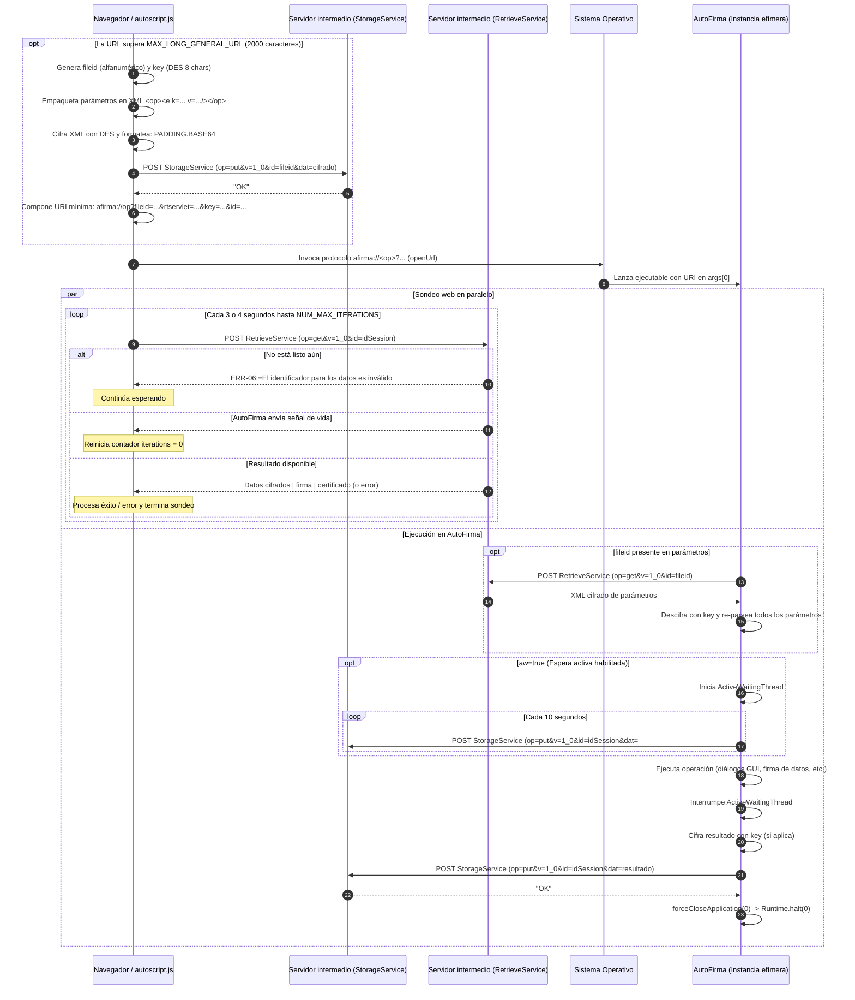

# 03. Transporte por servidor intermedio

Este capítulo describe el mecanismo de comunicación basado en **servidor intermedio**
(`StorageService` y `RetrieveService`), utilizado en el protocolo `afirma://` de
AutoFirma 1.9.2 cuando la invocación se produce directamente desde el navegador
o el sistema operativo sin establecer un canal persistente de socket local o WebSocket.

Todas las citas corresponden al código fuente original de
[ctt-gob-es/clienteafirma](https://github.com/ctt-gob-es/clienteafirma) en el tag
`v1.9.2` (commit `b4fe147c3`), con rutas relativas a la raíz del repositorio.

---

## 1. Visión general y ciclo de vida

El transporte por servidor intermedio es el mecanismo desacoplado original de
AutoFirma para la comunicación bidireccional entre la página web de la sede electrónica
y la aplicación de escritorio. Se apoya en dos servicios web HTTP independientes
expuestos por la sede (o por una infraestructura intermedia compartida):

1. **Servicio de almacenamiento (`stservlet` / `StorageService`):**
   Recibe mediante HTTP peticiones de almacenamiento temporal de datos (parámetros de
   entrada de gran tamaño, señales de espera activa y el resultado o error de la operación).
2. **Servicio de recuperación (`rtservlet` / `RetrieveService`):**
   Permite descargar mediante HTTP los datos previamente depositados en el servidor
   a partir de un identificador de transacción único.

### 1.1 Cuándo se utiliza este transporte

En el cliente JavaScript oficial (`autoscript.js`), este transporte es gestionado
por el objeto `AppAfirmaJSWebService` (`afirma-ui-miniapplet-deploy/src/main/webapp/js/autoscript.js:3709-4870`).
Se selecciona en `cargarAppAfirma` (`autoscript.js:883-935`) cuando se cumple
cualquiera de las siguientes condiciones:

* La sede web invoca `setForceWSMode(true)` (`autoscript.js:156, 329-331`).
* La plataforma del cliente es móvil: iOS o Android (`autoscript.js:901`).
* El navegador no ofrece soporte para WebSockets nativos o es Internet Explorer
  o Firefox con versión $\le 60$ (`autoscript.js:908-912`), y además tampoco
  soporta el canal por socket local TLS (`autoscript.js:925-934`).

### 1.2 Ciclo de vida: un proceso por operación

A diferencia de los transportes por socket local (`afirma://service?`) y WebSocket
(`afirma://websocket?`), donde una misma instancia de AutoFirma puede atender
múltiples comandos a lo largo de una sesión, en el transporte por servidor intermedio:

* Cada invocación arranca un proceso completamente nuevo de la JVM (`SimpleAfirma.java:957-962`).
* Al finalizar el procesamiento de la operación (con éxito o con error), `main`
  ejecuta inmediatamente `forceCloseApplication(0)`
  (`afirma-simple/src/main/java/es/gob/afirma/standalone/SimpleAfirma.java:978-980`),
  lo que culmina en `Runtime.getRuntime().halt(exitCode)` sin ejecutar *shutdown hooks*
  ni reciclar la instancia (`SimpleAfirma.java:454-456`).
* La aplicación no retiene estado entre peticiones sucesivas.

### 1.3 Diagrama de secuencia completo

El flujo completo que involucra subida previa por exceso de longitud de URL,
espera activa, ejecución de la operación y sondeo del resultado se ilustra a continuación:



---

## 2. Contrato HTTP de los servlets intermediarios

Los servlets forman parte de los componentes de servidor de AutoFirma y se
encuentran en los módulos `afirma-signature-storage` y `afirma-signature-retriever`.

Ambos heredan de `HttpServlet` y sobrescriben el método `service()`, por lo que
procesan de forma idéntica peticiones cursadas por **GET** o por **POST**
(`StorageService.java:59`, `RetrieveService.java:49`).

### 2.1 Cabeceras de respuesta HTTP comunes

Ambos servlets configuran sistemáticamente las siguientes cabeceras antes de
procesar cualquier operación (`StorageService.java:61-63`, `RetrieveService.java:51-53`):

```http
Access-Control-Allow-Origin: *
Content-Type: text/plain; charset=utf-8
```

La respuesta es siempre texto plano codificado en UTF-8 con soporte de CORS abierto
a cualquier origen (`*`), condición indispensable para peticiones AJAX desde el navegador.

### 2.2 `StorageService` (`afirma-signature-storage`)

Ruta canónica: `/afirma-signature-storage/StorageService`
Clase: `es.gob.afirma.signfolder.server.proxy.StorageService`

#### 2.2.1 Comprobación de operatividad (`op=check`)
Si la petición es `GET` y contiene `op=check`, responde inmediatamente
con la cadena `OK\n` sin registrar logs ni requerir parámetros adicionales
(`StorageService.java:68-73`):

```http
GET /afirma-signature-storage/StorageService?op=check HTTP/1.1

HTTP/1.1 200 OK
Content-Type: text/plain; charset=utf-8

OK
```

#### 2.2.2 Almacenamiento de datos (`op=put`)
Parámetros esperados en la petición:

| Parámetro | Nombre en código | Obligatorio | Descripción |
|---|---|---|---|
| `op` | `PARAMETER_NAME_OPERATION` | Sí | Debe ser `put` (`StorageService.java:54, 131`). |
| `v` | `PARAMETER_NAME_SYNTAX_VERSION` | Sí | Versión de la sintaxis. El cliente envía `1_0` (`IntermediateServerUtil.java:25`). |
| `id` | `PARAMETER_NAME_ID` | Sí | Identificador alfanumérico del fichero temporal en servidor (`StorageService.java:46`). |
| `dat` | `PARAMETER_NAME_DATA` | No | Contenido de los datos a almacenar (`StorageService.java:52`). |

**Mecanismo de extracción según el método HTTP:**
* **En peticiones GET:** Los parámetros se extraen directamente con `request.getParameter()`
  (`StorageService.java:82-87`).
* **En peticiones POST:** `StorageService` **no utiliza el análisis estándar del contenedor de servlets**.
  Lee manualmente el cuerpo íntegro desde el flujo binario `request.getInputStream()`, lo transforma en `String`
  utilizando el juego de caracteres de la plataforma, lo fragmenta por el delimitador `&`,
  y separa cada par por el primer carácter `=` (`StorageService.java:90-115`).
  Cualquier fragmento sin `=` se descarta.
  *Nota sobre el contrato en POST:* Si una petición POST enviase los parámetros en la *query string* de la URL
  en lugar de en el cuerpo, `request.getInputStream()` estaría vacío y `StorageService` respondería
  con `ERR-00:=No se ha indicado codigo de operacion` (`StorageService.java:118-123`). Por este motivo,
  tanto el cliente JavaScript (`autoscript.js:4270-4318`) como el cliente interno de AutoFirma
  (`UrlHttpManagerImpl.java:190-276`) ubican siempre los parámetros en el cuerpo HTTP de las peticiones POST.

**Tratamiento y almacenamiento en disco (`storeSign`):**
1. Si `id == null`, devuelve `ERR-05:=No se ha proporcionado un identificador para los datos`
   (`StorageService.java:153-157`).
2. Si `dat` es nulo o vacío, el servlet no aborta: asigna a los datos el mensaje de error
   `ERR-02:=No se han proporcionado los datos de la operación` y lo guarda físicamente
   en el fichero (`StorageService.java:162-167`).
3. Si `dat` contiene valor, se decodifica con `URLDecoder.decode(data, "utf-8")`
   (`StorageService.java:169`).
4. Si `StorageConfig.getMaxDataSize() > 0` y la longitud en bytes del texto decodificado
   supera dicho umbral (y no está activo el modo depuración `StorageConfig.DEBUG`),
   se sustituye el contenido a guardar por el error `ERR-07:=Los datos solicitados o enviados son inválidos`
   (`StorageService.java:170-175`).
5. Se crea el directorio temporal si no existe (`StorageConfig.getTempDir().mkdirs()`) y se
   escribe el fichero cuyo nombre coincide exactamente con `id` (`StorageService.java:178-190`).
6. Si la escritura concluye con éxito, responde con la cadena `OK` (`StorageService.java:199`).
   Si falla la escritura en disco por `IOException`, responde con
   `ERR-18:=No se ha podido enviar la firma generada a la Web de origen` (`StorageService.java:191-195`).

### 2.3 `RetrieveService` (`afirma-signature-retriever`)

Ruta canónica: `/afirma-signature-retriever/RetrieveService`
Clase: `es.gob.afirma.signfolder.server.proxy.RetrieveService`

#### 2.3.1 Comprobación de operatividad (`op=check`)
Al igual que en `StorageService`, si `op=check`, devuelve `OK\n`
(`RetrieveService.java:66-70`). Nótese que aquí se comprueba antes de verificar
la versión de sintaxis `v`, pero **a diferencia de `StorageService`, no exige que el método sea GET**
(`RetrieveService.java:66` frente a `StorageService.java:68`).

#### 2.3.2 Recuperación de datos (`op=get`)
Parámetros esperados:

| Parámetro | Nombre en código | Obligatorio | Descripción |
|---|---|---|---|
| `op` | `PARAMETER_NAME_OPERATION` | Sí | Debe ser `get` (`RetrieveService.java:44, 82`). |
| `v` | `PARAMETER_NAME_SYNTAX_VERSION` | Sí | Versión de la sintaxis (`1_0`). |
| `id` | `PARAMETER_NAME_ID` | Sí | Identificador del fichero a recuperar. |

**Mecanismo de extracción:**
A diferencia de `StorageService`, `RetrieveService` siempre utiliza `request.getParameter()`
tanto para GET como para POST (`RetrieveService.java:57, 74, 104`).

**Lectura y destrucción inmediata (`retrieveSign`):**
1. Se localiza el fichero temporal en `new File(RetrieveConfig.getTempDir(), id)`
   (`RetrieveService.java:113`).
2. Se evalúan conjuntamente cuatro condiciones de fallo (`RetrieveService.java:117`):
   * `!inFile.isFile()` (no existe o es un directorio).
   * `!inFile.canRead()` (sin permisos de lectura).
   * `isExpired(inFile, RetrieveConfig.getExpirationTime())` (ha superado el tiempo máximo de vida).
3. Si se cumple cualquiera de los fallos anteriores:
   * Se emite por la respuesta HTTP:
     `ERR-06:=El identificador para los datos es inválido ('<id>')\n`
     (`RetrieveService.java:132-134`).
   * Si el fichero físico existía pero estaba caducado o sin permisos, y `!RetrieveConfig.DEBUG`,
     **se elimina del disco** inmediatamente (`RetrieveService.java:136-138`).
4. Si el fichero es válido y legible:
   * Se lee su contenido íntegro mediante un búfer de 4096 bytes (`RetrieveService.java:142-144, 193-211`).
   * Se escribe en la respuesta HTTP mediante `out.println(new String(bytes))`
     (`RetrieveService.java:143`).
   * **Destrucción de un solo uso (*read-once*):** Si no está activo el modo `DEBUG`, el servlet
     **borra el fichero inmediatamente tras servirlo** (`inFile.delete()`, `RetrieveService.java:152-154`).
     Este diseño implica que la lectura es destructiva y carece de confirmación de recepción (*acknowledgement*).
     Si la conexión de red se interrumpe durante la transmisión HTTP o el navegador sufre una caída antes
     de guardar la respuesta, el fichero ya habrá desaparecido del disco del servidor; un segundo intento
     de descarga devolverá indefectiblemente `ERR-06:=El identificador para los datos es inválido`.
     Dado que el cliente JavaScript interpreta `ERR-06` como indicación de que el proceso aún continúa
     en curso (`autoscript.js:4442`), el cliente web continuará sondeando inútilmente hasta agotar
     el número máximo de reintentos (`NUM_MAX_ITERATIONS`), concluyendo con error por tiempo de espera.

### 2.4 Catálogo de errores de los servlets intermediarios

Tanto `StorageService` como `RetrieveService` cuentan con una clase interna `ErrorManager`
(`es.gob.afirma.signfolder.server.proxy.ErrorManager`) que genera respuestas con el formato:

```
<CÓDIGO>:=<MENSAJE>
```

| Código | Mensaje original en el servidor | Generado en | Condición |
|---|---|---|---|
| `ERR-00` | `No se ha indicado código de operación` | Storage / Retrieve | Falta el parámetro `op`. |
| `ERR-01` | `Código de operación no soportado` | Storage / Retrieve | `op` no es `put`/`check` (en storage) o `get`/`check` (en retriever). |
| `ERR-02` | `No se han proporcionado los datos de la operación` | Storage | Falta el parámetro `dat` (se escribe dentro del fichero temporal). |
| `ERR-05` | `No se ha proporcionado un identificador para los datos` | Storage / Retrieve | Falta el parámetro `id`. |
| `ERR-06` | `El identificador para los datos es inválido ('<id>')` | Retrieve | Fichero inexistente, inaccesible o caducado. |
| `ERR-07` | `Los datos solicitados o enviados son inválidos` | Storage / Retrieve | Tamaño superior a `maxFileSize` o fallo de lectura en disco. |
| `ERR-18` | `No se ha podido enviar la firma generada a la Web de origen` | Storage | `IOException` al escribir en el disco del servidor. |
| `ERR-20` | `No se ha indicado la versión de la sintaxis de la operación` | Storage / Retrieve | Falta el parámetro `v`. |

### 2.5 Configuración de los servlets (`StorageConfig` y `RetrieveConfig`)

Ambos servlets cargan su configuración estática en su primer acceso
(`StorageConfig.java:64-173`, `RetrieveConfig.java:55-154`).

1. **Ubicación del fichero `intermediate_config.properties`:**
   * Se busca en la ruta de directorio designada por la propiedad del sistema Java
     `-Dclienteafirma.config.path=<ruta>` (`StorageConfig.java:69-82`).
   * Si no se especifica o no puede leerse, se carga desde el CLASSPATH de la aplicación web
     mediante `getResourceAsStream("intermediate_config.properties")` (`StorageConfig.java:84-88`).
   * Si no se encuentra, se asumen los valores predeterminados de fábrica.
2. **Propiedades configurables:**
   * `tmpDir`: Directorio donde se crean los ficheros temporales. Si no se define,
     toma `System.getProperty("java.io.tmpdir")` (`StorageConfig.java:107-141`).
     Admite interpolación de variables del sistema de la forma `${propiedad}` (`StorageConfig.java:216-243`).
   * `expTime`: Tiempo de caducidad en milisegundos. Por defecto: `60000` (60 segundos / 1 minuto)
     (`StorageConfig.java:49, 145-157`).
     *Impacto en el arranque en frío y `fileid`:* Los ficheros de parámetros temporales subidos
     por el navegador bajo un `fileid` están sujetos a esta misma cota de 60 segundos. Dado que el mecanismo
     de espera activa (`ActiveWaitingThread`) únicamente emite señales `#WAIT` asociadas al identificador
     de transacción final (`id`), y solo arranca *después* de haber descargado con éxito los parámetros
     iniciales, el fichero `fileid` **carece por completo de señal de mantenimiento de vida (*keep-alive*)**.
     Si el arranque en frío de la máquina virtual de Java o la autorización del sistema operativo
     demora más de 60 segundos, la rutina `removeExpiredFiles()` o el propio `RetrieveService.retrieveSign`
     eliminarán el fichero de parámetros, provocando que la aplicación nativa aborte con el error
     `SAF_16` (`ERROR_RECOVERING_DATA`).
   * `maxFileSize`: Tamaño máximo de fichero en bytes (solo en `StorageConfig`).
     Por defecto: `0` (ilimitado) (`StorageConfig.java:52, 160-172`).
   * `debug`: Booleano (`true`/`false`). Si es `true`, **se desactiva el borrado de ficheros**
     y ningún fichero se considera caducado (`StorageConfig.java:101-104, 208-210, 228-232`).
3. **Limpieza automática de caducados:**
   Al final de cada petición (`service`), ambos servlets ejecutan `removeExpiredFiles()`,
   recorriendo `tmpDir.listFiles()` y borrando aquellos ficheros donde
   `System.currentTimeMillis() - file.lastModified() > expTime`
   (`StorageService.java:142, 206-226`, `RetrieveService.java:94, 162-184`).

---

## 3. Subida previa por URL larga y descarga en AutoFirma

### 3.1 Umbral de longitud en el cliente web

Las URIs invocadas por el navegador tienen un límite práctico de longitud según el
sistema operativo y el navegador. En `autoscript.js`:

* `MAX_LONG_GENERAL_URL = 2000` caracteres (`autoscript.js:3712`).
* Antes de invocar la URI, `autoscript.js` comprueba si `buildUrl()` excede ese límite
  (`autoscript.js:3803, 3894, 4215-4217`).
* Si lo excede, conmuta automáticamente a la rutina `sendDataAndExecAppIntent()`
  (`autoscript.js:4256-4323`).

### 3.2 Formato del XML de parámetros (`buildXML`)

Cuando se supera el límite de longitud, los parámetros de la operación no viajan
en la query string de la URI de invocación, sino dentro de un documento XML
generado por `buildXML(op, params)` (`autoscript.js:4392-4401`):

```xml
<sign>
  <e k="ver" v="3"/>
  <e k="op" v="sign"/>
  <e k="id" v="b0817c91726a"/>
  <e k="format" v="PAdES"/>
  <e k="algorithm" v="SHA256withRSA"/>
  <e k="stservlet" v="https://sede.gob.es/afirma-signature-storage/StorageService"/>
  <e k="dat" v="JVBERi0xLjQKJeLjz9MKNyAw..."/>
  <e k="properties" v="Y29kZT1..."/>
</sign>
```

Reglas del XML:
1. La etiqueta raíz adopta el nombre de la operación (`sign`, `cosign`, `countersign`,
   `selectcert`, `batch`, `save`, `load`).
2. Cada parámetro se serializa como un elemento hijo `<e k="CLAVE" v="VALOR"/>`.
3. Todo el documento XML resultante se codifica en Base64 plano:
   `Base64.encode(xml + '</' + op + '>')` (`autoscript.js:4400`).
4. Dicho Base64 se cifra mediante el algoritmo simétrico DES (ver §4) y se envía
   por HTTP POST a `storageServletAddress` con:
   `op=put&v=1_0&id=<fileId>&dat=<datos_cifrados>`
   donde `fileId` es un identificador aleatorio recién generado (`autoscript.js:4262, 4313-4318`).

### 3.3 Composición de la URI reducida

Tras depositar el XML en el `StorageService`, el cliente compone una URI mínima
llamando a `buildUrlWithoutData` (`autoscript.js:4413-4424`):

```
afirma://sign?jvc=3&fileid=f48b1092a&rtservlet=https%3A%2F%2Fsede.gob.es%2Fafirma-signature-retriever%2FRetrieveService&key=48192048&id=b0817c91726a
```

Parámetros transportados en la URI reducida:
* `fileid`: Identificador temporal para descargar el XML desde `rtservlet`.
* `rtservlet`: URL del servicio de recuperación.
* `key`: Clave simétrica DES de 8 caracteres para descifrar el XML.
* `id`: Identificador de sesión con el que la sede esperará el resultado final.
* `mcv`: Versión mínima de cliente (opcional).

### 3.4 Descarga y re-parseo en AutoFirma

Cuando AutoFirma recibe la URI en `ProtocolInvocationLauncher.launch`, detecta la
presencia de `fileid` (`ProtocolInvocationLauncher.java:307, 384, 459, 549, 660, 767`):

1. **Descarga (`getDataFromRetrieveServlet`):**
   `ProtocolInvocationLauncherUtil.getDataFromRetrieveServlet(params)`
   (`afirma-simple/src/main/java/es/gob/afirma/standalone/protocol/ProtocolInvocationLauncherUtil.java:52-84`):
   * Solicita al `rtservlet` los datos:
     `IntermediateServerUtil.retrieveData(rtservlet, fileid)`.
   * Comprueba si el servidor devolvió un error de texto:
     si `recoveredData.length > 8` y comienza por `err-` ignorando mayúsculas,
     lanza `InvalidEncryptedDataLengthException` (`ProtocolInvocationLauncherUtil.java:68-71`),
     mostrando el error `SAF_16` (`ERROR_RECOVERING_DATA`).
   * Si no es error, descifra los octetos con `CypherDataManager.decipherData(recoveredData, params.getDesKey())`
     (`ProtocolInvocationLauncherUtil.java:76`). Si falla el descifrado, lanza `DecryptionException`,
     mostrando el error `SAF_15` (`ERROR_DECRYPTING_DATA`).
2. **Re-parseo:**
   * Para operaciones de firma, selección de certificado, guardado y carga:
     los datos descifrados se pasan a `ProtocolInvocationUriParser.getParametersTo<Op>(xmlData, true)`
     (`ProtocolInvocationLauncher.java:397, 473, 563, 678, 777`).
     El método `ProtocolInvocationUriParserUtil.parseXml(byte[] xml)`
     (`afirma-core/src/main/java/es/gob/afirma/core/misc/protocol/ProtocolInvocationUriParserUtil.java:91-131`)
     analiza el DOM con `SecureXmlBuilder`, extrae cada nodo `<e>` y decodifica cada
     atributo `v` mediante `URLDecoder.decode(value, "UTF-8")` (`123`).
   * Para operaciones de lotes (`batch`):
     si `params.isJsonBatch()` es `true`, parsea con `TriphaseDataParser.parseParamsListJson(batchDefinition)`
     (`afirma-crypto-batch-client/.../TriphaseDataParser.java:156-180`), esperando un JSON
     con estructura `{"params": [{"k": "...", "v": "..."}, ...]}`. Si no, parsea con `parseXml`
     (`ProtocolInvocationLauncher.java:329-333`).

3. **Consideraciones y defectos conocidos en el flujo con `fileid`:**
   * **Ventana de caducidad estricta:** La descarga del XML mediante `fileid` debe completarse
     antes de que transcurran 60 segundos desde su depósito en `StorageService` (§2.5). Al no existir
     señal de espera activa para `fileid`, cualquier demora en el inicio del proceso en el cliente
     provocará el borrado del fichero en el servidor y el fallo `SAF_16`.
   * **Pérdida de versión y metadatos (`BUG-07`):** En operaciones de firma, si los parámetros se
     recuperan por `fileid`, AutoFirma omite re-sincronizar la versión negociada tras descifrar el XML,
     degradando la respuesta a versión 0 y perdiendo los metadatos `extraData`. Ver [BUG-07](A1-bugs-autofirma.md#bug-07-pérdida-de-la-versión-negociada-y-metadatos-extradata-en-servidor-intermedio-con-urls-largas).
   * **Inoperancia en `load` (`BUG-04`):** Aunque `launch()` incluye la llamada para descargar
     parámetros por `fileid` en `load`, la clase `UrlParametersToLoad` no analiza `stservlet` ni `id`,
     haciendo inviable el retorno del resultado. Ver [BUG-04](A1-bugs-autofirma.md#bug-04-inoperancia-funcional-de-afirmaload-por-servidor-intermedio-y-nullpointerexception-en-gestión-de-errores).

---

## 4. El mecanismo de cifrado simétrico (`key`)

Para proteger la confidencialidad de los documentos y de los datos de firma
que transitan por un servidor intermedio que podría no ser de confianza, el protocolo
incluye un mecanismo de cifrado simétrico basado en el algoritmo **DES**.

### 4.1 La clave simétrica `key`

* Se transporta en el parámetro `key` de la URI (`UrlParameters.java:56`).
* **Validación en Java (`UrlParameters.verifyCipherKey`):**
  (`afirma-core/src/main/java/es/gob/afirma/core/misc/protocol/UrlParameters.java:327-345`):
  * Si el parámetro no está presente, o su valor es nulo o de longitud 0,
    se devuelve `null` (comunicación en claro).
  * Si está presente, su longitud debe ser **estrictamente de 8 caracteres**
    (`CIPHER_KEY_LENGTH = 8`, `UrlParameters.java:53, 341`). Si tiene una longitud distinta,
    lanza `ParameterException("La longitud de la clave de cifrado no es correcta")` (`SAF_03`).
  * Los bytes de la clave se obtienen con `key.getBytes()` utilizando la codificación por defecto
    de la plataforma (`UrlParameters.java:344`).
* **Generación en JavaScript (`generateCipherKey`):**
  (`autoscript.js:4220-4232`):
  Genera un número entero aleatorio módulo $10^8$ y lo rellena con ceros a la izquierda
  hasta alcanzar 8 dígitos mediante `zeroFill(..., 8)`:
  `random = zeroFill(randomInts[0] % 100000000, 8);`.
  La clave en la práctica es una cadena ASCII de 8 dígitos (por ejemplo `"04928172"`).

### 4.2 Algoritmo y modo: `DES/ECB/NoPadding`

El cifrado se realiza con el algoritmo DES en modo ECB (Electronic Codebook)
sin relleno criptográfico nativo:
`Cipher.getInstance("DES/ECB/NoPadding")`
(`afirma-simple/src/main/java/es/gob/afirma/standalone/crypto/DesCipher.java:31, 50`).

Dado que DES opera sobre bloques rígidos de 8 octetos (`PADDING_LENGTH = 8`),
AutoFirma implementa un esquema de relleno manual propio (`DesCipher.padding`, `DesCipher.java:64-69`):
* Si `data.length % 8 != 0`, se extiende el array de bytes hasta el siguiente múltiplo
  de 8 rellenando con octetos con valor `0x00` (`Arrays.copyOf`).

**Ausencia total de negociación criptográfica:**
En el protocolo `afirma://` de AutoFirma 1.9.2 no existe ningún mecanismo, parámetro ni cabecera
para negociar algoritmos criptográficos más robustos (como AES-GCM o AES-CBC). El algoritmo DES
en modo ECB está fijado en el código fuente de forma incondicional tanto en el backend Java
(`DesCipher.java:31, 50`) como en el cliente JavaScript (`autoscript.js:4220-4245`). Toda clave
recibida en el parámetro `key` debe tener exactamente 8 caracteres (`CIPHER_KEY_LENGTH = 8`),
siendo rechazada cualquier otra longitud con excepción `ParameterException` (`SAF_03`).

### 4.3 Formato del dato cifrado: `PADDING.BASE64_URL_SAFE`

El dato cifrado nunca se transmite como binario puro, sino como una cadena de texto
estructurada gestionada por `CypherDataManager` y `NativeDataCipher`
(`afirma-simple/.../CypherDataManager.java:71-76`, `NativeDataCipher.java:97-102`):

```
<N_PADDING>.<DATOS_CIFRADOS_BASE64_URL_SAFE>
```

1. `N_PADDING`: Número de bytes de relleno (0 a 7) que se agregaron al final
   del texto original para completar el bloque de 8:
   `padding = (8 - (data.length % 8)) % 8` (`CypherDataManager.java:73`).
2. `.`: Carácter delimitador literal (`PADDING_CHAR_SEPARATOR = '.'`, `CypherDataManager.java:16`).
3. `DATOS_CIFRADOS_BASE64_URL_SAFE`: Los octetos devueltos por el cifrador DES codificados
   en **Base64 seguro para URLs** (`RFC 3548 §4`), donde los caracteres `+` y `/`
   se sustituyen por `-` y `_`, y se omiten los saltos de línea
   (`Base64.encode(..., true)`, `afirma-core/.../Base64.java:293-295`).

### 4.4 Descifrado

Al descifrar (`CypherDataManager.decipherData`, `CypherDataManager.java:51-61`):
1. Si no hay clave (`cypherKey == null`), se asume que los datos son Base64 plano
   URL-safe: se reemplazan `_` por `/` y `-` por `+` y se aplica `Base64.decode` (`CypherDataManager.java:29-34`).
2. Si hay clave, se busca el primer punto `.`. La subcadena anterior se parsea como
   entero `padding`.
3. La subcadena posterior se normaliza a Base64 estándar (`.replace('-', '+').replace('_', '/')`)
   y se decodifica en binario.
4. Se descifra con `DesCipher.decipher(..., cipherKey)`.
5. Si `padding > 0`, se trunca el final del array descifrado eliminando los últimos
   `padding` octetos: `Arrays.copyOf(decipheredData, decipheredData.length - padding)`
   (`CypherDataManager.java:60`).

---

## 5. Espera activa: `aw=true`, `#WAIT` y `ActiveWaitingThread`

### 5.1 Activación y propósito

El parámetro común `aw` (Active Waiting) se extrae como:
`Boolean.parseBoolean(params.get("aw"))` (`UrlParameters.java:257-258`).

El cliente JavaScript `autoscript.js` añade automáticamente `aw=true` en todos los
entornos de escritorio, pero **lo omite deliberadamente en dispositivos móviles** (Android e iOS)
(`autoscript.js:3795, 3883, 3955, 4018, 4073, 4124`).

Su finalidad es prevenir que la página web agote su tiempo de espera mientras la persona
usuaria navega por diálogos de selección de certificados, introduce el PIN de una tarjeta
inteligente o posiciona una firma visible en un PDF.

### 5.2 El hilo `ActiveWaitingThread`

Si `!bySocket && params.isActiveWaiting()`, AutoFirma arranca el hilo de espera activa:
`requestWait(params.getStorageServletUrl(), params.getId())`
(`ProtocolInvocationLauncher.java:338, 408, 484, 574, 684, 791, 855-862`).

Características de `ActiveWaitingThread` (`afirma-simple/.../ActiveWaitingThread.java:12-68`):
* **Constantes:** Cadena enviada `WAIT_CONSTANT = "#WAIT"` (`14`), periodo de reposo
  `SLEEP_PERIOD = 10000` ms (10 segundos) (`15`).
* **Bucle de ejecución:** Mientras no se cancele (`!this.cancelled`):
  1. Adquiere el semáforo global exclusivo de servidor intermedio:
     `synchronized (IntermediateServerUtil.getUniqueSemaphoreInstance())` (`40`).
  2. Envía `#WAIT` al `StorageService`:
     `IntermediateServerUtil.sendData("#WAIT", storageServiceUrl, transactionId)` (`43`).
  3. Duerme durante 10 segundos (`Thread.sleep(SLEEP_PERIOD)`).
* **Sobreescritura en servidor:** Cada envío de `#WAIT` sobreescribe el fichero temporal
  `<transactionId>` en el `StorageService`.

### 5.3 Procesamiento de `#WAIT` en el cliente JavaScript

En el sondeo periódico del navegador (`retrieveRequest` / `successResponseFunction` en `autoscript.js`):
1. El navegador consulta al `RetrieveService` por el fichero de resultado.
2. Si el contenido devuelto comienza por `#WAIT` (`html.substr(0, 5).toLowerCase() == "#wait"`, `autoscript.js:4452`):
   * La función devuelve la señal de control `"reset"` (`autoscript.js:4453`).
   * El bucle de sondeo **pone a cero el contador de iteraciones transcurridas**:
     `iterations = 0; afirmaConnected = true;` (`autoscript.js:4778-4780`).
   * Se reprograma la siguiente comprobación tras `WAITING_CYCLE_MILLIS` (3000 ms).
   * La sesión web permanece viva indefinidamente mientras AutoFirma continúe latiendo cada 10 segundos.

---

## 6. Devolución de resultados y gestión de errores

### 6.1 `IntermediateServerUtil.sendData`

Todas las subidas desde AutoFirma hacia `StorageService` se canalizan a través de
`IntermediateServerUtil.sendData(CharSequence data, String storageServiceUrl, String id)`
(`afirma-simple/.../IntermediateServerUtil.java:34-43`):

```java
final StringBuilder url = new StringBuilder(storageServiceUrl)
    .append("?op=").append("put")
    .append("&v=").append("1_0")
    .append("&id=").append(id)
    .append("&dat=").append(data);

send(url);
```

Donde `send(url)` invoca:
`new HttpManager().readUrl(url.toString(), UrlHttpMethod.POST)` (`IntermediateServerUtil.java:65`).

#### El mecanismo de envío HTTP en `HttpManager`
A pesar de que los parámetros se concatenan tras un signo `?` como si fuera una query string,
`UrlHttpManagerImpl` detecta si el método es `UrlHttpMethod.POST`:
1. Divide la cadena por el primer `?`: toma la base como URL de destino y la parte posterior
   como `urlParameters` (`afirma-core/.../UrlHttpManagerImpl.java:190-196`).
2. Configura `conn.setRequestMethod("POST")` y `conn.setDoOutput(true)`.
3. Establece `Content-Length` y escribe `urlParameters.getBytes(StandardCharsets.UTF_8)`
   en el flujo de salida `conn.getOutputStream()` (`UrlHttpManagerImpl.java:268-276`).
4. Por consiguiente, los parámetros se transmiten en el **cuerpo de la petición HTTP POST**
   como `application/x-www-form-urlencoded`.

Este comportamiento desacopla la construcción sintáctica del código (`IntermediateServerUtil`)
de la transmisión en red real. Resulta fundamental por dos razones:
* **Límites de infraestructura:** Las firmas generadas y los lotes pueden alcanzar varios megabytes.
  Si los parámetros viajaran en la query string de la URI, la inmensa mayoría de servidores web, proxies
  inversos y balanceadores de carga rechazarían la conexión con un error HTTP 414 (*URI Too Long*).
* **Contrato de `StorageService`:** Como se detalló en §2.2.2, `StorageService` en peticiones POST
  lee exclusivamente desde `request.getInputStream()` y desestima la query string. Cualquier cliente
  que enviase los parámetros en la URL de una petición POST provocaría que el servlet retornase
  inmediatamente el error `ERR-00`.

### 6.2 Sincronización y finalización con `sendDataToServer`

En `ProtocolInvocationLauncher.java:870-886`, la subida final del resultado o error
se realiza mediante `sendDataToServer(String data, String serviceUrl, String id)`:

1. **Detención inmediata de la espera activa:**
   Obtiene `getActiveWaitingThread()` y llama a `interrupt()` (`872-875`),
   marcando `cancelled = true` en el hilo.
2. **Exclusión mutua con semáforo único:**
   Ejecuta dentro del bloque:
   `synchronized (IntermediateServerUtil.getUniqueSemaphoreInstance())` (`877`).
   Esto garantiza que si el hilo de espera activa estaba enviando un `#WAIT`,
   el resultado final no se subirá hasta que termine, y ningún nuevo `#WAIT`
   podrá enviarse después de haber subido el resultado definitivo.
3. **Tratamiento de error en subida:**
   Si `IntermediateServerUtil.sendData` lanza una `IOException`, se registra en el log
   y se muestra a la persona usuaria el diálogo modal de error `SAF_11`
   (`ERROR_SENDING_RESULT`, `ProtocolInvocationLauncher.java:880-884`).

### 6.3 Comportamiento por operación

El destino del resultado según cada operación al usar servidor intermedio (`!bySocket`):

| Operación | En caso de éxito | En caso de error (`SocketOperationException`) | Cancelación de usuario |
|---|---|---|---|
| `sign` / `cosign` / `countersign` | `sendDataToServer` en `launch()` (`ProtocolInvocationLauncher.java:721`). | `sendDataToServer(URLEncoder.encode(msg), ...)` (`711-712`). | Sube `"CANCEL"` en texto plano (`701-702, 712`). |
| `signandsave` | `sendDataToServer` en `launch()` (`ProtocolInvocationLauncher.java:612`). | `sendDataToServer(URLEncoder.encode(msg), ...)` (`602-603`). | Sube `"CANCEL"` en texto plano (`592-593, 603`). |
| `selectcert` | `IntermediateServerUtil.sendData` **dentro** de `processSelectCert` (`ProtocolInvocationLauncherSelectCert.java:275`). | `sendDataToServer(URLEncoder.encode(msg), ...)` en `launch()` (`ProtocolInvocationLauncher.java:427`). | Sube `"CANCEL"` en texto plano. `AOCancelledOperationException` se captura en `ProtocolInvocationLauncherSelectCert.java:201-205` y se relanza como `throw new SocketOperationException(getResultCancel())` cuando `!bySocket`; en `ProtocolInvocationLauncher.java:422-428`, `catch (SocketOperationException)` la intercepta y ejecuta `sendDataToServer("CANCEL", ...)`. El bloque `catch (AOCancelledOperationException)` en `launch()` (`420-422`) es código muerto. |
| `save` | `IntermediateServerUtil.sendData("OK", ...)` **dentro** de `processSave` (`ProtocolInvocationLauncherSave.java:120`). | `sendDataToServer(URLEncoder.encode(msg), ...)` en `launch()` (`ProtocolInvocationLauncher.java:501`). Ver [BUG-08](A1-bugs-autofirma.md#bug-08-invocación-incondicional-de-senddatatoserver-en-socketoperationexception-provoca-nullpointerexception-en-conexiones-por-socket). | Sube `"CANCEL"` en texto plano (`ProtocolInvocationLauncher.java:498, 501`). |
| `batch` | Devuelto por `processBatch` (gestiona internamente su subida o retorno trifásico). | `sendDataToServer(URLEncoder.encode(msg), ...)` en `launch()` (`ProtocolInvocationLauncher.java:353`). Ver [BUG-08](A1-bugs-autofirma.md#bug-08-invocación-incondicional-de-senddatatoserver-en-socketoperationexception-provoca-nullpointerexception-en-conexiones-por-socket). | Sube `"CANCEL"` en texto plano (`ProtocolInvocationLauncher.java:350, 353`). |
| `load` | **No sube nada** en caso de éxito; retorna la cadena en `processLoad` (`ProtocolInvocationLauncher.java:797-810`). Ver [BUG-04](A1-bugs-autofirma.md#bug-04-inoperancia-funcional-de-afirmaload-por-servidor-intermedio-y-nullpointerexception-en-gestión-de-errores). | `sendDataToServer(URLEncoder.encode(msg), ...)` en `launch()` (`ProtocolInvocationLauncher.java:808`). Ver [BUG-04](A1-bugs-autofirma.md#bug-04-inoperancia-funcional-de-afirmaload-por-servidor-intermedio-y-nullpointerexception-en-gestión-de-errores) y [BUG-08](A1-bugs-autofirma.md#bug-08-invocación-incondicional-de-senddatatoserver-en-socketoperationexception-provoca-nullpointerexception-en-conexiones-por-socket). | Sube `"CANCEL"` en texto plano (`ProtocolInvocationLauncher.java:805, 808`). |

### 6.4 Estructura del resultado de firma devuelto

Cuando la operación `sign` concluye con éxito, `NativeSignDataProcessor.postProcess`
compone una cadena separada por el carácter tubería `'|'` (`NativeSignDataProcessor.java:23, 65-103`):

* **Si se proporcionó clave `key` (`this.cipher != null`):**
  Cada componente se cifra de forma individual con DES y se formatea como `PADDING.BASE64`:
  ```
  <cifrado(certificado)>|<cifrado(firma)>[|<cifrado(extraDataJSON)>]
  ```
  (`NativeSignDataProcessor.java:72-80`). El tercer elemento (metadatos en JSON)
  solo se incluye si el protocolo solicitado es $\ge 3$ y existen `extraData` (`77`).
* **Si no se proporcionó clave:**
  Los componentes viajan en Base64 URL-safe estándar:
  ```
  <base64UrlSafe(certificado)>|<base64UrlSafe(firma)>[|<base64UrlSafe(extraDataJSON)>]
  ```
  (`NativeSignDataProcessor.java:89-100`).

---

## 7. Protocolo de sondeo en el cliente JavaScript

El objeto `AppAfirmaJSWebService` de `autoscript.js` orquesta el sondeo
hacia el `RetrieveService` (`autoscript.js:4716-4823`).

### 7.1 Temporización y límites

* `WAITING_CYCLE_MILLIS`: Intervalo entre peticiones de sondeo consecutivas.
  Vale **4000 ms** en Android/iOS y **3000 ms** en escritorio (`autoscript.js:3718`).
* `NUM_MAX_ITERATIONS`: Número máximo de sondeos sin recibir respuesta concluyente.
  Vale **15** en Android/iOS y **10** en escritorio (`autoscript.js:3722`).
* Tiempo máximo de espera en escritorio antes de dar timeout:
  $$10 \text{ intentos} \times 3000 \text{ ms} = 30 \text{ segundos}$$
  (salvo que se reciba la señal `#WAIT`, que resetea `iterations = 0`).

### 7.2 Petición de sondeo (`retrieveRequest`)

El cliente lanza periódicamente una petición HTTP POST asíncrona a `retrieverServletAddress`:
`op=get&v=1_0&id=<idDocument>&it=<iterations>`
(`autoscript.js:4724, 4811-4815`).

### 7.3 Despacho de la respuesta (`successResponseFunction`)

Al recibir HTTP status 200, `successResponseFunction(html, cipherKey, ...)`
(`autoscript.js:4439-4638`) evalúa la respuesta en cascada:

1. **Reintento (`ERR-06`):**
   Si `html.substr(0, 6).toLowerCase() == "err-06"` (`4442`), el cliente asume que AutoFirma
   aún no ha generado ni depositado el resultado en el servidor. La función devuelve `true`
   y el bucle de sondeo continúa reintentando.
   *Nota sobre la pérdida de datos:* Si una respuesta ya generada se perdió por corte de conexión
   durante la descarga previa en `RetrieveService`, este ya habrá borrado el fichero del disco (§2.3.2);
   las consultas sucesivas devolverán `ERR-06` y el cliente permanecerá en espera hasta agotar
   las `NUM_MAX_ITERATIONS` antes de reportar el fallo.
2. **Espera activa (`#WAIT`):**
   Si `html.substr(0, 5).toLowerCase() == "#wait"` (`4452`), devuelve `"reset"`.
   El bucle pone `iterations = 0`, marca `afirmaConnected = true` y continúa esperando (`4778-4780`).
3. **Cancelación del usuario (`CANCEL`):**
   Si el contenido es `"CANCEL"`, `"CANCEL\r\n"` o `"CANCEL\n"` (`4471`),
   invoca `errorCallback("es.gob.afirma.core.AOCancelledOperationException", ...)` y detiene el sondeo.
4. **Operación completada sin datos (`OK`):**
   Si el contenido es `"OK"`, `"OK\r\n"` o `"OK\n"` (`4479`),
   invoca `successCallback()` sin argumentos (típico de `save`).
5. **Errores de AutoFirma (`SAF_`):**
   Si comienza por `"SAF_"` (`4487`), invoca `errorCallback("java.lang.Exception", html)`.
6. **Errores de servidor (`ERR-` con `:=`):**
   Si comienza por `"ERR-"` y contiene `":="` (`4457`), extrae el mensaje de error.
   Si era `ERR-11:`, asigna el tipo `es.gob.afirma.core.AOCancelledOperationException`;
   para cualquier otro, `java.lang.Exception`.
7. **Resultado final:**
   Si no coincide con ninguno de los anteriores, fragmenta la cadena por `'|'`
   y descifra cada bloque con `decipher(bloque, cipherKey)` (`4512-4523, 4553, 4587-4600`).
   Invoca el `successCallback` pasando los datos decodificados.

---

## 8. Restricciones de seguridad y validaciones de URL

Para prevenir ataques de redirección o acceso indebido a servicios locales desde
la aplicación nativa, `UrlParameters.validateURL` aplica validaciones
obligatorias sobre `stservlet` y `rtservlet`
(`afirma-core/.../UrlParameters.java:351-380`):

1. **Protocolo:** La URL debe usar exclusivamente el esquema `http` o `https` (`364`).
   Cualquier otro protocolo lanza `ParameterException`.
2. **Bloqueo de acceso local:** El host de la URL no puede ser `localhost` ni `127.0.0.1` (`370`).
   Si coincide con alguno, lanza `ParameterLocalAccessRequestedException` (`371-373`),
   la cual es capturada en `ProtocolInvocationLauncher` para mostrar y registrar
   el error `SAF_13` (`ERROR_LOCAL_ACCESS_BLOCKED`, `ProtocolInvocationLauncher.java:732-737`).
3. **Prohibición de parámetros preexistentes:** La URL del servlet no puede contener
   los caracteres `'?'` ni `'='` (`UrlParameters.java:376`). Si los contiene, lanza
   `ParameterException("Se han encontrado parametros en la URL del servlet")`.
4. **Sintaxis del identificador (`id` / `fileid`):**
   El identificador de sesión debe tener como máximo 20 caracteres (`MAX_ID_LENGTH = 20`,
   `UrlParameters.java:50, UrlParametersToSign.java:219-221`) y estar formado
   **estrictamente por caracteres alfanuméricos** `[a-zA-Z0-9]` (`UrlParametersToSign.java:224-228`).
   Esta comprobación es crítica porque el servidor intermedio utiliza este valor directamente
   como nombre del fichero temporal en el disco (`new File(tmpDir, id)`).
