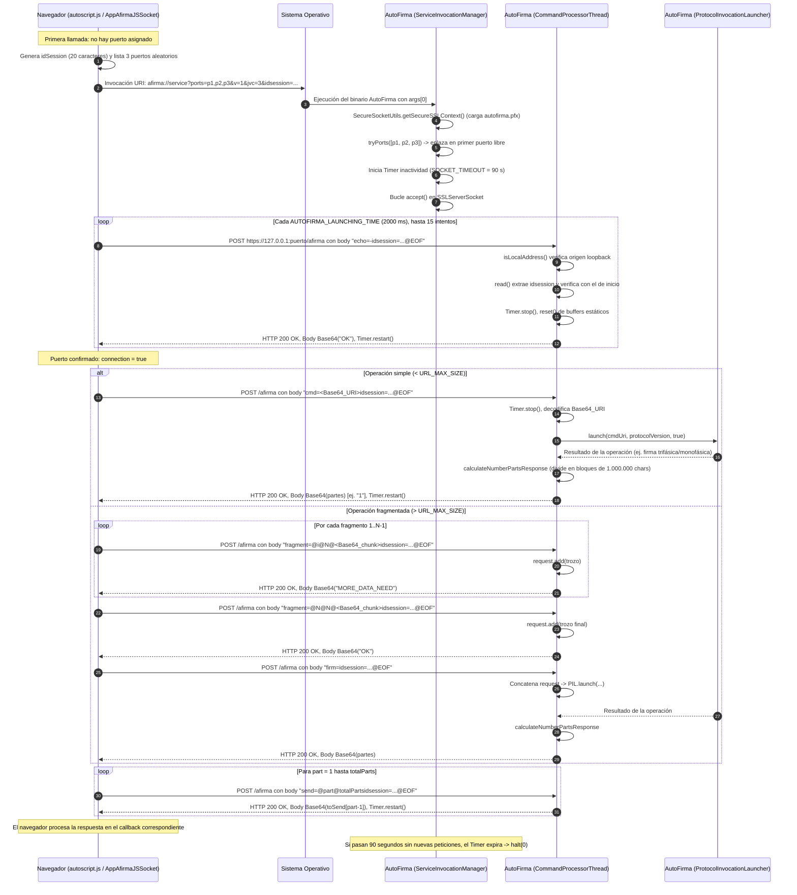

# 04. Transporte por socket local

Este capítulo describe el mecanismo de transporte basado en un **servidor de
socket TLS local** (`afirma://service?`), utilizado en el protocolo `afirma://`
de AutoFirma 1.9.2 para establecer un canal de comunicación seguro y
persistente entre la página web de la sede electrónica y la aplicación de
escritorio instalada en la máquina cliente.

Todas las citas corresponden al código fuente original de
[ctt-gob-es/clienteafirma](https://github.com/ctt-gob-es/clienteafirma) en el tag
`v1.9.2` (commit `b4fe147c3`), con rutas relativas a la raíz del repositorio.

---

## 1. Visión general y ciclo de vida

El transporte por socket local fue diseñado para permitir la interacción
bidireccional directa entre el navegador web y AutoFirma a través del bucle
local (`127.0.0.1`), sin necesidad de apoyarse en la infraestructura de un
servidor intermedio (`StorageService`/`RetrieveService`) y como alternativa para
entornos donde la tecnología WebSocket no se encuentra disponible o soportada.

A diferencia del transporte por servidor intermedio (capítulo 03), donde cada
operación requiere lanzar un nuevo proceso de AutoFirma que muere tras
responder, el servidor de socket local **mantiene la instancia viva**
atendiendo peticiones HTTP/TLS en un bucle continuo hasta que vence un periodo
de inactividad.

### 1.1 Cuándo se utiliza este transporte

En el cliente JavaScript oficial (`autoscript.js`), la selección del transporte
la realiza la función `cargarAppAfirma`
(`afirma-ui-miniapplet-deploy/src/main/webapp/js/autoscript.js:883-935`). El
transporte por socket local está implementado por el objeto `AppAfirmaJSSocket`
(`autoscript.js:2608-3370`) y se selecciona en la tercera posición de la
cascada de decisiones (`autoscript.js:925-934`):

1. **No se fuerza el modo Web Service** (`!forceWSMode`) y la plataforma no es móvil
   (no es iOS ni Android).
2. **No se cumplen los requisitos de WebSocket:** el navegador no soporta
   WebSockets nativos (`!isWebSocketsSupported()`), o bien es Internet Explorer,
   o bien es Firefox con versión $\le 60$ (`autoscript.js:908-912`).
3. **Compatibilidad del navegador con socket local TLS:** no es Internet Explorer
   antiguo (versiones $\le 10$) ni Safari versión 10 (`autoscript.js:925-927`):
   ```javascript
   if ((!Platform.isInternetExplorer() || Platform.getVersion() > 10) &&
       (!Platform.isSafari() || Platform.getVersion() != 10)) {
       appAfirma = AppAfirmaJSSocket;
   }
   ```
4. Si estas condiciones no se satisfacen, el flujo degrada al transporte por
   servidor intermedio `AppAfirmaJSWebService` (`autoscript.js:932-934`).

`AppAfirmaJSSocket` declara la constante interna:
```javascript
var PROTOCOL_VERSION = 1;
```
(`autoscript.js:2621`). El cliente JavaScript oficial inmoviliza la versión en `1`
y nunca negocia versiones superiores por socket local, a pesar de que el servidor
Java de AutoFirma admite hasta la versión `3` (`CURRENT_PROTOCOL_VERSION = 3` en
`ServiceInvocationManager.java:42`). Como consecuencia de esta congelación, las
operaciones de firma ejecutadas a través de este transporte nunca devuelven el
bloque de metadatos extendidos `extraData` (como el nombre del archivo firmado),
dado que su emisión exige explícitamente una versión de protocolo $\ge 3$
(`NativeSignDataProcessor.java:77, 97`).


### 1.2 Topología y persistencia de sesión

La arquitectura se compone de:

* **Cliente:** el navegador web ejecutando `autoscript.js`, que realiza
  peticiones HTTP mediante `XMLHttpRequest` con destino a
  `https://127.0.0.1:<puerto>/afirma` (`autoscript.js:2626, 3024, 3029`).
* **Servidor:** AutoFirma levantando un `SSLServerSocket` enlazado a la
  interfaz local (`ServiceInvocationManager.java:112-113`), utilizando un
  certificado TLS autofirmado generado durante la instalación de la aplicación
  e importado en los almacenes de confianza del sistema y de los navegadores.
* **Sesión:** la comunicación queda vinculada a un identificador único
  (`idsession`), generado por el JavaScript (`autoscript.js:1612-1632, 2927`) y
  validado por AutoFirma en cada petición entrante
  (`CommandProcessorThread.java:585-586, 627-632`). Múltiples operaciones
  consecutivas pueden reutilizar el canal abierto sin volver a invocar la
  aplicación nativa (`autoscript.js:2908-2911`).

### 1.3 Ciclo de vida y temporizador de inactividad

El ciclo de vida del proceso en este modo no está ligado al fin de una
operación concreta, sino al control temporal de inactividad:

1. **Arranque:** `ProtocolInvocationLauncher.launch` invoca
   `ServiceInvocationManager.startService`
   (`afirma-simple/src/main/java/es/gob/afirma/standalone/protocol/ProtocolInvocationLauncher.java:280`).
2. **Temporizador:** al abrir el puerto se inicia un temporizador Swing
   (`javax.swing.Timer`) con un retardo fijo de inactividad:
   ```java
   private static int SOCKET_TIMEOUT = 90000; // 90 segundos
   ```
   (`afirma-simple/src/main/java/es/gob/afirma/standalone/protocol/ServiceInvocationManager.java:39, 127-135`).
3. **Reinicio tras operación:** el temporizador se detiene al comenzar el
   procesamiento de un comando válido (`CommandProcessorThread.java:262, 279,
   331, 370, 400`) y se reinicia desde cero al completar el envío de la
   respuesta al socket (`CommandProcessorThread.java:457-459`).
4. **Cierre forzado:** si transcurren 90 segundos consecutivos sin recibir
   comandos válidos, el temporizador expira (`ServiceInvocationManager.java:127-133`):
   * En macOS, ejecuta el script de cierre del proceso intermedio
     (`MacUtils.closeMacService(channelInfo.getIdSession())`, línea 130).
   * Llama a `Runtime.getRuntime().halt(0)` (línea 132), matando la JVM
     inmediatamente sin ejecutar *shutdown hooks* ni liberar recursos ordenadamente.

### 1.4 Diagrama de secuencia completo

El siguiente diagrama refleja el flujo completo de una sesión de socket local,
desde el arranque y negociación inicial hasta la ejecución de una firma y el
cierre posterior:



---

## 2. La URI de arranque (`afirma://service?`)

### 2.1 Formato y variantes sintácticas

La activación del servidor de socket se solicita mediante una URI con el esquema
`afirma://` dirigida al host virtual `service`. El despachador general
`ProtocolInvocationLauncher.launch` reconoce dos formas equivalentes
(`afirma-simple/src/main/java/es/gob/afirma/standalone/protocol/ProtocolInvocationLauncher.java:264`):

```
afirma://service?<parámetros>
afirma://service/?<parámetros>
```

Cualquier otra variante (por ejemplo con mayúsculas `AFIRMA://service?`) es
rechazada con el código de error `SAF_02` (`ProtocolInvocationLauncher.java:172-178`).

El cliente JavaScript oficial construye invariablemente la variante sin barra
(`autoscript.js:2930-2933`):
```javascript
var url = "afirma://service?ports=" + portsLine
    + "&v=" + PROTOCOL_VERSION
    + "&jvc=" + VERSION_CODE
    + "&idsession=" + idSession;
```

### 2.2 Parámetros de la URI de servicio

Los parámetros se extraen en `ProtocolInvocationLauncher.launch` mediante
`extractParams` (`ProtocolInvocationLauncher.java:192, 946-966`). Los específicos
de esta modalidad son:

| Parámetro | Tipo / Formato | Obligatorio | Descripción | Líneas en el código |
|---|---|---|---|---|
| `ports` | Enteros separados por comas `,` | **Sí** | Lista de puertos TCP locales candidatos sobre los que AutoFirma intentará levantar el servidor SSL. Si falta, se muestra `SAF_03` y se aborta. | `ProtocolInvocationLauncher.java:272-277, 976-990` |
| `v` | Entero (por defecto `1`) | No | Versión del protocolo de comunicación solicitado para el canal. `ServiceInvocationManager` solo acepta `1`, `2` o `3`. | `ProtocolInvocationLauncher.java:267, 907-915`; `ServiceInvocationManager.java:42-45, 212-220` |
| `idsession` | Cadena alfanumérica | No | Identificador único de sesión. Debe ser estrictamente alfanumérico; si contiene caracteres no válidos se descarta en silencio. | `ProtocolInvocationLauncher.java:992-1008` |
| `jvc` | Entero (por defecto `1`) | No | Versión del código JavaScript cliente (`VERSION_CODE = 3` en `autoscript.js:27`). Si es menor que `1`, muestra aviso en consola. | `ProtocolInvocationLauncher.java:64-66, 196-214` |

#### Extracción y validación de `ports`
En `getChannelInfo` (`ProtocolInvocationLauncher.java:973-990`):
* La cadena se divide por comas: `ps.split(",")`.
* Cada elemento se convierte a entero con `Math.abs(Integer.parseInt(portsText[i]))` (`982`). El método aplica defensivamente el valor absoluto: si se proporcionan puertos con signo negativo (como `-63117`), se convierten automáticamente a positivos (`63117`).
* No se realiza una verificación explícita del rango de puertos TCP (1 a 65535); si un número resultante se encuentra fuera de dicho rango o es cero, el fallo se delega en el constructor del socket en `tryPorts`, cuya excepción es capturada prosiguiendo con el siguiente candidato.
* Si algún valor no es convertible a entero numérico, se lanza `IllegalArgumentException` (`985-988`).
* Si `channelInfo.getPorts() == null`, `launch` registra un error `SEVERE`, muestra el diálogo con `ProtocolInvocationLauncherErrorManager.ERROR_PARAMS` (`SAF_03`) y devuelve su mensaje de error (`272-277`).

En el JavaScript cliente (`autoscript.js:1653-1677, 2892`), `AfirmaUtils.getRandomPorts(minPort, maxPort)`
genera **3 puertos aleatorios únicos**:
* Rango por defecto: `DEFAULT_MIN_PORT = 49152` hasta `MAX_PORT = 65535` (`autoscript.js:1606, 1609, 1658-1659`).
* Rango mínimo absoluto permitido: `MIN_PORT = 1024` (`autoscript.js:1603, 1658`).

#### Extracción y saneamiento de `idsession`
En `ProtocolInvocationLauncher.java:992-1008`:
* Se lee el parámetro `idsession`.
* Se recorre cada carácter exigiendo que sea alfanumérico según `Character.isLetterOrDigit(c)` (`996`):
  ```java
  boolean valid = true;
  for (final char c : idSession.toCharArray()) {
      if (!Character.isLetterOrDigit(c)) {
          valid = false;
          break;
      }
  }
  if (!valid) {
      LOGGER.info("No se ha proporcionado un id de sesion valido");
      idSession = null;
  }
  ```
* Si no es válido, se sustituye por `null` sin detener la ejecución (`1006-1007`). El objeto contenedor es `ChannelInfo` (`afirma-simple/src/main/java/es/gob/afirma/standalone/protocol/ChannelInfo.java:7-45`).

En el cliente JavaScript (`autoscript.js:1612-1632`), `AfirmaUtils.generateNewIdSession()`
produce una cadena aleatoria de longitud fija `ID_LENGTH = 20` utilizando
`window.crypto.getRandomValues()` sobre el alfabeto:
```javascript
VALID_CHARS_TO_ID = "1234567890abcdefghijklmnopqrstuwxyzABCDEFGHIJKLMNOPQRSTUVWXYZ";
```
Nótese que en este literal de `autoscript.js:1600` la letra minúscula `'v'` está
omitida entre la `'u'` y la `'w'` (el conjunto contiene 61 caracteres en lugar de
los 62 del alfabeto alfanumérico estándar). No obstante, el backend Java de AutoFirma
evalúa `Character.isLetterOrDigit(c)`, por lo que acepta sin restricciones la letra
`'v'` minúscula en cualquier identificador recibido.

#### Negociación de versión (`v`) y asimetría con WebSocket
El parámetro `v` establece la versión de protocolo para el canal:
* En socket local HTTP, `ServiceInvocationManager.checkSupportProtocol` (`ServiceInvocationManager.java:212-220`)
  admite exclusivamente las versiones `{ 1, 2, 3 }` (`CURRENT_PROTOCOL_VERSION = 3`).
  Si se solicita una versión no admitida (por ejemplo `v=4`), se arroja
  `UnsupportedProtocolException(protocolVersion, protocolVersion > 3)` y se
  retorna el error `SAF_21` (`ERROR_UNSUPPORTED_PROCEDURE`).
* Si el parámetro se omite en la URI, `getVersion` asigna por defecto `v=1`
  (`ProtocolInvocationLauncher.java:912-914`), coincidiendo con el valor fijo
  enviado por `AppAfirmaJSSocket` (`autoscript.js:2621`).
* Esta regla contrasta con el transporte WebSocket (`afirma://websocket?`), el cual
  admite exclusivamente las versiones `{ 3, 4 }` (`AfirmaWebSocketServerManager.java:36`)
  y rechaza `{ 1, 2 }`.

### 2.3 Despacho en `ProtocolInvocationLauncher.launch`

Al procesar `afirma://service?` (`ProtocolInvocationLauncher.java:264-291`):
1. Obtiene la versión requerida: `requestedProtocolVersion = getVersion(urlParams)`.
2. Extrae `channelInfo = getChannelInfo(urlParams)`.
3. Invoca el arranque del servicio:
   ```java
   ServiceInvocationManager.startService(channelInfo, requestedProtocolVersion);
   ```
4. Si `startService` lanza `UnsupportedProtocolException`, captura el error, muestra
   `ERROR_UNSUPPORTED_PROCEDURE` (`SAF_21`) y devuelve su mensaje (`281-288`).
5. Si no se produce excepción de versión, la instrucción siguiente en el método es:
   ```java
   return RESULT_OK;
   ```
   (Línea 290). Este valor de retorno presenta una dualidad anómala en el código original:
   * **En ejecución normal (éxito):** `startService` entra en un bucle infinito
     `while (true)` bloqueante (`ServiceInvocationManager.java:136`), del que solo se sale
     cuando expira el temporizador de inactividad ejecutando `Runtime.getRuntime().halt(0)`.
     Por ello, en un escenario exitoso la línea 290 es **código muerto e inalcanzable**.
   * **En caso de fallo de red o almacén SSL:** si `tryPorts` no logra enlazar ningún
     puerto o si falla la carga del certificado `autofirma.pfx`, `startService` captura
     silenciosamente la excepción (`ServiceInvocationManager.java:148-168`), escribe en el
     log y retorna normalmente (`void`). En consecuencia, la ejecución alcanza la línea 290
     y devuelve `RESULT_OK` ("OK") a `SimpleAfirma.main`, que concluye el proceso con éxito
     (código 0) sin mostrar ningún diálogo ni advertir al navegador (ver
     [BUG-10 en A1-bugs-autofirma.md](A1-bugs-autofirma.md#bug-10-silenciamiento-de-excepciones-en-serviceinvocationmanagerstartservice-y-retorno-erróneo-de-ok-tras-fallo-de-inicialización-del-socket)).


---

## 3. Infraestructura de red y seguridad TLS

### 3.1 Apertura del `SSLServerSocket` y selección de puerto

El método `ServiceInvocationManager.startService`
(`ServiceInvocationManager.java:103-169`) delega la creación del socket seguro
en `tryPorts` (`176-197`):

```java
private static SSLServerSocket tryPorts(final int[] ports, final SSLServerSocketFactory socket) throws IOException {
    checkNullParameter(ports, "La lista de puertos no puede ser nula");
    checkNullParameter(socket, "El socket servidor no puede ser nulo");
    for (final int port : ports) {
        try {
            final SSLServerSocket ssocket = (SSLServerSocket) socket.createServerSocket(port);
            LOGGER.info("Establecido el puerto " + port + " para el servicio Autofirma");
            return ssocket;
        }
        catch (final BindException e) {
            LOGGER.warning("El puerto " + port + " parece estar en uso, se continua con el siguiente: " + e);
        }
        catch(final Exception e) {
            LOGGER.warning("No se ha podido conectar al puerto " + port + ", se intentara con el siguiente: " + e);
        }
    }
    throw new IOException("No se ha podido ligar el socket servidor a ningun puerto");
}
```

Reglas aplicadas sobre el socket servidor:
1. Se prueban los puertos secuencialmente en el orden en que venían en el parámetro `ports`.
2. El primer puerto disponible se selecciona y se retorna de inmediato.
3. Se activa la reutilización de dirección (`ServiceInvocationManager.java:113`):
   ```java
   ssocket.setReuseAddress(true);
   ```
4. Si ninguno de los puertos de la lista está libre, `tryPorts` lanza `IOException`,
   la cual es capturada en el `catch (IOException e)` de `startService` (`148-150`),
   registrando un log `SEVERE` sin mostrar interfaz gráfica y saliendo del método normalmente,
   lo que provoca que `launch()` retorne `RESULT_OK` (ver [BUG-10](A1-bugs-autofirma.md#bug-10-silenciamiento-de-excepciones-en-serviceinvocationmanagerstartservice-y-retorno-erróneo-de-ok-tras-fallo-de-inicialización-del-socket)).

### 3.2 Restricción de suites de cifrado

AutoFirma impone explícitamente una lista blanca estricta de suites de cifrado
TLSv1.2 (`ServiceInvocationManager.java:47-92, 122`):
```java
ssocket.setEnabledCipherSuites(ENABLED_CIPHER_SUITES);
```

La lista contiene 30 suites estándar de cifrado simétrico AES (128 y 256 bits) en
modos GCM y CBC con funciones resumen SHA-256 y SHA-384, combinadas con
intercambios de clave ECDHE, RSA, ECDH y DHE.

El comentario en el código fuente (`ServiceInvocationManager.java:115-121`)
expone el motivo de restringir las suites por defecto de la JVM:
> *«Restringimos las suites a utilizar a las por defecto de Java 11 (compatible con
> Java 8 y posteriores) omitiendo las suites de TLSv1.3 ya que la implementacion
> de estas no es compatible con la implementacion de Chrome v74 y anteriores
> (probablemente porque la version implementada en Java se basa en uno de los
> ultimos bocetos del estandar y no en la version final). Se hace de esta manera
> porque Java no responde a los mecanismos tradicionales para desactivar el
> protocolo (como la propiedad "jdk.tls.disabledAlgorithms").»*

### 3.3 El almacén de claves SSL local (`autofirma.pfx`)

Para establecer la conexión TLS en `127.0.0.1`, `ServiceInvocationManager` llama
a `SecureSocketUtils.getSecureSSLContext()`
(`afirma-simple/src/main/java/es/gob/afirma/standalone/protocol/SecureSocketUtils.java:34-60`).

La configuración interna de `SecureSocketUtils` define:
```java
private static final String KSPASS = "654321";
private static final String CTPASS = "654321";
private static final String KEYSTORE_NAME = "autofirma.pfx";
private static final String PKCS12 = "PKCS12";
private static final String SSLCONTEXT = "TLSv1";
```
(`SecureSocketUtils.java:22-26`).

#### Localización del almacén
`getKeyStoreFile()` (`SecureSocketUtils.java:65-79`) busca el fichero
`autofirma.pfx` en dos directorios del sistema mediante `DesktopUtil`:
1. `DesktopUtil.getApplicationDirectory()`: directorio del ejecutable o binario
   instalado (`afirma-simple/src/main/java/es/gob/afirma/standalone/DesktopUtil.java:160-177`).
2. `DesktopUtil.getAlternativeDirectory()`: directorio de datos del usuario
   (`DesktopUtil.java:257-270`):
   * **Windows:** `%ALLUSERSPROFILE%\Autofirma\autofirma.pfx` (`DesktopUtil.java:228-231`).
   * **Linux:** `$HOME/.afirma/Autofirma/autofirma.pfx` (`DesktopUtil.java:237-240`).
   * **macOS:** `$HOME/Library/Application Support/Autofirma/autofirma.pfx` (`DesktopUtil.java:246-249`).

Si el fichero no existe en ninguna de las dos ubicaciones, se lanza
`KeyStoreException("No se encuentra el almacen para el cifrado de la comunicacion SSL")`
(`SecureSocketUtils.java:38-40`).

#### Inicialización del contexto
1. Se carga el almacén PKCS#12 con contraseña `654321` (`48-51`).
2. Se inicializa una instancia de `KeyManagerFactory` con el algoritmo por defecto
   de la plataforma (`KeyManagerFactory.getDefaultAlgorithm()`, típicamente `SunX509`)
   usando la contraseña de clave `654321` (`53-54`).
3. Se crea el `SSLContext` solicitando el protocolo `"TLSv1"` y se inicializa
   con los gestores de clave cargados (`56-57`):
   ```java
   final SSLContext sc = SSLContext.getInstance(SSLCONTEXT);
   sc.init(kmf.getKeyManagers(), null, null);
   ```

### 3.4 Generación e instalación del certificado de confianza

Para que las llamadas HTTPS desde el navegador a `https://127.0.0.1:<puerto>/`
no sean bloqueadas por advertencias de seguridad SSL/TLS, el proceso de instalación
de AutoFirma (`afirma-ui-simple-configurator`) genera previamente una Autoridad de
Certificación (CA) raíz local y un certificado SSL de servidor:

* **Módulos configuradores:** `ConfiguratorWindows.java`, `ConfiguratorLinux.java`,
  `ConfiguratorMacOSX.java` en `afirma-ui-simple-configurator/src/main/java/es/gob/afirma/standalone/configurator/`.
* **Generación criptográfica:** `CertUtil.getCertPackForLocalhostSsl("Autofirma", "654321")`
  genera un par de claves y dos certificados:
  1. `Autofirma_ROOT.cer`: certificado de CA raíz autofirmada.
  2. `autofirma.pfx`: almacén PKCS#12 conteniendo el certificado de servidor
     emitido para `CN=localhost`, `IP=127.0.0.1` firmado por dicha CA raíz,
     junto con su clave privada.
* **Inyección de confianza en el sistema:**
  * En **Windows:** se instala `Autofirma_ROOT.cer` en el almacén de Entidades de
    certificación raíz de confianza de Windows CryptoAPI mediante `certutil -addstore Root`.
  * En **macOS:** se añade al llavero del sistema (`/Library/Keychains/System.keychain`)
    con permisos de confianza SSL mediante el comando `security add-trusted-cert`.
  * En **Linux:** se copia en los certificados del sistema (`/etc/ssl/certs` o
    `/etc/pki/ca-trust`) y se ejecutan scripts para insertar la CA en las bases de
    datos NSS de los perfiles de Mozilla Firefox (`cert9.db` / `cert8.db`)
    usando la herramienta `certutil` (`ConfiguratorFirefoxLinux.java`).

### 3.5 Control de acceso por dirección de origen local

En cada conexión aceptada por el socket, `CommandProcessorThread.run` verifica
inmediatamente que el cliente proceda exclusivamente de la interfaz de bucle
local (`CommandProcessorThread.java:92-101`):

```java
final InetSocketAddress requestorAddress = (InetSocketAddress) this.localSocket.getRemoteSocketAddress();
if (!isLocalAddress(requestorAddress)) {
    LOGGER.severe("Se ha detectado un acceso no autorizado desde " + requestorAddress.getHostString() + ". Se cerrara el socket por seguridad.");
    closeSocket(this.localSocket);
    return;
}
```

El método `isLocalAddress` (`CommandProcessorThread.java:157-165`) valida
estrictamente contra tres constantes:
```java
private static final String LOCALHOST = "localhost";
private static final String LOOP_DIR = "127.0.0.1";
private static final String LOOP_DIR_2 = "0:0:0:0:0:0:0:1";
```
Si el host remoto no coincide con ninguna de las tres cadenas, la conexión se
descarta y el socket se cierra de inmediato sin emitir ninguna respuesta.

---

## 4. Gramática del protocolo sobre el canal seguro

### 4.1 Envoltorio HTTP pseudo-estándar

La comunicación establecida a través del socket no emplea un servidor web
convencional ni un framework HTTP (como Netty o Jetty), sino un procesador de
flujo plano en `CommandProcessorThread`.

* Desde el cliente JavaScript (`autoscript.js:3024-3025, 3113-3114`), se emite un
  `POST` hacia la URL `https://127.0.0.1:<puerto>/afirma` con la cabecera:
  ```http
  Content-type: application/x-www-form-urlencoded
  ```
* En el servidor, `CommandProcessorThread.read` no parsea las cabeceras HTTP;
  lee el flujo de bytes completo como texto decodificado en UTF-8
  (`CommandProcessorThread.java:539`) y busca dentro de la cadena recibida los
  delimitadores y nombres de comando propios del protocolo.

### 4.2 El delimitador `@EOF` y el algoritmo de lectura del socket

Dado que una petición HTTP enviada por el navegador mantiene el socket abierto
o puede transmitirse en múltiples paquetes TCP, AutoFirma requiere un marcador
explícito de fin de entrada:
```java
private static final String SEPARADOR = "@";
private static final String EOF = SEPARADOR + "EOF"; // "@EOF"
```
(`CommandProcessorThread.java:44-45`). Todas las peticiones del cliente JavaScript
añaden obligatoriamente la terminación `@EOF` al final del cuerpo de la petición.

El método `read(InputStream socketIs)` (`CommandProcessorThread.java:520-620`)
implementa un lector con búfer y ventana deslizante de seguridad para evitar
quedar bloqueado en el `read` de la conexión:

```
+------------------------------------+-------------------------+
| ... datos ya leídos en data buffer | subFragment (36 bytes)  | <-- ventana de seguridad
+------------------------------------+-------------------------+
                                     | insert (lectura actual) |
                                     +-------------------------+
```

* **Constantes del lector:**
  * `READ_BUFFER_SIZE = 2048` bytes (`CommandProcessorThread.java:24`).
  * `BUFFERED_SECURITY_RANGE = 36` bytes (`CommandProcessorThread.java:30`): tamaño
    diseñado para albergar conjuntamente la etiqueta `idsession=`, su valor (20 caracteres)
    y la etiqueta `@EOF` (4 caracteres), evitando que el marcador quede partido
    entre dos lecturas sucesivas del búfer TCP.
  * `MAX_READING_BUFFER_TRIES = 10` (`CommandProcessorThread.java:33`): número máximo
    de lecturas consecutivas vacías o compuestas únicamente por espacios blancos.
    Si se agotan los 10 intentos, devuelve `null` para ignorar la petición y
    evitar consumo desmedido de memoria (`542-547`).
* **Tratamiento de lecturas vacías y cierre silencioso:**
  El límite de 10 reintentos está diseñado específicamente para gestionar conexiones
  anómalas o sondas de red que emiten únicamente espacios en blanco o tramas vacías
  (como sucede cuando un cliente falla en la negociación TLS o contacta al puerto sin
  enviar una petición HTTP válida). Puesto que `socketIs.read(reqBuffer)` es una
  operación bloqueante en el socket TCP, las demoras normales de red en transmisiones
  legítimas no incrementan el contador: este solo avanza si una lectura efectiva devuelve
  exclusivamente caracteres blancos (`insert.trim().isEmpty()`). Cuando se sobrepasa el
  límite, `read()` retorna `null`, y `run()` (`CommandProcessorThread.java:124-126`)
  emite un aviso (`LOGGER.warning("Se ha recibido una peticion vacia")`) y procede a
  cerrar la conexión mediante `closeSocket(this.localSocket)` (`150`) de manera
  completamente silenciosa, sin emitir ningún código ni cuerpo de error HTTP hacia el cliente.
* **Detección del fin de mensaje:**
  Se busca `@EOF` tanto en `insert` (la lectura actual) como en `subFragment`
  (la concatenación de los últimos 36 bytes de la lectura previa con el inicio de
  la actual).
* **Limpieza del búfer `data`:**
  Cuando se localiza `@EOF`, el lector calcula la posición de `idsession` y de
  `@EOF`, extrae el identificador de sesión si está presente, y recorta del
  acumulador `data` los bytes pertenecientes a estas etiquetas de control
  (`588-611`), dejando en `data` únicamente el comando limpio.

### 4.3 Validación y extracción de `idsession`

Dentro de `read`, al hallar la etiqueta `@EOF` se comprueba si la petición
contiene la subcadena `idsession` (`CommandProcessorThread.java:46, 567, 577`):

1. **Extracción:** se extrae el valor comprendido entre `idsession=` y `@EOF`:
   ```java
   requestSessionId = subFragment.substring(idSessionPos + IDSESSION.length() + 1, eofPos);
   ```
   (`569-572, 579-582`).
2. **Validación:** se invoca `checkIdSession(requestSessionId)` (`627-632`):
   ```java
   private void checkIdSession(final String requestSessionId) throws IllegalArgumentException {
       if (this.idSession != null && !this.idSession.equals(requestSessionId)) {
           throw new IllegalArgumentException("No se ha recibido el idSession esperado.");
       }
   }
   ```
3. **Respuesta ante fallo:** si el `idsession` no coincide con el configurado en la
   URI de arranque `afirma://service`, se lanza `IllegalArgumentException`,
   capturada en `run()` (`108-113`), la cual envía al socket un mensaje de error
   `sendError(ProtocolInvocationLauncherErrorManager.ERROR_PARAMS, ..., "ID de sesion erroneo")`
   y cierra inmediatamente la conexión.

### 4.4 Detección y prioridad de comandos

Una vez extraído el texto de la petición HTTP, `processCommand`
(`CommandProcessorThread.java:181-229`) determina el tipo de comando entrante
mediante `getUriTypeFromRequest` (`236-253`).

La detección busca por subcadena (`indexOf`) en un orden de prioridad estricto:
```java
final String[] supportedUriTypes = new String[] { CMD, ECHO, FRAGMENT, SIGN, SEND };
```
(`CommandProcessorThread.java:237`).

El primer prefijo de la lista que aparezca en el cuerpo HTTP determina la rama
del `switch`:

| Comando | Constante | Literal buscado | Finalidad |
|---|---|---|---|
| `cmd=` | `CMD` | `"cmd="` | Inicia una operación completa enviada en una sola petición. |
| `echo=` | `ECHO` | `"echo="` | Sondeo de disponibilidad (*ping*) y reinicio de sesión. |
| `fragment=` | `FRAGMENT` | `"fragment="` | Envío de un trozo de una petición fragmentada. |
| `firm=` | `SIGN` | `"firm="` | Orden de ejecución tras haber transmitido todos los fragmentos. |
| `send=` | `SEND` | `"send="` | Petición del cliente para descargar un fragmento del resultado. |

Si el texto no contiene ninguno de estos cinco literales, lanza
`IllegalArgumentException("Los datos recibidos por HTTP no contienen comando reconocido")`
(`248-250`).

---

## 5. Catálogo detallado de comandos

### 5.1 Comando `echo=`: sondeo de disponibilidad y reset

Utilizado por el cliente JavaScript para verificar si AutoFirma ya está levantada
y escuchando en el puerto asignado.

* **Sintaxis enviada por el cliente:**
  ```
  echo=[-][idsession=<id>]@EOF
  ```
  En el primer intento de sondeo tras lanzar la app, el JS envía `echo=-idsession=...@EOF`
  (`autoscript.js:3081`). El guion `-` representa la orden de reinicio:
  ```java
  private static final String RESET = "-";
  ```
  (`CommandProcessorThread.java:43`).
* **Tratamiento en AutoFirma (`doEchoPetition`, líneas 260-270):**
  1. Detiene el temporizador de inactividad: `this.timer.stop()` (`262`).
  2. Si el comando contiene `-` (`cmd.contains(RESET)`), ejecuta `reset()` (`264-266`):
     ```java
     private static void reset(){
         request.clear();
         toSend.clear();
         parts = 0;
     }
     ```
     (`433-437`). Esto descarta cualquier dato pendiente de operaciones anteriores.
  3. Responde con éxito enviando la cadena `"OK"`:
     ```java
     sendData(createHttpResponse(true, OK), socket, ECHO);
     ```
  4. En `sendData`, al comprobar que el temporizador estaba parado, lo reinicia
     con `this.timer.restart()` (`457-459`).
* **Respuesta recibida en JS:** el cuerpo de la respuesta HTTP es el Base64 de `"OK"`.
  Al decodificarlo y verificar que es `"OK"` (`autoscript.js:3027`), el JS da la
  conexión por establecida (`connection = true`) y fija el puerto activo.

### 5.2 Comando `cmd=`: invocación de operación sin fragmentar

Se utiliza cuando la URL de la operación cabe en una única petición HTTP
(su longitud no supera `URL_MAX_SIZE`).

* **Sintaxis enviada por el cliente:**
  ```
  cmd=<Base64_URI>[idsession=<id>]@EOF
  ```
  Donde `<Base64_URI>` es la codificación Base64 URL-safe de la URI completa de
  operación (`afirma://sign?...`, `afirma://save?...`, `afirma://batch?...`, etc.)
  (`autoscript.js:3161`).
* **Tratamiento en AutoFirma (`doCmdPetition`, líneas 327-361):**
  1. Extrae y decodifica la URI:
     ```java
     final String cmdUri = new String(Base64.decode(cmd.trim(), true));
     ```
  2. Valida que empiece por `afirma://` y **no empiece** por `afirma://service?`
     ni `afirma://service/?` (`329`). No se permite anidar una orden de servicio
     dentro de un socket ya abierto. Si no cumple, lanza `IllegalArgumentException`
     (`357-360`).
  3. Detiene el temporizador (`331`).
  4. **Rama específica de guardado (`afirma://save?` / `afirma://save/?`):**
     * Invoca `ProtocolInvocationLauncher.launch(cmdUri, this.protocolVersion, true)` (`334`).
     * Si la operación devuelve `"OK"`, responde con `SAVE_OK` (`336`).
     * Si devuelve `"CANCEL"`, responde con `CANCEL` (`339`).
     * Si devuelve cualquier otra cosa, lanza `IllegalArgumentException("Error al realizar la operacion 'save'")` (`342-344`).
  5. **Resto de operaciones (`sign`, `selectcert`, `batch`, `load`, etc.):**
     * Si `toSend.isEmpty()` (primera ejecución), ejecuta la operación:
       ```java
       final String operationResult = ProtocolInvocationLauncher.launch(cmdUri.toString(), this.protocolVersion, true);
       calculateNumberPartsResponse(operationResult);
       ```
       (`348-352`).
     * Responde al cliente con el **número total de partes** en que se ha dividido
       el resultado (`parts`):
       ```java
       sendData(createHttpResponse(true, Integer.toString(parts)), socket, "Se mandaran " + parts + " partes");
       ```
       (`353`).
* **Comportamiento fundamental y descarte de `ver`:**
  * Nótese que el comando `cmd=` **no devuelve el resultado de la firma**, sino el
    número de fragmentos disponibles (por ejemplo `"1"`). El cliente debe solicitar
    a continuación cada parte mediante `send=`.
  * **Inmutabilidad de la versión negociada:** al invocar
    `ProtocolInvocationLauncher.launch(cmdUri, this.protocolVersion, true)`, la variable
    `requestedProtocolVersion` recibe el valor fijado en el apretón de manos inicial
    (`this.protocolVersion != -1`). Como consecuencia, las guardas
    `if (requestedProtocolVersion == -1)` en `ProtocolInvocationLauncher.java:300, 650`
    evalúan a `false`, provocando que cualquier parámetro `ver=...` incluido dentro de
    `cmdUri` sea **completamente ignorado**. La versión negociada en el arranque rige
    invariablemente para todas las operaciones de la sesión.

### 5.3 Comando `fragment=`: recepción fragmentada de peticiones grandes

Cuando la URI construida por el cliente supera el límite de seguridad del
navegador (`URL_MAX_SIZE`), el cliente no puede enviarla en un único `cmd=`. En
su lugar, divide la URI en trozos y los envía secuencialmente con `fragment=`.

* **Límites `URL_MAX_SIZE` en `autoscript.js:2650`:**
  * Internet Explorer: `12000` caracteres.
  * Mozilla Firefox: `458752` caracteres.
  * Resto de navegadores (Chrome, Edge, Safari): `1048576` caracteres (1 MB).
* **Sintaxis enviada por el cliente:**
  ```
  fragment=@<part>@<partTotal>@<Base64_chunk>[idsession=<id>]@EOF
  ```
  Donde:
  * `<part>`: índice 1-based del fragmento actual (1, 2, ...).
  * `<partTotal>`: número total de fragmentos esperados.
  * `<Base64_chunk>`: trozo correspondiente de la URI codificado en Base64 URL-safe.
  (`autoscript.js:3223`).
* **Tratamiento en AutoFirma (`doFragmentPetition`, líneas 367-391):**
  1. Detiene el temporizador (`370`).
  2. Divide la petición por el carácter separador `@`:
     ```java
     final String[] petition = fragment.split(SEPARADOR);
     final int part = Integer.parseInt(petition[1]);
     final int partTotal = Integer.parseInt(petition[2]);
     final String save = new String(Base64.decode(petition[3].trim(), true));
     ```
  3. Almacena el fragmento en la lista estática `request` (`377-384`):
     * Si `request.size() == part`, sustituye la posición (`request.set(part - 1, save)`).
     * En caso contrario, inserta (`request.add(part - 1, save)`).
  4. Genera la respuesta HTTP:
     * Si es el último fragmento (`part == partTotal`): responde con Base64 de `"OK"` (`386`).
     * Si aún faltan fragmentos (`part < partTotal`): responde con Base64 de `"MORE_DATA_NEED"` (`389`).
* **Recepción en JS:** mientras reciba `MORE_DATA_NEED`, `executeOperationRecursive`
  continúa enviando el siguiente fragmento (`autoscript.js:3184-3189`). Cuando recibe
  `OK`, significa que todos los trozos están en AutoFirma y procede a disparar el
  comando `firm=` (`autoscript.js:3192-3197`).

### 5.4 Comando `firm=`: ejecución diferida de la petición fragmentada

Una vez que todos los fragmentos han sido transferidos a AutoFirma, el cliente
envía `firm=` para ordenar el ensamblado y procesamiento de la operación.

* **Sintaxis enviada por el cliente:**
  ```
  firm=[idsession=<id>]@EOF
  ```
  (Definido por la constante `SIGN = "firm="` en `CommandProcessorThread.java:60`
  y enviado en `autoscript.js:3280`).
* **Tratamiento en AutoFirma (`doFragmentedProcess`, líneas 276-321):**
  1. Detiene el temporizador (`279`).
  2. Si `toSend.isEmpty()` (primera ejecución):
     * Concatena secuencialmente todos los fragmentos acumulados en `request`:
       ```java
       final StringBuilder totalhttpRequest = new StringBuilder();
       for (final String object: request){
           totalhttpRequest.append(object);
       }
       ```
       (`285-288`).
     * **Si la operación es `save`:** ejecuta `launch(...)` y responde con
       `SAVE_OK` si devolvió `"OK"`, o `CANCEL` si devolvió `"CANCEL"` (`291-304`).
     * **Para el resto de operaciones:**
       ```java
       final String operationResult = ProtocolInvocationLauncher.launch(totalhttpRequest.toString(), this.protocolVersion, true);
       calculateNumberPartsResponse(operationResult);
       ```
       (`307-310`).
  3. Si no es una operación `save`, responde con el número total de partes disponibles:
     ```java
     sendData(createHttpResponse(true, Integer.toString(parts)), socket, "Se mandaran " + parts + " partes");
     ```
     (`316-320`).

### 5.5 Comando `send=`: descarga fragmentada del resultado

Utilizado por el cliente JavaScript para solicitar cada uno de los bloques de
datos que componen la respuesta de la operación.

* **Fragmentación de salida en AutoFirma (`calculateNumberPartsResponse`, líneas 416-428):**
  AutoFirma impone un tamaño máximo por bloque de respuesta:
  ```java
  private static final int RESPONSE_MAX_SIZE = 1000000; // 1.000.000 de caracteres
  ```
  (`CommandProcessorThread.java:54`).
  Calcula el número de partes:
  ```java
  parts = (int) Math.ceil(operationResult.length() / (double) RESPONSE_MAX_SIZE);
  ```
  Y trocea la cadena resultante almacenándola en la lista estática `toSend`:
  ```java
  for (int i = 0; i < parts; i++){
      offset = RESPONSE_MAX_SIZE * i;
      toSend.add(operationResult.substring(offset, Math.min(offset + RESPONSE_MAX_SIZE, operationResult.length())));
  }
  ```
* **Sintaxis enviada por el cliente:**
  ```
  send=@<part>@<partTotal>[idsession=<id>]@EOF
  ```
  Donde `<part>` es el índice 1-based de la parte solicitada y `<partTotal>` es el
  total anunciado previamente (`autoscript.js:3347`).
* **Tratamiento en AutoFirma (`doSendPetition`, líneas 397-411):**
  1. Detiene el temporizador (`400`).
  2. Parsea `part` y `partTotal` separando por `@` (`402-404`).
  3. Valida los índices:
     ```java
     if (part < 1 || part > partTotal) {
         throw new IllegalArgumentException("Se ha solicitado enviar un fragmento invalido: " + part + "de " + partTotal);
     }
     ```
     (`405-409`).
  4. Recupera el fragmento de la lista estática `toSend` (en la posición `part - 1`)
     y lo envía como cuerpo HTTP:
     ```java
     sendData(createHttpResponse(true, toSend.get(part - 1)), socket, "Mandada la parte " + part + " de " + partTotal);
     ```
     (`410`).
* **Recepción en JS:** la función `addFragmentRequest` concatena los fragmentos
  decodificados en la variable acumuladora `totalResponseRequest`
  (`autoscript.js:3297`). Cuando `part == totalParts`, cierra el diálogo de
  espera y pasa el resultado completo al callback de éxito correspondiente
  (`autoscript.js:3299-3318`).

---

## 6. Formato de las respuestas HTTP y codificación

### 6.1 Construcción en `createHttpResponse`

Todas las respuestas transmitidas por el socket se construyen en el método estático
`createHttpResponse(boolean ok, String response)`
(`CommandProcessorThread.java:493-511`):

```java
private static byte[] createHttpResponse(final boolean ok, final String response) {
    final StringBuilder sb = new StringBuilder();
    if (ok) {
        sb.append("HTTP/1.1 200 OK\n");
    }
    else {
        sb.append("HTTP/1.1 500 Internal Server Error");
    }
    sb.append("Connection: close\n");
    sb.append("Pragma: no-cache\n");
    sb.append("Server: Cliente @firma\n");
    sb.append("Content-Type: text/html; charset=utf-8\n");
    sb.append("Access-Control-Allow-Origin: *\n");
    sb.append('\n');
    if (response != null) {
        sb.append(Base64.encode(response.getBytes(StandardCharsets.UTF_8), true));
    }
    return sb.toString().getBytes(StandardCharsets.UTF_8);
}
```

Detalles de la cabecera HTTP y código de estado:
* **Invariabilidad de `HTTP/1.1 200 OK`:** En todo el código de `CommandProcessorThread.java`,
  el método `createHttpResponse` es invocado en 12 puntos distintos (líneas 269, 295,
  298, 318, 336, 339, 353, 386, 389, 410, 471 y 483), y en **todas y cada una de las 12
  llamadas el primer parámetro `ok` es incondicionalmente `true`**.
  AutoFirma **nunca emite un código HTTP 500** por el canal de socket local: todas las
  respuestas —tanto las de éxito como las cancelaciones del usuario (`CANCEL`), errores de
  memoria (`MEMORY_ERROR`) y fallos funcionales o criptográficos (`SAF_nn`)— se envían
  invariablemente con el encabezado de estado `HTTP/1.1 200 OK`.
* **Código muerto y anomalía sintáctica en la rama `HTTP 500`:**
  La rama `else` (líneas 824-826) que emite `HTTP/1.1 500 Internal Server Error` es
  **código muerto al 100%**. Nótese adicionalmente que dicha rama contiene un defecto de
  formato: omite el salto de línea al final del literal, por lo que si alguna vez llegara a
  ejecutarse, concatenaría la línea de estado con la primera cabecera produciendo una
  cabecera HTTP sintácticamente corrupta (`HTTP/1.1 500 Internal Server ErrorConnection: close\n`).
* **Separadores de línea no estándar:** se utiliza exclusivamente el carácter de salto de línea
  simple `\n` (código ASCII 10), en lugar de la secuencia estándar de HTTP `\r\n` (CRLF)
  exigida por RFC 7230 / RFC 9112. Los navegadores web modernos (Chromium, Firefox, Safari, Edge)
  incorporan analizadores HTTP permisivos en conexiones sobre `localhost`, por lo que
  procesan las respuestas con normalidad a través de `XMLHttpRequest`, aunque parsers HTTP
  estrictos de bajo nivel pueden denunciar el formato.
* **Cabeceras fijas:**
  * `Connection: close`: cada transacción HTTP cierra la conexión tras responder.
  * `Pragma: no-cache`: previene cacheo intermedio.
  * `Server: Cliente @firma`: firma del servidor.
  * `Content-Type: text/html; charset=utf-8`: declara HTML aunque el contenido es
    texto plano codificado.
  * `Access-Control-Allow-Origin: *`: permite que cualquier origen web invoque el
    puerto local mediante CORS.
* **Cuerpo:** la cadena `response` se convierte a bytes UTF-8 y se codifica en
  Base64 URL-safe con `Base64.encode(..., true)`. Si `response == null`, no se
  añade cuerpo tras la línea en blanco.

### 6.2 Catálogo de respuestas de control

El protocolo utiliza un conjunto cerrado de cadenas de control que viajan
codificadas en Base64 en el cuerpo de la respuesta HTTP:

| Cadena de respuesta | Significado | Cuándo se devuelve |
|---|---|---|
| `"OK"` | Operación / comando aceptado con éxito. | En respuesta a `echo=` (`269`), y tras recibir el último bloque en `fragment=` (`386`). |
| `"MORE_DATA_NEED"` | Se requieren más datos. | En respuesta a `fragment=` cuando `part < partTotal` (`389`). |
| `"<n>"` (entero en texto) | Número de partes que componen el resultado. | En respuesta a `cmd=` (`353`) o `firm=` (`318`) para operaciones que devuelven datos. |
| `"SAVE_OK"` | Guardado en disco completado con éxito. | En respuesta a `cmd=` (`336`) o `firm=` (`295`) cuando la operación era `afirma://save?`. |
| `"CANCEL"` | Operación cancelada por el usuario. | Cuando el usuario cancela en el diálogo de guardado de `save` (`298, 339`) o la selección de certificado. |
| `"MEMORY_ERROR"` | Error de memoria en la máquina virtual. | Producido al capturar `OutOfMemoryError` (`CommandProcessorThread.java:35, 143, 483`). |
| `"SAF_nn: ..."` | Mensaje de error de AutoFirma. | Producido al capturar excepciones en el procesamiento (`469-474`). |

---

## 7. Gestión de errores y excepciones

### 7.1 Mapeo de excepciones en `CommandProcessorThread.run`

El método `run` envuelve la lectura y el procesamiento de cada conexión en un
bloque `try / catch` exhaustivo (`CommandProcessorThread.java:104-149`):

| Excepción capturada | Origen típico | Código SAF asignado | Mensaje enviado en el log |
|---|---|---|---|
| `IllegalArgumentException` en `read` | `idSession` erróneo (`108`). | `SAF_03` (`ERROR_PARAMS`) | `"ID de sesion erroneo"` (`110`). |
| Cualquier otra excepción en `read` | Fallo de lectura del socket (`114`). | `SAF_03` (`ERROR_PARAMS`) | `"No se pudieron leer los datos del socket"` (`116`). |
| `IllegalArgumentException` en `processCommand` | Orden desconocida: ni `echo=`, `cmd=`, `fragment=`, `firm=` ni `send=` (`247-250`). Se lanza antes del `switch` y no la envuelve nadie. | `SAF_03` (`ERROR_PARAMS`) | `"Parametros incorrectos"` (`135`). |
| `IOException` | Fallo al escribir la respuesta y, sobre todo, cualquier excepción del `switch` de `processCommand`, que su `catch (Exception)` envuelve en `IOException` (`226-229`): un `cmd=` cuya URI no es una operación `afirma://` (`356-359`), un `send=` fuera de rango (`404-408`) o un `save` que no acaba en `OK` ni en `CANCEL` (`341-345`). Su `IllegalArgumentException` no llega a `run` como tal. | `SAF_11` (`ERROR_SENDING_RESULT`) | `"Envio del resultado a la aplicacion"` (`139`). |
| `OutOfMemoryError` | Agotamiento del espacio de memoria de la JVM durante el parseo o la firma (`141`). | *(Sin código SAF)* | Envía el literal `"MEMORY_ERROR"` mediante `sendMemoryError` (`143, 481-487`). |
| `Exception` (cualquier otra) | Ninguno en la práctica: `processCommand` envuelve en `IOException` lo que lanza su `switch`, incluida la ejecución de `launch` (`145`). | `SAF_09` (`ERROR_SIGNATURE_FAILED`) | `"Error al procesar el comando"` (`147`). |

### 7.2 La anomalía de `sendError`

El método `sendError` transmite el error al cliente de la siguiente forma
(`CommandProcessorThread.java:469-475`):

```java
private void sendError(final String safError, final Socket socket, final String petition) {
    try {
        sendData(createHttpResponse(true, ProtocolInvocationLauncherErrorManager.getErrorMessage(safError)), this.localSocket, "ID de sesion erroneo");
    } catch (final IOException ex) {
        LOGGER.warning("No se ha podido informar a la aplicacion del error producido: " + ex);
    }
}
```

Aspectos destacables en el código:
1. **Envío con HTTP 200:** nótese que la llamada es `createHttpResponse(true, ...)`.
   El servidor devuelve un código de estado `HTTP/1.1 200 OK`, **no un 500**.
   El mensaje de error viaja codificado en Base64 en el cuerpo.
2. **Recepción en el cliente:** debido a que el código HTTP es 200, el navegador
   no dispara el evento `onerror` ni detecta fallo a nivel HTTP. Es el código
   JavaScript de `autoscript.js` quien debe decodificar el cuerpo y verificar
   si la cadena empieza por `"SAF_"` o es `"CANCEL"` (`autoscript.js:3360-3369`):
   ```javascript
   if (data.length > 4 && data.substr(0, 4) == "SAF_") {
       errorCallback("java.lang.Exception", data);
       return;
   }
   ```
3. **Literal hardcodeado en el log:** el tercer parámetro de `sendData` en la
   línea 471 pasa invariablemente la descripción `"ID de sesion erroneo"`,
   incluso cuando el error procede de parámetros incorrectos, fallos de lectura
   o fallos de firma.

### 7.3 Errores de protocolo y versión no soportada

Si la URI `afirma://service` solicita una versión de protocolo no reconocida:
1. `ServiceInvocationManager.checkSupportProtocol(protocolVersion)` valida si
   `protocolVersion` pertenece a `{ 1, 2, 3 }` (`ServiceInvocationManager.java:44-45, 212-220`).
2. Si no pertenece, lanza `UnsupportedProtocolException(protocolVersion, protocolVersion > 3)`.
3. `ProtocolInvocationLauncher.launch` captura esta excepción
   (`ProtocolInvocationLauncher.java:281-288`):
   ```java
   final String errorCode = e.isNewVersionNeeded()
           ? ProtocolInvocationLauncherErrorManager.ERROR_UNSUPPORTED_PROCEDURE
           : ProtocolInvocationLauncherErrorManager.ERROR_UNSUPPORTED_PROCEDURE;
   ProtocolInvocationLauncherErrorManager.showError(errorCode, e);
   return ProtocolInvocationLauncherErrorManager.getErrorMessage(errorCode);
   ```
   Muestra el diálogo de error al usuario con `SAF_21` y termina la ejecución.

---

## 8. Gestión del temporizador, concurrencia y cierre

### 8.1 Política de reinicio del temporizador

El temporizador `Timer` de 90 segundos (`SOCKET_TIMEOUT = 90000`) rige la vida
del proceso servidor. Su política de parada y reinicio está diseñada para
proteger la aplicación de ataques por denegación de servicio que busquen mantener
el proceso abierto indefinidamente (`CommandProcessorThread.java:452-460`):

* Al recibir un comando válido (`echo`, `cmd`, `fragment`, `firm`, `send`), el hilo
  ejecuta `this.timer.stop()`.
* Al enviar la respuesta en `sendData`:
  ```java
  if (!this.timer.isRunning()) {
      this.timer.restart();
  }
  ```
* **Protección contra DoS:** si se produce un error antes de que el temporizador
  fuera detenido (por ejemplo, una conexión que envía un `idSession` erróneo o una
  dirección no local en `read`), el temporizador **no se reinicia**:
  > *«Si el Timer estaba parado es que estabamos procesando una operacion, tras lo
  > cual, se reinicia el temporizador. En cambio, si estaba en ejecucion, es que
  > nunca lo hemos parado, por lo que el error se ha producido antes de empezar a
  > procesar una peticion valida. No lo reiniciaremos en este ultimo caso, ya que
  > podria tratarse de un ataque con peticiones invalidas que busque que la
  > aplicacion no se cierre en ningun momento.»* (`452-456`).

### 8.2 Cierre forzado por inactividad

Cuando el temporizador alcanza los 90 segundos sin actividad, se ejecuta el
listener configurado en `ServiceInvocationManager.java:127-134`:
```java
final Timer timer = new Timer(SOCKET_TIMEOUT, evt -> {
    LOGGER.warning("Se ha caducado la conexion. Se deja de escuchar en el puerto...");
    if (Platform.OS.MACOSX.equals(Platform.getOS())) {
        MacUtils.closeMacService(channelInfo.getIdSession());
    }
    Runtime.getRuntime().halt(0);
});
```
`Runtime.getRuntime().halt(0)` fuerza la terminación inmediata del proceso de la
JVM con código 0, sin ejecutar métodos de finalización ni hilos de parada.

### 8.3 Particularidad de cierre en macOS (`MacUtils.closeMacService`)

En sistemas macOS, además de la JVM existe el proceso nativo del lanzador
Objective-C (`AppDelegate.m`) que arrancó el sistema operativo para gestionar el
esquema de URL.

Para forzar la terminación limpia de este proceso auxiliar, `closeMacService`
(`afirma-simple/src/main/java/es/gob/afirma/standalone/so/macos/MacUtils.java:78-95`)
construye y ejecuta un script de shell bash:
```java
final ShellScript script = new ShellScript(
    "kill -9 $(ps -ef | grep " + sessionIdText + " | awk '{print $2}')"
);
script.run();
```
El script busca en la tabla de procesos del sistema aquellos que contengan en su
línea de órdenes la cadena del `idSession` y les envía una señal `SIGKILL` (`kill -9`).

### 8.4 Estado estático y concurrencia

En `ServiceInvocationManager.java:136-143`, el bucle del servidor acepta conexiones
y lanza un hilo independiente para cada una:
```java
while (true){
    try {
        new CommandProcessorThread(ssocket.accept(), timer, channelInfo.getIdSession(), protocolVersion).start();
    }
    catch (final SocketTimeoutException e) { ... }
}
```

No obstante, las variables que almacenan los datos de la petición y de la respuesta
en `CommandProcessorThread` son **campos estáticos compartidos**:
```java
private final static List<String> request = new ArrayList<>();
private final static List<String> toSend = new ArrayList<>();
private static int parts = 0;
```
(`CommandProcessorThread.java:67-69`).

Estos campos:
* No cuentan con sincronización (`synchronized`, bloqueos reentrantes o colecciones
  concurrentes).
* El diseño asume un modelo estrictamente secuencial impuesto por el cliente
  JavaScript (que espera la respuesta HTTP de un fragmento antes de enviar el
  siguiente).
* Si dos peticiones llegaran de forma concurrente sobre el mismo puerto, o si dos
  pestañas del navegador compartieran sesión, se producirían condiciones de carrera
  al modificar `request` y `toSend`, provocando excepciones de concurrencia o
  corrupción cruzada de datos (ver [BUG-09 en A1-bugs-autofirma.md](A1-bugs-autofirma.md#bug-09-estado-estático-sin-sincronización-y-condiciones-de-carrera-en-commandprocessorthread)).

Que el estado sea compartido no es en sí el defecto: lo impone el protocolo. Cada
orden llega por una conexión TCP nueva y la única marca que llevan todas es el
`idsession`, común a todo el canal (§4.3); no hay identificador de conversación.
Un servidor tiene que acumular los fragmentos y las partes del resultado por
sesión, y dos conversaciones de la misma sesión intercaladas son, en el cable,
indistinguibles de una sola: ninguna implementación puede separarlas. Lo que sí
es de la implementación es la falta de sincronización: atender las conexiones en
orden evitaría la corrupción de las listas, aunque no la mezcla de conversaciones.

---

## 9. El cliente JavaScript de referencia (`AppAfirmaJSSocket`)

El objeto `AppAfirmaJSSocket`
(`afirma-ui-miniapplet-deploy/src/main/webapp/js/autoscript.js:2608-3370`)
implementa la máquina de estados del lado del navegador:

### 9.1 Inicialización y parámetros de temporización

* `PROTOCOL_VERSION = 1` (`autoscript.js:2621`): versión fija de protocolo enviada en la URI de servicio (`&v=1`).
* `VALID_CHARS_TO_ID = "1234567890abcdefghijklmnopqrstuwxyzABCDEFGHIJKLMNOPQRSTUVWXYZ"` (`autoscript.js:1600`): alfabeto de 61 caracteres empleado por `generateNewIdSession()` (`1612-1632`) para generar el identificador de sesión de longitud `ID_LENGTH = 20`, omitiendo la letra `'v'` minúscula.
* `WAITING_TIME = 500` ms (`autoscript.js:2624`): tiempo de espera para reintentos
  de peticiones en caso de respuestas vacías.
* `AUTOFIRMA_LAUNCHING_TIME = 2000` ms (`autoscript.js:149`): tiempo de retardo
  entre el lanzamiento de la app y la primera comprobación por `echo`.
* `AUTOFIRMA_CONNECTION_RETRIES = 15` (`autoscript.js:152`): número de reintentos
  máximos antes de considerar que la aplicación no está instalada (permitiendo un
  tiempo máximo de arranque de $15 \times 2 = 30$ segundos).

### 9.2 Bucle de conexión inicial por `echo`

1. En la primera ejecución (`port == ""`), `execAppIntent` llama a `openNativeApp(ports)`
   y programa la comprobación con `setTimeout(executeEchoByServiceByPort, AUTOFIRMA_LAUNCHING_TIME, ports, url)`
   (`autoscript.js:2890-2897`).
2. `executeEchoByServiceByPort` lanza en paralelo peticiones `executeEchoByService`
   para cada uno de los 3 puertos candidatos (`3000-3006`).
3. Para evitar que múltiples puertos respondan a la vez, se utiliza un objeto semáforo
   (`semaphore.locked = false`, `3001-3002`). El primer puerto que devuelva HTTP 200
   con cuerpo `"OK"` bloquea el semáforo (`semaphore.locked = true`), fija la variable
   global `port` y continúa con `executeOperationByService()` (`3027-3041`).
4. Si un puerto no responde y aún no se ha conectado:
   * Si ya se había conectado en operaciones anteriores pero falla la mitad de los
     intentos, asume que el proceso se cayó y vuelve a invocar la app (`3047-3054`).
   * Si se agotan los 15 reintentos, muestra el diálogo `ERROR_CONNECTING_AFIRMA` o
     devuelve `es.gob.afirma.standalone.ApplicationNotFoundException` al `errorCallback`
     (`3056-3069`).
   * En caso contrario, reintenta con `executeEchoByServiceDelayed` tras 2000 ms (`3072`).

### 9.3 Flujo recursivo de fragmentación y recepción

* **Envío:** `executeOperationRecursive(url, i, iFinal)` (`3168-3226`) envía
  cada trozo con `fragment=@i@iFinal@...`. Al recibir `"MORE_DATA_NEED"`, se
  llama recursivamente para `i + 1`. Al recibir `"OK"` en el último fragmento,
  llama a `doFirm()` (`3196`).
* **Ejecución:** `doFirm()` (`3231-3281`) envía `firm=...`. Al recibir el número
  de partes, inicia la descarga llamando a `addFragmentRequest(1, parts)` (`3255`).
* **Descarga:** `addFragmentRequest(part, totalParts)` (`3286-3350`) envía
  `send=@part@totalParts...`. Acumula la respuesta decodificada en
  `totalResponseRequest`. Si `part < totalParts`, se invoca recursivamente para
  `part + 1`; si `part == totalParts`, concluye y despacha el resultado (`3299-3318`).


