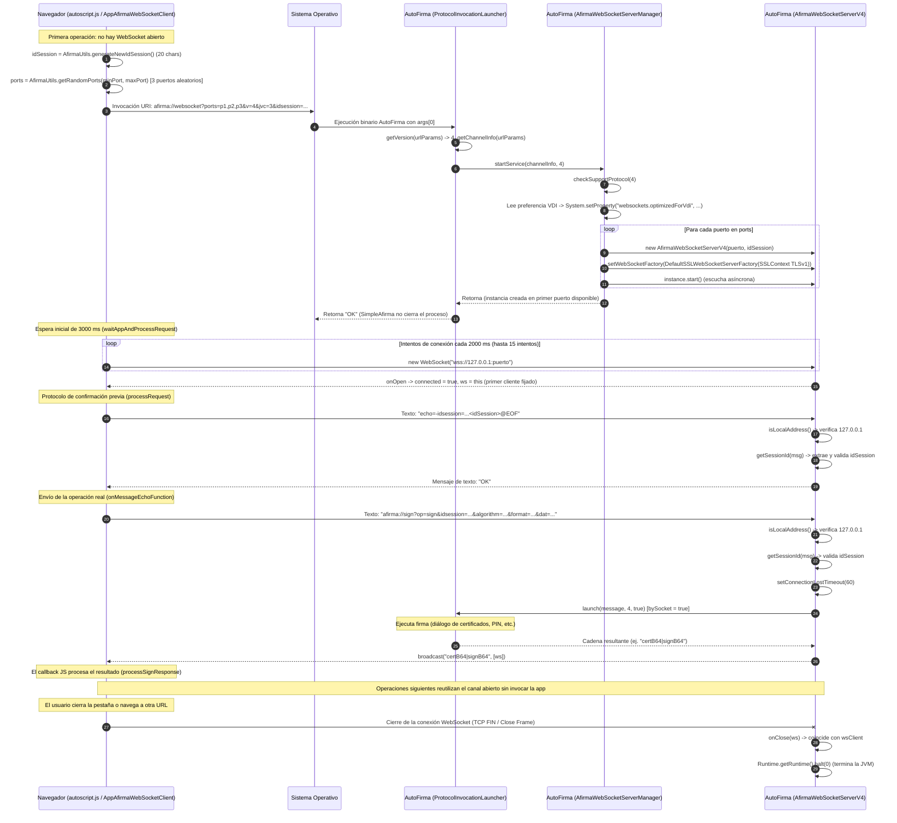

# 05. Transporte por WebSocket

Este capítulo describe el mecanismo de transporte basado en **WebSocket seguro**
(`afirma://websocket?`), utilizado en el protocolo `afirma://` de AutoFirma
1.9.2 para establecer un canal bidireccional, persistente y de baja latencia
entre la página web de la sede electrónica y la aplicación de escritorio
AutoFirma.

Todas las citas corresponden al código fuente original de
[ctt-gob-es/clienteafirma](https://github.com/ctt-gob-es/clienteafirma) en el tag
`v1.9.2` (commit `b4fe147c3`), con rutas relativas a la raíz del repositorio.

---

## 1. Visión general y ciclo de vida

El transporte por WebSocket representa la vía preferente de comunicación local
en AutoFirma para navegadores modernos. A diferencia del transporte por servidor
intermedio (capítulo 03), no requiere infraestructura intermedia de red en la
nube ni almacenamiento temporal en servlets; y a diferencia del transporte por
socket local TLS basado en HTTP (capítulo 04), la comunicación fluye sobre un
único canal dúplex nativo (`wss://127.0.0.1:<puerto>`), eliminando la sobrecarga
de peticiones HTTP repetitivas, la necesidad de fragmentar manualmente las
peticiones o respuestas en bloques de 1 MB, y los mecanismos de espera activa
por sondeo.

### 1.1 Cuándo se utiliza este transporte

En el cliente JavaScript oficial (`autoscript.js`), la función `cargarAppAfirma`
(`afirma-ui-miniapplet-deploy/src/main/webapp/js/autoscript.js:883-935`) determina
el orden de prioridad de los transportes. El transporte por WebSocket está
implementado por el objeto `AppAfirmaWebSocketClient`
(`autoscript.js:1745-2602`) y se selecciona en la segunda posición de la
cascada condicional (`autoscript.js:908-920`):

1. **No se fuerza el modo Web Service** (`!forceWSMode`) y la plataforma no es
   móvil (no es iOS ni Android; `885-888`).
2. **Requisitos de WebSocket cumplidos:**
   * El navegador soporta la API WebSocket (`isWebSocketsSupported()` comprueba
     `'WebSocket' in window || 'MozWebSocket' in window`, líneas `197-199`).
   * No es Internet Explorer (`!Platform.isInternetExplorer()`, línea `914`). El
     comentario del código aclara que en IE no se puede garantizar el
     funcionamiento si cierta opción de red corporativa está activa (`910-912`).
   * No es Firefox en versión 60 o inferior (`!Platform.isFirefox60orLower()`,
     línea `914`). El comentario señala que en versiones antiguas de Firefox las
     llamadas múltiples ocasionaban incidencias tras las adaptaciones para
     entornos de escritorio virtual VDI (`912-913`).
3. Si estas condiciones se satisfacen, se instancia el cliente:
   ```javascript
   clienteFirma = new AppAfirmaWebSocketClient(window, undefined);
   if (!!minPort) {
       clienteFirma.setPortRange(minPort, maxPort);
   }
   ```
   (`autoscript.js:915-919`).
4. Si las condiciones no se cumplen, el cliente degrada a socket local HTTP
   (`AppAfirmaJSSocket`, capítulo 04) o a servidor intermedio
   (`AppAfirmaJSWebService`, capítulo 03).

`AppAfirmaWebSocketClient` declara internamente la versión de protocolo:
```javascript
var PROTOCOL_VERSION = 4;
```
(`autoscript.js:1747`).

### 1.2 Topología y persistencia de sesión

La arquitectura se compone de los siguientes elementos:

* **Cliente web:** el navegador ejecutando `autoscript.js`, que establece una
  conexión segura mediante la API nativa de JavaScript:
  `new WebSocket("wss://127.0.0.1:<puerto>")` (`autoscript.js:1751, 2201`).
* **Servidor en AutoFirma:** una instancia de `WebSocketServer` (de la biblioteca
  `org.java-websocket:Java-WebSocket:1.6.1-SNAPSHOT`,
  `afirma-simple/pom.xml:228-231`) levantada por `AfirmaWebSocketServerManager`
  (`afirma-simple/src/main/java/es/gob/afirma/standalone/protocol/AfirmaWebSocketServerManager.java:22-109`).
  El socket utiliza cifrado TLS mediante un certificado local cargado desde
  `autofirma.pfx` (`SecureSocketUtils.java:24, 79`).
* **Identificador de sesión (`idsession`):** generado aleatoriamente por el
  cliente JavaScript (`autoscript.js:1612-1632, 1784`), comunicado en la URI de
  arranque (`autoscript.js:2156`), y validado por AutoFirma en cada mensaje
  entrante (`AfirmaWebSocketServerV4.java:72-78`).
* **Persistencia:** el canal WebSocket permanece abierto entre operaciones
  consecutivas. El cliente JavaScript comprueba `isAppOpened()`
  (`autoscript.js:2133-2135`); si el socket ya está conectado, no vuelve a
  invocar la aplicación nativa a través del sistema operativo, sino que envía
  directamente la nueva operación por el socket existente
  (`autoscript.js:2125-2129`).

### 1.3 Ciclo de vida y cierre del proceso

El ciclo de vida del proceso AutoFirma en modo WebSocket difiere sustancialmente
tanto del servidor intermedio como del socket local HTTP:

1. **Arranque asíncrono en `main`:** `SimpleAfirma.main`
   (`afirma-simple/src/main/java/es/gob/afirma/standalone/SimpleAfirma.java:962`)
   ejecuta `ProtocolInvocationLauncher.launch(args[0])`. A diferencia del modo
   socket HTTP (donde `ServiceInvocationManager.startService` entra en un bucle
   bloqueante `while (true)` que nunca retorna), en WebSocket
   `AfirmaWebSocketServerManager.startService` inicia el servidor en segundo
   plano llamando a `instance.start()` (`AfirmaWebSocketServerManager.java:81`)
   y retorna de inmediato a `launch`, que devuelve `"OK"`
   (`ProtocolInvocationLauncher.java:261`).
2. **Supervivencia del hilo principal:** `SimpleAfirma.main` contiene una guarda
   específica para WebSocket (`SimpleAfirma.java:978-980`):
   ```java
   if (!args[0].startsWith(WEBSOCKET_REQUEST_PREFIX)) {
       forceCloseApplication(0);
   }
   ```
   Donde `WEBSOCKET_REQUEST_PREFIX = "afirma://websocket"` (`SimpleAfirma.java:154`).
   Al coincidir el prefijo, el hilo principal no fuerza el cierre (`halt(0)`), y la
   JVM se mantiene en ejecución gracias a los hilos activos no demonio del
   `WebSocketServer`.
3. **Cierre vinculado a la desconexión del cliente:** en `AfirmaWebSocketServer.java:82-91`:
   ```java
   @Override
   public void onClose(final WebSocket ws, final int code, final String reason, final boolean remote) {
       LOGGER.info("Se ha cerrado la comunicacion con el socket del puerto " + getAddress().getPort() + " . Codigo: " + code + ": " + reason);
       if (this.wsClient == null || this.wsClient.equals(ws)) {
           LOGGER.info("Cerramos la aplicacion");
           Runtime.getRuntime().halt(0);
       }
   }
   ```
   Cuando el navegador cierra la pestaña, recarga la página o se destruye la
   conexión WebSocket, se invoca `onClose` en el servidor. Si el cliente que se
   desconecta es el cliente principal (`this.wsClient`), AutoFirma termina
   inmediatamente llamando a `Runtime.getRuntime().halt(0)`.
4. **Ausencia de temporizador de inactividad:** a diferencia del socket HTTP
   (`SOCKET_TIMEOUT = 90000` ms en `ServiceInvocationManager.java:39`), **el modo
   WebSocket no tiene temporizador de inactividad**. La aplicación permanece viva
   mientras el canal WebSocket se mantenga abierto.
5. **Detección de conexión perdida (*heartbeat*):** para detectar caídas de red o
   cierres anómalos del navegador, el servidor ajusta el temporizador de pérdida
   de conexión (`setConnectionLostTimeout`, provisto por `org.java_websocket.WebSocketServer`)
   en cada mensaje recibido (`AfirmaWebSocketServer.java:111`,
   `AfirmaWebSocketServerV4.java:89`):
   * Operaciones de firma por lotes (`afirma://batch?`): **240 segundos**.
   * Resto de operaciones: **60 segundos**.
   Si transcurre este periodo sin respuesta a los pings de control de WebSocket, la
   biblioteca dispara `onClose`, lo que culmina en `Runtime.getRuntime().halt(0)`.

### 1.4 Diagrama de secuencia completo

El siguiente diagrama refleja el flujo completo de una sesión mediante WebSocket
(versión 4 del protocolo), desde la apertura inicial y verificación por eco hasta
la firma y el cierre por finalización de la página:



---

## 2. La URI de arranque (`afirma://websocket?`)

### 2.1 Formato y variantes sintácticas

La puesta en marcha del servidor WebSocket se solicita mediante una URI dirigida al
host virtual `websocket`. El despachador general
`ProtocolInvocationLauncher.launch` reconoce dos variantes sintácticas idénticas
(`afirma-simple/src/main/java/es/gob/afirma/standalone/protocol/ProtocolInvocationLauncher.java:225`):

```
afirma://websocket?<parámetros>
afirma://websocket/?<parámetros>
```

Cualquier otra variante (por ejemplo con esquema en mayúsculas `AFIRMA://websocket?`)
es rechazada con el error `SAF_02`
(`ProtocolInvocationLauncher.java:172-178`).

El cliente JavaScript oficial construye invariablemente la variante sin barra
(`afirma-ui-miniapplet-deploy/src/main/webapp/js/autoscript.js:2153-2156`):
```javascript
var url = "afirma://websocket?ports=" + portsLine
    + "&v=" + PROTOCOL_VERSION
    + "&jvc=" + VERSION_CODE
    + "&idsession=" + idSession;
```

### 2.2 Catálogo de parámetros de la URI de arranque

Los parámetros se extraen en `ProtocolInvocationLauncher.launch` mediante el método
auxiliar `extractParams` (`ProtocolInvocationLauncher.java:192, 946-966`). Los
parámetros específicos evaluados en esta rama son:

| Parámetro | Tipo / Formato | Obligatorio | Descripción | Cita en el código |
|---|---|---|---|---|
| `ports` | Enteros separados por comas `,` | No | Lista de puertos TCP locales candidatos. Si no se indica, AutoFirma asigna por defecto el puerto fijo `63117`. | `ProtocolInvocationLauncher.java:87, 233-236, 976-990` |
| `v` | Entero (por defecto `1`) | No | Versión del protocolo solicitada. Para WebSocket **solo se admiten las versiones `3` y `4`**. Si se omite o vale `< 3`, se rechaza con `SAF_21`. | `ProtocolInvocationLauncher.java:228, 240-245, 923-938`; `AfirmaWebSocketServerManager.java:36, 100-107` |
| `idsession` | Cadena alfanumérica | No | Identificador único de sesión generado por el JavaScript. Si contiene caracteres no alfanuméricos, se ignora y se establece a `null`. | `ProtocolInvocationLauncher.java:992-1008` |
| `jvc` | Entero (por defecto `1`) | No | Versión del código JavaScript cliente (`VERSION_CODE = 3` en `autoscript.js:27`). Si es menor que `1`, muestra aviso en consola. | `ProtocolInvocationLauncher.java:64-66, 196-214` |

#### Extracción y gestión de `ports`
En `getChannelInfo` (`ProtocolInvocationLauncher.java:973-990`):
* Si el parámetro `ports` está presente, se divide por comas y cada valor se
  convierte a entero positivo mediante `Math.abs(Integer.parseInt(portsText[i]))`
  (`982`). Si algún elemento no es numérico, se lanza `IllegalArgumentException`
  (`985-987`).
* **Diferencia crítica con el socket HTTP (`afirma://service?`):** en `service?`, la
  ausencia de `ports` genera inmediatamente un error fatal `SAF_03`
  (`ProtocolInvocationLauncher.java:270-277`). En cambio, en `websocket?`, si
  `channelInfo.getPorts() == null`, el método asigna el puerto por defecto
  (`ProtocolInvocationLauncher.java:233-236`):
  ```java
  if (channelInfo.getPorts() == null) {
      LOGGER.severe("Usando puerto por defecto para la comunicacion WebSocket");
      channelInfo.setPorts(new int[] { DEFAULT_WEBSOCKET_PORT });
  }
  ```
  Donde:
  ```java
  private static final int DEFAULT_WEBSOCKET_PORT = 63117;
  ```
  (`ProtocolInvocationLauncher.java:87`). Esta rama permite la compatibilidad hacia
  atrás con clientes antiguos que operaban en el protocolo versión 3 sin selección
  aleatoria de puertos.

En el cliente JavaScript moderno (`autoscript.js:1653-1677, 2109`),
`AfirmaUtils.getRandomPorts(minPort, maxPort)` selecciona **3 puertos aleatorios
únicos** dentro del rango estándar:
* `DEFAULT_MIN_PORT = 49152` (`autoscript.js:1606, 1658`).
* `MAX_PORT = 65535` (`autoscript.js:1609, 1659`).
* Rango mínimo seleccionable: `MIN_PORT = 1024` (`autoscript.js:1603, 1658`).

#### Extracción y saneamiento de `idsession`
En `ProtocolInvocationLauncher.java:992-1008`:
* Si el parámetro `idsession` existe y no está vacío, se comprueba que todos sus
  caracteres satisfagan `Character.isLetterOrDigit(c)` (`999`).
* Si se detecta algún carácter no alfanumérico, se registra en el log y se anula el
  identificador (`idSession = null`, líneas `1005-1007`).
* El identificador saneado se empaqueta en una instancia de `ChannelInfo`
  (`afirma-simple/src/main/java/es/gob/afirma/standalone/protocol/ChannelInfo.java:7-45`).

En el cliente JavaScript (`autoscript.js:1612-1632`), `AfirmaUtils.generateNewIdSession()`
produce una cadena aleatoria de longitud 20 (`ID_LENGTH = 20`) obtenida con
`window.crypto.getRandomValues()` a partir del alfabeto:
```javascript
var VALID_CHARS_TO_ID = "1234567890abcdefghijklmnopqrstuwxyzABCDEFGHIJKLMNOPQRSTUVWXYZ";
```
(`autoscript.js:1600`; nótese la errata de origen en la que falta la letra `v` minúscula).

#### Validación estricta de la versión `v`
En `ProtocolInvocationLauncher.java:228`:
```java
requestedProtocolVersion = getVersion(urlParams);
```
Si el parámetro `v` no está presente, `getVersion` retorna `1` por defecto
(`ProtocolInvocationLauncher.java:927`). A continuación se invoca:
```java
AfirmaWebSocketServerManager.startService(channelInfo, requestedProtocolVersion);
```
En `AfirmaWebSocketServerManager.java:54, 100-107`:
```java
private static final int[] SUPPORTED_PROTOCOL_VERSIONS = new int[] { PROTOCOL_VERSION_3, PROTOCOL_VERSION_4 };

private static void checkSupportProtocol(final int version) throws UnsupportedProtocolException {
    for (final int supportedVersion : SUPPORTED_PROTOCOL_VERSIONS) {
        if (supportedVersion == version) {
            return;
        }
    }
    throw new UnsupportedProtocolException(version, version > CURRENT_PROTOCOL_VERSION);
}
```
Si la versión indicada no es `3` ni `4` (por ejemplo si se omite `v`, resultando en
`v=1`), se lanza `UnsupportedProtocolException`. En `ProtocolInvocationLauncher.java:240-245`,
esta excepción es capturada:
```java
} catch (final UnsupportedProtocolException e) {
    LOGGER.severe("La version del protocolo no esta soportada (" + e.getVersion() + "): " + e);
    final String errorCode = ProtocolInvocationLauncherErrorManager.ERROR_UNSUPPORTED_PROCEDURE;
    ProtocolInvocationLauncherErrorManager.showError(errorCode, e);
    forceCloseApplication(0);
}
```
AutoFirma muestra un diálogo modal con el error `SAF_21` (*«La versión de Autofirma
instalada no es compatible con este trámite»*) y mata la aplicación de inmediato
con `forceCloseApplication(0)`.

### 2.3 Despacho en `ProtocolInvocationLauncher.launch`

El bloque de gestión de WebSocket en `ProtocolInvocationLauncher.java:225-262` sigue
esta secuencia:

1. Registra en el log la URI completa (`226`).
2. Obtiene `requestedProtocolVersion` y `channelInfo` (`228-229`).
3. Si no hay puertos, asigna `DEFAULT_WEBSOCKET_PORT` (`233-236`).
4. Invoca `AfirmaWebSocketServerManager.startService(channelInfo, requestedProtocolVersion)` (`239`).
5. Captura `UnsupportedProtocolException`: muestra `SAF_21` y ejecuta `forceCloseApplication(0)` (`240-245`).
6. Captura `SocketOperationException` (cuando ningún puerto candidato pudo abrirse):
   registra el fallo grave, muestra `ERROR_CANNOT_OPEN_SOCKET` (`SAF_45`) y ejecuta
   `forceCloseApplication(0)` (`246-251`).
7. Si no se produjo excepción, retorna la constante `"OK"` (`RESULT_OK`, línea `261`).

---

## 3. Infraestructura de red y seguridad TLS

### 3.1 Apertura del socket seguro y selección de puerto

La clase `AfirmaWebSocketServerManager`
(`afirma-simple/src/main/java/es/gob/afirma/standalone/protocol/AfirmaWebSocketServerManager.java:52-94`)
coordina la inicialización de la red:

```java
int i = 0;
final int[] ports = channelInfo.getPorts();
do {
    LOGGER.info("Tratamos de abrir el socket en el puerto: " + ports[i]);

    try {
        switch (protocolVersion) {
        case PROTOCOL_VERSION_4:
            instance = new AfirmaWebSocketServerV4(ports[i], channelInfo.getIdSession());
            break;

        default:
            instance = new AfirmaWebSocketServer(ports[i], channelInfo.getIdSession());
            break;
        }

        final SSLContext sc = SecureSocketUtils.getSecureSSLContext();
        instance.setWebSocketFactory(new DefaultSSLWebSocketServerFactory(sc));
        instance.start();
    }
    catch (final Exception e) {
        LOGGER.log(Level.WARNING, "No se ha podido abrir un socket en el puerto: " + ports[i], e);
        instance = null;
    }
    i++;
}
while (instance == null && i < ports.length);

if (instance == null) {
    throw new SocketOperationException("No se ha podido abrir ningun socket. Se aborta la comunicacion.");
}
```

Aspectos clave de esta inicialización:
* **Iteración secuencial de puertos:** prueba cada puerto del array en orden. La
  primera llamada a `instance.start()` que no lance excepción fija la variable
  estática `instance` y rompe el bucle.
* **Fábrica SSL:** asocia la fábrica segura `DefaultSSLWebSocketServerFactory`
  configurada con el `SSLContext` provisto por `SecureSocketUtils.getSecureSSLContext()`.
* **Fallo total de puertos:** si todos los puertos candidatos fallan (por estar en
  uso o bloqueados por cortafuegos locales), se lanza `SocketOperationException`
  (`92`), lo que desemboca en el diálogo modal `SAF_45`.

### 3.2 Configuración criptográfica TLS (`SecureSocketUtils`)

La configuración del canal seguro es compartida con el socket local HTTP y se gestiona
en `SecureSocketUtils.java:17-80`:

* **Almacén de claves:** busca el fichero `autofirma.pfx` en el directorio de la
  aplicación (`DesktopUtil.getApplicationDirectory()`) o en el directorio alternativo
  (`DesktopUtil.getAlternativeDirectory()`, líneas `65-78`). Si no existe, lanza
  `KeyStoreException` (`38-40`).
* **Parámetros del certificado:**
  ```java
  private static final String KSPASS = "654321";
  private static final String CTPASS = "654321";
  private static final String KEYSTORE_NAME = "autofirma.pfx";
  private static final String PKCS12 = "PKCS12";
  private static final String SSLCONTEXT = "TLSv1";
  ```
  (`SecureSocketUtils.java:22-26`).
* **Inicialización del contexto:** carga el almacén PKCS#12 con contraseña `654321`,
  crea un `KeyManagerFactory` con el algoritmo por defecto del sistema (ej.
  `SunX509`), y configura el contexto TLS solicitando `"TLSv1"` (`48-57`).

### 3.3 Enlace de red e interfaz de escucha

En el constructor de `AfirmaWebSocketServer.java:51-56`:
```java
public AfirmaWebSocketServer(final int port, final String sessionId) {
    super(new InetSocketAddress(port));
    setReuseAddr(true);
    this.sessionId = sessionId;
    ...
```
* **Enlace a todas las interfaces (`0.0.0.0`):** al instanciar `new InetSocketAddress(port)`
  sin especificar dirección IP, Java enlaza el socket servidor a la dirección comodín
  `INADDR_ANY` (`0.0.0.0`). Esto significa que el socket escucha en **todas** las
  interfaces de red de la máquina (incluidas interfaces Ethernet o Wi-Fi accesibles
  desde la red local), y no únicamente en `127.0.0.1`. La restricción de acceso local
  se delega por completo a la verificación de la IP del cliente en la capa de
  aplicación en la versión 4 (§4.2).
* **Reutilización de dirección:** `setReuseAddr(true)` permite reiniciar el servicio
  incluso si el puerto TCP se encuentra en estado `TIME_WAIT`.
* **Hook de apagado del servidor:** añade un `ShutdownHook` a la JVM para asegurar
  la llamada a `stop()` del servidor WebSocket al terminar la aplicación (`58-67`).

### 3.4 Propiedad de sistema `websockets.optimizedForVdi`

En `AfirmaWebSocketServerManager.java:59-61`:
```java
final boolean optimizedForVdi = PreferencesManager
        .getBoolean(PreferencesManager.PREFERENCE_GENERAL_VDI_OPTIMIZATION);
System.setProperty(SYSTEM_PROPERTY_OPTIMIZED_FOR_VDI, Boolean.toString(optimizedForVdi));
```
Donde `SYSTEM_PROPERTY_OPTIMIZED_FOR_VDI = "websockets.optimizedForVdi"` (`línea 39`).
Esta propiedad se lee de la configuración del usuario en la pestaña General de
preferencias (`PreferencesPanelGeneral.java:73, 701, 740`: *«Funcionamiento optimizado
para VDI. No recomendado en otros entornos»*). No obstante, en la base de código de
AutoFirma 1.9.2 ninguna otra clase vuelve a consultar esta propiedad del sistema (ver
sección final «Lo que el código no aclara»).

---

## 4. Versiones del servidor WebSocket: v3 frente a v4

AutoFirma 1.9.2 soporta formalmente dos versiones del protocolo sobre WebSocket
(`SUPPORTED_PROTOCOL_VERSIONS = { 3, 4 }`, `AfirmaWebSocketServerManager.java:36`):

### 4.1 Versión 3 (`AfirmaWebSocketServer`)

La clase base `AfirmaWebSocketServer`
(`afirma-simple/src/main/java/es/gob/afirma/standalone/protocol/AfirmaWebSocketServer.java:25-121`)
implementa la versión original del protocolo:

1. **Sin validación de origen:** en `onMessage` (`99-115`), no se examina la dirección
   IP del cliente remoto. Al estar enlazado a `0.0.0.0`, cualquier dispositivo de la
   red local capaz de alcanzar el puerto TCP puede enviar peticiones.
2. **Sin validación de sesión:** aunque el constructor recibe `sessionId` y lo guarda
   en `this.sessionId` (`55`), el método `onMessage` **nunca comprueba si el mensaje
   incluye `idsession`**, ni si este coincide con el de inicio.
3. **Eco básico:** ante cualquier mensaje que comience por `echo=` (`103`), responde
   directamente `"OK"` sin requerir `@EOF` ni identificador de sesión.
4. **Anomalía en la versión de protocolo delegada:** la clase declara el campo
   estático `private static int protocolVersion = -1;` (`línea 41`), pero **nunca lo
   modifica**. Al despachar una operación (`113`):
   ```java
   broadcast(ProtocolInvocationLauncher.launch(message, protocolVersion, true), Collections.singletonList(ws));
   ```
   Pasa `protocolVersion = -1`. En `ProtocolInvocationLauncher.launch` (`653-655`),
   al recibir `-1`, la versión de protocolo efectiva se resuelve a partir del parámetro
   `ver` o del valor por defecto de los parámetros de la operación (`1`).

### 4.2 Versión 4 (`AfirmaWebSocketServerV4`)

La versión 4 se introdujo para subsanar vulnerabilidades de seguridad y aislamiento
en entornos multiusuario y escritorios virtuales (commit `dd0e691a0` y `933ff2ada`).
Está implementada en `AfirmaWebSocketServerV4.java:21-128`:

```java
public final class AfirmaWebSocketServerV4 extends AfirmaWebSocketServer {
    private static final int PROTOCOL_VERSION = 4;
    private static final String ECHO_REQUEST_PREFIX = "echo=";
    private static final String ECHO_REQUEST_SUFFIX = "@EOF";
    private static final String IDSESSION_PARAM_PREFIX = "idsession=";
    private static final String ECHO_OK_RESPONSE = "OK";
    private static final String LOCALHOST_ADDRESS = "127.0.0.1";
    ...
```

En cada mensaje recibido en `onMessage` (`AfirmaWebSocketServerV4.java:57-93`), se
aplican tres filtros estrictos y secuenciales:

#### Filtro 1: Comprobación de IP local estricta
```java
final InetAddress remoteAddress = ws.getRemoteSocketAddress().getAddress();
if (remoteAddress == null || !isLocalAddress(remoteAddress)) {
    LOGGER.warning("Peticion al socket desde IP externa o sin identificar: " + remoteAddress);
    final String errorResponse = ProtocolInvocationLauncherErrorManager.getErrorMessage(
            ProtocolInvocationLauncherErrorManager.ERROR_EXTERNAL_REQUEST_TO_SOCKET);
    broadcast(errorResponse, Collections.singletonList(ws));
    return;
}
```
(`57-68`). La función auxiliar `isLocalAddress` (`100-102`) establece:
```java
private static boolean isLocalAddress(final InetAddress address) {
    return address != null && LOCALHOST_ADDRESS.equals(address.getHostAddress());
}
```
* **Comportamiento:** exige que la dirección IP remota sea textualmente `"127.0.0.1"`.
* **Rechazo:** si la petición proviene de otra IP (o por IPv6 como `::1`), se envía el
  código de error `SAF_47` (*«Peticion al socket desde IP externa o sin identificar»*,
  `ProtocolInvocationLauncherErrorManager.java:78, 135`) y se aborta el procesamiento.

#### Filtro 2: Validación del identificador de sesión
```java
if (this.sessionId != null && !this.sessionId.equals(getSessionId(message))) {
    LOGGER.warning("La peticion no incluia el id de sesion correcto");
    final String errorResponse = ProtocolInvocationLauncherErrorManager.getErrorMessage(
            ProtocolInvocationLauncherErrorManager.ERROR_INVALID_SESSION_ID);
    broadcast(errorResponse, Collections.singletonList(ws));
    return;
}
```
(`72-78`). La función `getSessionId(message)` (`109-127`) extrae el parámetro:
* Busca la subcadena `idsession=`.
* Si existe un delimitador `&` posterior, extrae el valor hasta el `&`.
* Si no hay `&`, extrae hasta el final de la cadena; y si termina en el sufijo `@EOF`,
  lo elimina con `substring(0, id.length() - ECHO_REQUEST_SUFFIX.length())` (`120-122`).
* **Rechazo:** si `this.sessionId` se configuró en el arranque y el mensaje no lo
  proporciona o no coincide exactamente, se responde con el error `SAF_46` (*«Id de
  sesión inválido»*, `ProtocolInvocationLauncherErrorManager.java:77, 134`).

#### Filtro 3: Procesamiento del mensaje y delegación con versión 4
Superadas las comprobaciones de seguridad:
* Si `message.startsWith("echo=")`: responde `"OK"` (`81-83`).
* En cualquier otro caso: ajusta el *connection lost timeout* (240 s para lotes,
  60 s para el resto) y despacha la operación indicando expresamente la versión 4
  (`91`):
  ```java
  broadcast(ProtocolInvocationLauncher.launch(message, PROTOCOL_VERSION, true), Collections.singletonList(ws));
  ```
  Al ser `bySocket = true`, la operación no interactúa con servlets intermedios y
  devuelve el resultado directamente como cadena.

### 4.3 Tabla comparativa de versiones

| Característica | Versión 3 (`AfirmaWebSocketServer`) | Versión 4 (`AfirmaWebSocketServerV4`) |
|---|---|---|
| Clase Java | `AfirmaWebSocketServer` | `AfirmaWebSocketServerV4` |
| Constante `PROTOCOL_VERSION` | No definida (campo `protocolVersion = -1`) | `4` (`AfirmaWebSocketServerV4.java:24`) |
| Puerto de escucha | Históricamente fijo (`63117`), o lista de puertos | Puertos aleatorios o rango configurable |
| Comprobación de IP remota | **Ninguna** (escucha expuesta en `0.0.0.0`) | **Obligatoria:** solo `127.0.0.1` (`SAF_47`) |
| Validación de `idsession` | **Ninguna** (parámetro ignorado) | **Obligatoria** si se fijó en inicio (`SAF_46`) |
| Sintaxis de la petición de eco | `echo=<cualquier_cosa>` | `echo=-idsession=<idSession>@EOF` |
| Versión trasladada a `launch` | `-1` (delega en parámetros de la operación) | `4` (fijo) |

---

## 5. Gramática del protocolo y catálogo de mensajes

Una de las simplificaciones más notables del transporte por WebSocket respecto al
socket local HTTP es que **no existe encapsulado ni protocolo de comandos
intermedio**:
* No se utiliza el prefijo `cmd=`.
* No se codifica la URI de la operación en Base64.
* No se utiliza fragmentación de paquetes en la capa de aplicación (`fragment=`,
  `MORE_DATA_NEED`).
* No se utiliza la orden de confirmación de ejecución `firm=`.
* No se descarga el resultado en bloques de 1 MB mediante `send=`.
* Las operaciones **no llevan el sufijo `@EOF`** (este sufijo se reserva
  exclusivamente para la petición de eco).

Todos los intercambios se realizan mediante tramas de texto UTF-8 estándar de
WebSocket (código de operación `0x1` según la RFC 6455).

### 5.1 Mensaje de eco (`echo=`)

Utilizado por el navegador para comprobar la disponibilidad del servidor antes de
enviar una operación.

* **Dirección:** Navegador $\to$ AutoFirma.
* **Sintaxis en versión 4:**
  ```
  echo=-idsession=<idSession>@EOF
  ```
  (`autoscript.js:2286`).
* **Respuesta de AutoFirma:**
  ```
  OK
  ```
  (`AfirmaWebSocketServer.java:33`, `AfirmaWebSocketServerV4.java:35`).
* **Nota sobre la sintaxis:** el guion tras el signo igual (`echo=-...`) procede de la
  gramática heredada del socket HTTP (`autoscript.js:2966`), donde el cuerpo POST era
  `echo=-idsession=...@EOF`. En WebSocket se mantuvo el mismo literal por simetría.

### 5.2 Mensajes de operación (`afirma://<op>?...`)

Tras recibir el `"OK"` del eco, el cliente JavaScript envía la URI completa de la
operación en texto plano UTF-8 directamente a través de `ws.send(currentOperationUrl)`
(`autoscript.js:2267`).

La URI la construye la función `buildUrl` (`autoscript.js:2065-2091`) con la
estructura general:
```
afirma://<op>?op=<op>&idsession=<idSession>&<parámetro_1>=<valor_1>&...
```

#### Prefijos de operación despachados por `ProtocolInvocationLauncher.launch`:

| Prefijo de URI | Clase despachadora | Operación realizada |
|---|---|---|
| `afirma://sign?`<br>`afirma://cosign?`<br>`afirma://countersign?` | `ProtocolInvocationLauncherSign` | Firma, cofirma o contrafirma electrónica monofásica o trifásica (`ProtocolInvocationLauncher.java:643-752`). |
| `afirma://signandsave?` | `ProtocolInvocationLauncherSignAndSave` | Firma de datos y almacenamiento directo en el sistema de ficheros del cliente (`ProtocolInvocationLauncher.java:532-640`). |
| `afirma://batch?` | `ProtocolInvocationLauncherBatch` | Firma de lotes de documentos en formato XML o JSON (`ProtocolInvocationLauncher.java:293-367`). |
| `afirma://selectcert?` | `ProtocolInvocationLauncherSelectCert` | Diálogo interactivo de selección de certificado digital sin firmar (`ProtocolInvocationLauncher.java:370-440`). |
| `afirma://save?` | `ProtocolInvocationLauncherSave` | Diálogo para guardar datos arbitrarios en disco (`ProtocolInvocationLauncher.java:443-529`). |
| `afirma://load?` | `ProtocolInvocationLauncherLoad` | Diálogo para seleccionar y leer uno o varios ficheros del disco (`ProtocolInvocationLauncher.java:753-834`). |

Cada una de estas ramas extrae sus parámetros específicos (detallados en sus
respectivos capítulos 06 al 10) llamando a
`ProtocolInvocationUriParserUtil.getParametersTo<Op>(urlParams, false)` donde el
segundo argumento (`servicesRequired = false`, derivado de `!bySocket`) indica que
**no se requiere la presencia del servlet de almacenamiento `stservlet`**.

### 5.3 Ejemplo real de mensaje de firma

Una invocación típica para firmar datos viaja por el WebSocket como la siguiente
cadena única en texto plano:

```
afirma://sign?op=sign&idsession=K3m9Pq2XyZ1w8A4bC7dE&algorithm=SHA256withRSA&format=CAdES&properties=ZXh0cmFQYXJhbXM...&ksb64=...&sticky=false&appname=SedeElectronica&dat=SGVsbG8gV29ybGQ=
```

---

## 6. Formato de las respuestas y codificación

AutoFirma procesa la petición de forma sincrónica en el hilo de trabajo del WebSocket
y devuelve el resultado llamando a:
```java
broadcast(result, Collections.singletonList(ws));
```
(`AfirmaWebSocketServer.java:113`, `AfirmaWebSocketServerV4.java:91`). La respuesta
viaja como un único mensaje de texto WebSocket directo al cliente emisor.

### 6.1 Respuestas por tipo de operación

El cliente JavaScript procesa el contenido textual en `processResponse(data)`
(`autoscript.js:2304-2359`):

#### 1. Firma / Multifirma (`sign`, `cosign`, `countersign`)
Procesada en `processSignResponse` (`autoscript.js:2512-2549`). La cadena devuelta por
`ProtocolInvocationLauncherSign` puede contener hasta tres campos separados por el
carácter tubería `|`:
```
<certificado_Base64>|<firma_Base64>|<metadatos_Base64>
```
* Si no hay separador `|`: se interpreta que la respuesta contiene únicamente la firma
  en Base64.
* Si hay un separador `|`: el primer campo es el certificado firmante codificado en
  Base64 y el segundo es la firma en Base64.
* Si hay dos separadores `|`: el tercer campo contiene metadatos adicionales en Base64
  (ej. información de firma trifásica).
* **Normalización de Base64:** el cliente JavaScript convierte cualquier variante
  URL-safe (`-` y `_`) a Base64 estándar (`+` y `/`):
  `data.substring(...).replace(/\-/g, "+").replace(/\_/g, "/")` (`2530-2537`).

#### 2. Selección de certificado (`selectcert`)
Procesada en `processSelectCertificateResponse` (`autoscript.js:2462-2471`). Devuelve
el certificado seleccionado en Base64 URL-safe, normalizado en el cliente:
```javascript
responseSuccessCallback(data.replace(/\-/g, "+").replace(/\_/g, "/"));
```

#### 3. Firma por lotes (`batch`)
Procesada en `processBatchResponse` (`autoscript.js:2476-2507`). Puede contener:
```
<resultado_lote>|<certificado_Base64>
```
El resultado del lote puede ser una cadena de estado o un objeto JSON con el detalle
de cada firma del lote (`AfirmaUtils.parseJSONData(result)`, línea `2490`).

#### 4. Carga de ficheros (`load`, `multiload`)
Procesada en `processLoadResponse` (`autoscript.js:2377-2434`).
* Para un único fichero: `<nombre_fichero>:<contenido_Base64>`.
* Para múltiples ficheros (`multiload`): parejas separadas por tubería:
  `<fichero_1>:<base64_1>|<fichero_2>:<base64_2>|...`

#### 5. Guardado de ficheros (`save`, `signandsave`)
Procesada en `processResponseWithoutReturn` (`autoscript.js:2439-2456`). La operación
tiene éxito si devuelve exactamente `"OK"` o `"SAVE_OK"`.

### 6.2 Respuestas de error y control

En `autoscript.js:2305-2327`, `processResponse` intercepta de inmediato las siguientes
cadenas especiales antes de evaluar la operación:

| Respuesta textual | Tipo de excepción JS asignada | Significado / Causa |
|---|---|---|
| `undefined`, `null` o `"CANCEL"` | `es.gob.afirma.core.AOCancelledOperationException` | La persona usuaria canceló la operación (cerró el diálogo de selección de certificados o pulsó Cancelar). |
| `"MEMORY_ERROR"` | `es.gob.afirma.core.OutOfMemoryError` | El tamaño del fichero excede la memoria disponible en la JVM de AutoFirma. |
| `"NULL"` | `java.lang.Exception` | Se produjo un error interno no identificado y el lanzador retornó cadena nula. |
| Empieza por `"SAF_"` (longitud $> 4$) | `java.lang.Exception` | Código de error catalogado del protocolo AutoFirma (ej. `"SAF_09: Error en la firma"`). |

---

## 7. Gestión de errores y excepciones

### 7.1 Errores específicos del canal WebSocket

Los errores propios de la negociación y seguridad del transporte WebSocket utilizan
códigos del catálogo `SAF_nn` gestionados por `ProtocolInvocationLauncherErrorManager`
(`afirma-simple/src/main/java/es/gob/afirma/standalone/protocol/ProtocolInvocationLauncherErrorManager.java:23-186`):

| Código | Constante en código | Mensaje asociado (`protocolmessages.properties`) | Cuándo y dónde se produce |
|---|---|---|---|
| `SAF_21` | `ERROR_UNSUPPORTED_PROCEDURE` | *«La versión de Autofirma instalada no es compatible con este trámite.\nActualice a la última versión disponible.»* | Versión de protocolo solicitada distinta de `3` y `4` (`ProtocolInvocationLauncher.java:242`). Muestra diálogo y termina la app. |
| `SAF_45` | `ERROR_CANNOT_OPEN_SOCKET` | *«No se pudo abrir un socket para la comunicación con la aplicación»* | Ninguno de los puertos candidatos de `ports` pudo ser abierto (`ProtocolInvocationLauncher.java:248`). Muestra diálogo y termina la app. |
| `SAF_46` | `ERROR_INVALID_SESSION_ID` | *«Id de sesión inválido»* | En versión 4, el mensaje recibido no incluye `idsession=` o no coincide con el configurado en el socket (`AfirmaWebSocketServerV4.java:75`). Se responde al socket. |
| `SAF_47` | `ERROR_EXTERNAL_REQUEST_TO_SOCKET` | *«Peticion al socket desde IP externa o sin identificar»* | En versión 4, la dirección IP remota no es exactamente `127.0.0.1` (`AfirmaWebSocketServerV4.java:65`). Se responde al socket. |

### 7.2 Errores en el cliente JavaScript

En `autoscript.js`, `AppAfirmaWebSocketClient` genera errores sintéticos del lado del
navegador ante contingencias de red:

* `java.lang.InterruptedException` (*«Autofirma se ha cerrado o ha cerrado el websocket de comunicacion»*, línea `2221`):
  producido en `webSocket.onclose` si el socket se cierra mientras la aplicación
  esperaba respuesta.
* `es.gob.afirma.standalone.ApplicationNotFoundException` (*«Error al conectar con la aplicación...»*, línea `2183`):
  producido en `waitAppAndProcessRequest` tras agotar los 15 reintentos de conexión
  sin que ningún puerto responda.
* `java.util.concurrent.TimeoutException` (*«Error al conectar con la aplicación...»*, línea `2279`):
  producido en `sendEcho` tras agotar los reintentos de eco sin respuesta satisfactoria.

---

## 8. Concurrencia, hilos y cierre

### 8.1 Modelo de hilos de `WebSocketServer`

AutoFirma delega la gestión de red en `org.java_websocket.server.WebSocketServer`:
1. **Hilo de selección NIO:** un hilo independiente ejecuta el selector de canales
   no bloqueantes (`java.nio.channels.Selector`) atendiendo nuevas conexiones y eventos
   de lectura/escritura de sockets.
2. **Pool de hilos de trabajo:** cuando se recibe una trama completa de WebSocket,
   se despacha `onMessage(ws, message)` sobre un hilo del pool de trabajadores.
3. **Bloqueo durante operaciones interactivas:** la ejecución de
   `ProtocolInvocationLauncher.launch(message, PROTOCOL_VERSION, true)` se produce de
   forma sincrónica dentro de `onMessage`. Si la operación requiere interacción del
   usuario (diálogo Swing de selección de certificado, introducción de PIN de tarjeta
   criptográfica o previsualización gráfica de firma PDF), **el hilo de trabajo se
   bloquea esperando la resolución del diálogo modal**.
4. **Serialización en el cliente:** en `AppAfirmaWebSocketClient`, las variables de
   estado (`currentOperation`, `currentOperationUrl`, `successCallback`,
   `errorCallback`) son propiedades únicas en el closure (`autoscript.js:1775-1793`).
   El cliente no envía una nueva operación hasta haber procesado la respuesta de la
   anterior, garantizando un flujo estrictamente secuencial sobre el WebSocket.

### 8.2 Restricción de cliente único (`wsClient`)

Para evitar interferencias de terceros o colisiones de procesos, `AfirmaWebSocketServer`
controla la identidad del cliente WebSocket conectado:

```java
private WebSocket wsClient = null;

@Override
public void onOpen(final WebSocket ws, final ClientHandshake handshake) {
    LOGGER.info("Apertura del socket del puerto " + getAddress().getPort());
    if (this.wsClient == null) {
        this.wsClient = ws;
    }
}
```
(`AfirmaWebSocketServer.java:70, 73-79`).

* La primera conexión que realiza el *handshake* con éxito se asigna a `this.wsClient`.
* Cuando se dispara el evento `onClose` (`AfirmaWebSocketServer.java:82-91`):
  ```java
  if (this.wsClient == null || this.wsClient.equals(ws)) {
      LOGGER.info("Cerramos la aplicacion");
      Runtime.getRuntime().halt(0);
  }
  ```
  Si una segunda conexión (por ejemplo, un escáner de puertos o una comprobación de red
  fallida) se conecta y se cierra, `this.wsClient.equals(ws)` resulta falso y AutoFirma
  **no se cierra**, evitando que intentos espurios maten el proceso principal.

### 8.3 Gestión de la terminación del proceso

A diferencia del socket local HTTP, donde `ServiceInvocationManager.java:132` recurre a
un script temporal en macOS (`MacUtils.closeMacService`) para buscar y matar el proceso
mediante `kill -9`, en modo WebSocket la desconexión se basa íntegramente en la señal
`onClose` del protocolo WebSocket:
* Cuando el usuario cierra la pestaña o navega fuera de la sede electrónica, el
  navegador emite automáticamente la trama *Close Frame* de WebSocket (código 1000/1001).
* Al recibir el cierre, el servidor ejecuta `Runtime.getRuntime().halt(0)`
  (`AfirmaWebSocketServer.java:89`), provocando la terminación inmediata del proceso
  Java en todos los sistemas operativos.

---

## 9. El cliente JavaScript de referencia (`AppAfirmaWebSocketClient`)

El objeto `AppAfirmaWebSocketClient`
(`afirma-ui-miniapplet-deploy/src/main/webapp/js/autoscript.js:1745-2602`)
implementa la máquina de estados del navegador:

### 9.1 Constantes de temporización y reintentos

* `AUTOFIRMA_LAUNCHING_TIME = 2000` ms (`autoscript.js:149`): intervalo de retardo
  entre rondas sucesivas de intento de conexión.
* `AUTOFIRMA_CONNECTION_RETRIES = 15` (`autoscript.js:152`): número máximo de
  reintentos para conectar con la aplicación (permitiendo hasta
  $3000\text{ ms} + 15 \times 2000\text{ ms} = 33$ segundos de margen de arranque).
* Retardo inicial de arranque: **3000 ms** antes de la primera comprobación
  (`setTimeout(waitAppAndProcessRequest, 3000, ...)`, línea `2115`).

### 9.2 Negociación de conexión y sondeo en abanico

1. **Invocación nativa:** si `isAppOpened()` es falso (`autoscript.js:2107, 2133-2135`),
   `execAppIntent` genera 3 puertos aleatorios y llama a `openNativeApp(ports)`
   (`2138-2158`), abriendo la URI `afirma://websocket?ports=...` mediante un `iframe`
   o redirección del navegador.
2. **Sondeo en paralelo:** tras el retardo inicial de 3 segundos,
   `waitAppAndProcessRequest` (`2162-2192`) crea un objeto `WebSocket` por cada uno
   de los puertos candidatos:
   ```javascript
   for (var i = 0; !connected && i < ports.length; i++) {
       createWebSocket(ports[i]);
   }
   ```
   (`2167-2169`).
3. **Captura del primer puerto disponible:** en `createWebSocket` (`2197-2234`):
   ```javascript
   webSocket.onopen = function() {
       connected = true;
       ws = this;
       console.log("Se abre el socket");
   };
   ```
   El primer socket que complete el *handshake* TLS fija `connected = true` y almacena
   la referencia en `ws`. Los otros puertos fallarán en la conexión TLS y serán
   descartados por el navegador.
4. **Confirmación obligatoria por eco en dos pasos:**
   Inmediatamente tras conectar (o al reutilizar la conexión en llamadas sucesivas),
   `processRequest` (`2242-2256`) **no envía la operación directamente**, sino que
   configura un manejador temporal de eco:
   ```javascript
   ws.onmessage = onMessageEchoFunction;
   sendEcho(ws, idSession, retries);
   ```
   `sendEcho` (`2272-2298`) emite:
   ```javascript
   ws.send("echo=-idsession=" + idSession + "@EOF");
   ```
5. **Transición a la operación real:** al recibir la respuesta del eco,
   `onMessageEchoFunction` (`2258-2268`) reconfigura el manejador:
   ```javascript
   var onMessageEchoFunction = function() {
       ws.onmessage = function (evt) {
           processResponse(evt.data);
       }
       ws.send(currentOperationUrl);
   };
   ```
   Y transmite la URI de la operación real (`currentOperationUrl`).

---

## Lo que el código no aclara

Esta sección recopila las discrepancias, comportamientos anómalos y decisiones de
diseño no documentadas detectadas al auditar el código fuente del tag `v1.9.2`:

1. **Proceso huérfano indefinido si no hay conexión inicial:** a diferencia del socket
   HTTP (`ServiceInvocationManager`), que arranca un temporizador de 90 segundos que
   mata la JVM si nadie se conecta, `AfirmaWebSocketServerManager` y
   `AfirmaWebSocketServer` **no tienen ningún temporizador de inactividad**. Si el
   navegador lanza `afirma://websocket?` pero el usuario cancela el diálogo del
   navegador para permitir abrir la aplicación externa, o si el navegador se cierra
   antes de conectar, el proceso de AutoFirma queda ejecutándose en segundo plano
   indefinidamente consumiendo memoria hasta que el sistema operativo se reinicie o se
   fuerce su cierre manual.
2. **`protocolVersion` en `AfirmaWebSocketServer` (v3) nunca se inicializa:** en
   `AfirmaWebSocketServer.java:41`, el atributo `protocolVersion` se declara como
   `private static int protocolVersion = -1;`. En ningún método de la clase se le
   asigna valor (a diferencia de `AfirmaWebSocketServerV4`, que tiene la constante `4`).
   Por tanto, en la versión 3 siempre se traslada `-1` a `ProtocolInvocationLauncher.launch`,
   forzando a que la versión efectiva se infiera de los parámetros de la operación o
   degrade a 1.
3. **Escucha en `0.0.0.0` en lugar de la interfaz de bucle local:** en
   `AfirmaWebSocketServer.java:52`, la llamada `super(new InetSocketAddress(port))`
   enlaza el servidor a todas las interfaces de red de la máquina (`INADDR_ANY`). En la
   versión 3 del servidor no existe ninguna comprobación de IP remota, permitiendo que
   cualquier equipo de la misma red local envíe órdenes de firma al puerto si este es
   alcanzable.
4. **Rechazo estricto de IPv6 en la versión 4:** en `AfirmaWebSocketServerV4.java:100-102`,
   `isLocalAddress` comprueba únicamente:
   `LOCALHOST_ADDRESS.equals(address.getHostAddress())` donde `LOCALHOST_ADDRESS = "127.0.0.1"`.
   A diferencia del socket HTTP (`CommandProcessorThread.java:159`), que admite
   `0:0:0:0:0:0:0:1` y `localhost`, la implementación de WebSocket versión 4 rechaza con
   `SAF_47` cualquier conexión originada a través de la dirección IPv6 de *loopback*
   (`::1`).
5. **Omisión de la versión por defecto incompatible:** si se invoca `afirma://websocket?`
   sin el parámetro `v`, `getVersion` asigna por defecto el valor `1`
   (`ProtocolInvocationLauncher.java:927`). Sin embargo, `AfirmaWebSocketServerManager.java:36`
   solo admite las versiones `3` y `4`. Como resultado, una invocación que omita el
   parámetro `v` no recurre a la versión más reciente ni a la más antigua soportada, sino
   que falla inmediatamente mostrando `SAF_21` y matando la aplicación.
6. **Propiedad `websockets.optimizedForVdi` huérfana:** en
   `AfirmaWebSocketServerManager.java:61`, se establece la propiedad del sistema:
   `System.setProperty("websockets.optimizedForVdi", Boolean.toString(optimizedForVdi))`.
   No existe ninguna otra referencia a esta propiedad en todo el repositorio de
   AutoFirma: ninguna clase lee su valor ni modifica su comportamiento en función de
   ella.
7. **Falta de comprobación del contenido de la respuesta de eco en JS:** en
   `autoscript.js:2258-2268`, `onMessageEchoFunction` no comprueba que el mensaje
   recibido sea la cadena `"OK"`. Cualquier mensaje devuelto por el socket (incluyendo
   un mensaje de error como `SAF_46` o `SAF_47`) es interpretado como un eco exitoso,
   lo que provoca que el cliente envíe de inmediato la operación real
   (`ws.send(currentOperationUrl)`).
8. **Ausencia de cierre explícito del WebSocket en el cliente:** en `autoscript.js`, el
   objeto `AppAfirmaWebSocketClient` no expone ni ejecuta en ningún momento `ws.close()`.
   El cierre del socket se confía enteramente a la destrucción del contexto de navegación
   por parte del explorador web (al cerrar o recargar la pestaña).
9. **Omisión de la letra 'v' en el alfabeto de generación de `idsession`:** en
   `autoscript.js:1600`, el literal `VALID_CHARS_TO_ID` contiene
   `"1234567890abcdefghijklmnopqrstuwxyzABCDEFGHIJKLMNOPQRSTUVWXYZ"`, donde falta la
   letra minúscula `v` tras la `u`.
10. **Inconsistencia entre el comentario de diseño y el código sobre `idsession`:** el
    comentario en `ProtocolInvocationLauncher.java:995-996` afirma que *«el ID de sesión
    solo puede estar conformado por números para evitar inyección de código en
    AppleScript»*. Sin embargo, el código inmediatamente posterior (`línea 999`) valida
    `Character.isLetterOrDigit(c)`, permitiendo letras mayúsculas y minúsculas.
