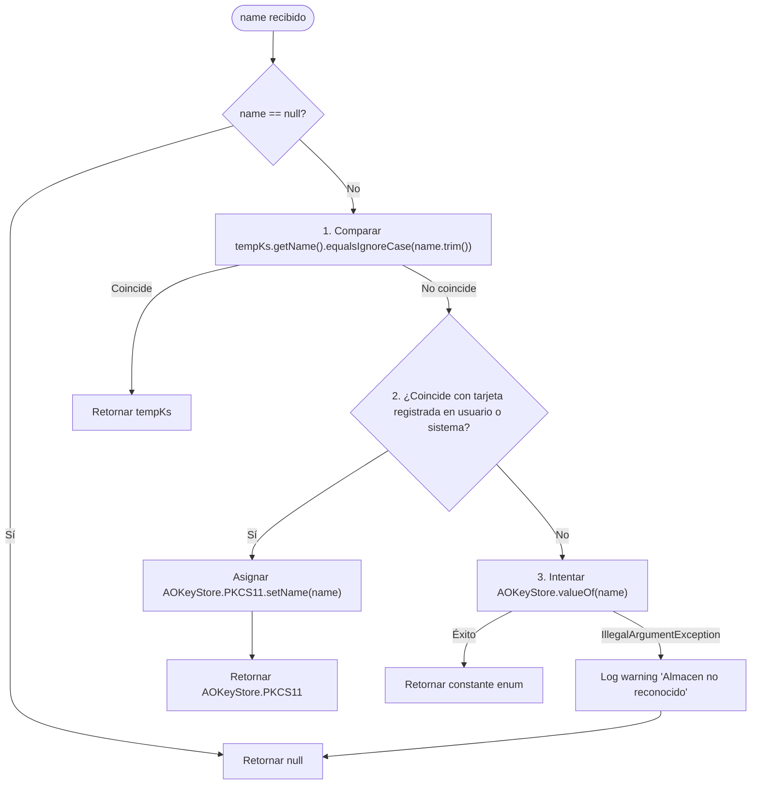
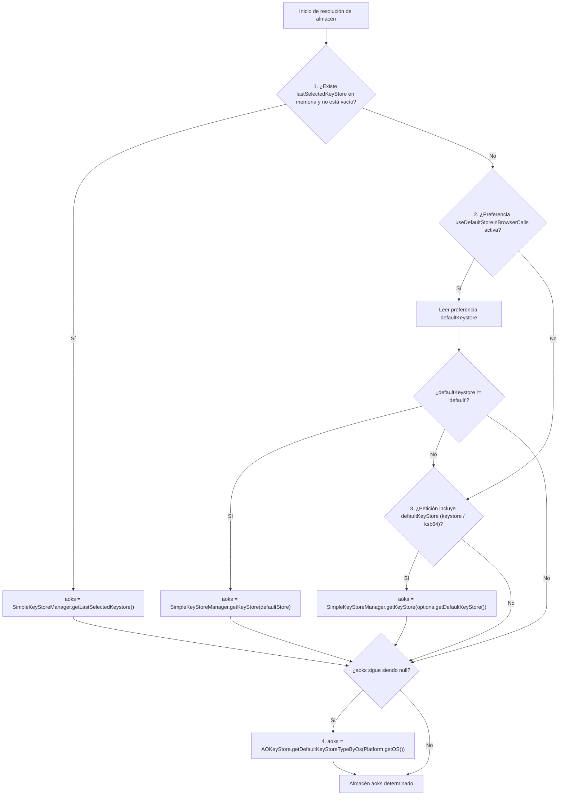
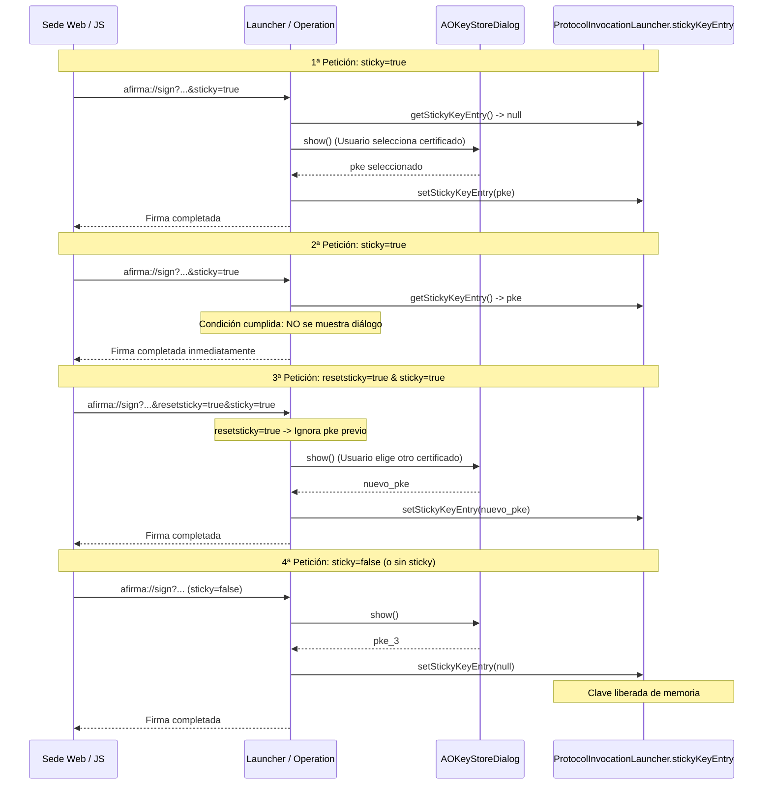

# 13. Almacenes de claves

Este capítulo describe cómo AutoFirma 1.9.2 gestiona, resuelve y utiliza los
almacenes de claves criptográficas y certificados en las invocaciones por el
protocolo `afirma://`. Se detallan los parámetros de entrada `keystore` y `ksb64`,
el catálogo completo de almacenes soportados por el núcleo (`AOKeyStore`), la
jerarquía de decisión para determinar qué almacén se utiliza en cada operación,
el manejo de bibliotecas nativas de dispositivos criptográficos, y el mecanismo
de sesión para fijar certificados mediante el uso de «certificado pegajoso»
(`sticky` y `resetsticky`).

Todas las citas al código corresponden al repositorio
[ctt-gob-es/clienteafirma](https://github.com/ctt-gob-es/clienteafirma) en el tag
`v1.9.2` (commit `b4fe147c3`).

---

## 1. Parámetros del protocolo para selección de almacén

Las operaciones que requieren acceso a claves o certificados (`sign`, `signandsave`,
`selectcert` y `batch`) permiten a la sede web solicitar un almacén específico o
precisar la biblioteca de un dispositivo PKCS#11 o la ruta de un fichero PKCS#12.

| Parámetro | Tipo | Origen en código | Descripción |
|---|---|---|---|
| `keystore` | Cadena en texto plano | `UrlParameters.java:63` (`KEYSTORE_OLD_PARAM`) | Parámetro histórico de AutoFirma 1.4.x. Formato `<nombre>[:<ruta_lib>]`. Marcado en código con `//TODO: Eliminar para terminar la compatibilidad con Autofirma 1.4.X`. |
| `ksb64` | Base64 | `UrlParameters.java:66` (`KEYSTORE_PARAM`) | Parámetro actual. Contiene la misma estructura `<nombre>[:<ruta_lib>]` codificada en Base64 para evitar problemas con caracteres reservados o rutas con espacios. |

Ambos parámetros son opcionales. En las operaciones `save` y `load` no se leen ni se
almacenan en sus respectivos objetos `UrlParametersToSave` y `UrlParametersToLoad`.

### 1.1 Precedencia y decodificación

El análisis de estos parámetros se centraliza en métodos protegidos estáticos de la
clase base `UrlParameters`:

* `getKeyStoreName(Map<String, String> params)` (`UrlParameters.java:384-412`)
* `getDefaultKeyStoreLib(Map<String, String> params)` (`UrlParameters.java:415-440`)

La regla de lectura es idéntica en ambos métodos:

```java
String ksValue = null;
if (params.get(KEYSTORE_OLD_PARAM) != null) {
    ksValue = params.get(KEYSTORE_OLD_PARAM);
}
else if (params.get(KEYSTORE_PARAM) != null) {
    try {
        ksValue = new String(Base64.decode(params.get(KEYSTORE_PARAM)));
    }
    catch (final Exception e) {
        // Interpretamos que no era Base64 y no se ha pasado un almacen valido
    }
}
```

Consecuencias directas:
1. **Precedencia de `keystore` sobre `ksb64`**: Si `params.get("keystore") != null`,
   se toma ese valor y **se ignora por completo** `ksb64`, incluso si `keystore` es
   una cadena vacía. Al comprobarse estrictamente `!= null` sin verificar `!isEmpty()`,
   si una petición incluye `keystore=&ksb64=...`, el parámetro legado vacío anula
   incondicionalmente al parámetro moderno `ksb64`. Posteriormente, el valor vacío `""`
   no coincide con ningún almacén en `SimpleKeyStoreManager.getKeyStore("")`, provocando
   la degradación al almacén por defecto del sistema operativo (Nivel 4). Por su parte,
   el cliente JavaScript de referencia `autoscript.js` elude esta anomalía al incluir
   `keystore` y `ksb64` únicamente cuando `defaultKeyStore != null && defaultKeyStore != "null"`
   (`autoscript.js:2880`).
2. **Fallback a Base64**: Solo si `keystore` está ausente (`null`), se evalúa `ksb64`.
   Si la decodificación falla, `ksValue` queda como `null`.
3. **Uso por el cliente JavaScript**: En `autoscript.js`, el cliente WebSocket solo
   envía `ksb64` (`autoscript.js:1946, 1963, 1993, 2014`). Los clientes de socket local
   y servidor intermedio envían **ambos** parámetros en la misma URI
   (`autoscript.js:2701-2702, 2835-2836, 2945-2946, 2968-2969, 3791-3792`),
   haciendo que en la práctica la aplicación de escritorio evalúe `keystore` en esos
   dos transportes.

### 1.2 Sintaxis del valor y separación de la biblioteca

El valor `ksValue` obtenido puede especificar únicamente el nombre del almacén o
combinarlo con la ruta de una biblioteca/fichero separada por dos puntos (`:`):

$$\text{ksValue} = \langle\text{nombre\_almacen}\rangle [ : \langle\text{ruta\_biblioteca}\rangle ]$$

* **Extracción del nombre (`getKeyStoreName`, `UrlParameters.java:399-411`)**:
  - Busca la posición del **primer** carácter `:` con `separatorPos = ksValue.indexOf(':')`.
  - Si `separatorPos == -1`, devuelve `ksValue` íntegro.
  - Si `ksValue.length() > 1` (y hay `:`), devuelve `ksValue.substring(0, separatorPos).trim()`.
  - Si no cumple lo anterior (por ejemplo, un `:` aislado), registra una advertencia en el log
    y devuelve `null`.
* **Extracción de la biblioteca (`getDefaultKeyStoreLib`, `UrlParameters.java:435-439`)**:
  - Si `separatorPos != -1 && separatorPos < ksValue.length() - 1`, extrae
    `ksValue.substring(separatorPos + 1)` y lo pasa por `cleanupPath(String)`.
  - En cualquier otro caso devuelve `null`.
* **Saneamiento de rutas (`cleanupPath`, `UrlParameters.java:447-456`)**:
  - Elimina comillas dobles y simples: `path.trim().replace("\"", "").replace("'", "")`.
  - Convierte a ruta canónica en disco: `new File(cleanedpath).getCanonicalPath()`.
  - Si el constructor o la resolución canónica fallan por sintaxis inválida en el SO,
    captura la excepción, registra un aviso y devuelve `null`.

#### Tratamiento de rutas de archivo absolutas y comportamiento en Windows

Dado que `separatorPos = ksValue.indexOf(':')` busca el **primer** carácter de dos puntos:
* **Formato canónico con prefijo de almacén (`PKCS12:C:\cert.p12` o `PKCS11:C:\lib\p11.dll`)**:
  El primer `:` se localiza tras el nombre del almacén (`separatorPos = 6`). El nombre extraído
  es `"PKCS12"`, mientras que la ruta enviada a `cleanupPath` es `"C:\cert.p12"` íntegra con su
  letra de unidad y dos puntos intactos (`ksValue.substring(separatorPos + 1)`), permitiendo a
  `cleanupPath` resolver la ruta canónica del archivo en disco sin incidencias.
* **Rutas absolutas de Windows sin prefijo (`C:\cert.p12`)**:
  Si un invocador omite el prefijo del almacén y pasa directamente una ruta absoluta de Windows
  en `keystore` o `ksb64`, el primer carácter `:` localizado es el separador de la letra de
  unidad (`separatorPos = 1`). Por consiguiente:
  1. `getKeyStoreName` extrae `"C"` como nombre de almacén (`ksValue.substring(0, 1)`).
  2. `SimpleKeyStoreManager.getKeyStore("C")` intenta resolverlo; al no coincidir con ningún
     `getName()` ni tarjeta registrada, evalúa `AOKeyStore.valueOf("C")`, arroja
     `IllegalArgumentException`, registra en el log `WARNING: Almacen de claves no reconocido (C)`
     y devuelve `null`.
  3. `getDefaultKeyStoreLib` extrae `\cert.p12` (`ksValue.substring(2)`), pero dado que el tipo
     de almacén resultó nulo, AutoFirma recurre a la jerarquía de resolución de Nivel 4 y asigna
     el almacén por defecto del sistema operativo (`AOKeyStore.WINDOWS`, CAPI).
  4. La aplicación abre el almacén de certificados de Windows e ignora por completo el fichero
     indicado.
  En sistemas Unix/Linux, al no existir dos puntos en una ruta como `/opt/cert.p12`, `separatorPos == -1`
  y la ruta completa se evalúa como nombre de almacén, fallando igualmente y degradando al almacén
  central (`SHARED_NSS`). Por tanto, la inclusión del prefijo `<nombre>:` es un requisito
  sintáctico estricto e indispensable del protocolo.

El resultado de estas funciones se guarda en los campos privados de `UrlParameters`:
`defaultKeyStore` (`UrlParameters.java:90, 135-137`) y `defaultKeyStoreLib`
(`UrlParameters.java:91, 147-149`), accesibles mediante sus respectivos *getters*.

---

## 2. Catálogo de almacenes (`AOKeyStore`)

El enum `AOKeyStore` (`afirma-core-keystores/src/main/java/es/gob/afirma/keystores/AOKeyStore.java:21-255`)
define todos los tipos de almacenes reconocidos en la plataforma @Firma. Cada entrada
asocia un nombre legible (`name`), un ordinal interno (`ordinal`), el nombre del
proveedor JCE subyacente (`providerName`), y dos *PasswordCallback* para la apertura
del almacén y para el acceso a certificados individuales.

| Constante Enum | Nombre legible (`getName()`) | Proveedor JCE (`providerName`) | Ordinal | PasswordCallback Almacén | PasswordCallback Certificado |
|---|---|---|:---:|---|---|
| `WINDOWS` | `"Windows"` | `"Windows-MY"` | 0 | `CachePasswordCallback("winmydummy")` | `NullPasswordCallback` |
| `APPLE` | `"Llavero de Mac"` | `"KeychainStore"` | 1 | `CachePasswordCallback("osxdummy")` | `CachePasswordCallback("osxdummy")` |
| `SHARED_NSS` | `"NSS"` | `"PKCS11"` | 2 | `NullPasswordCallback` | `UIPasswordCallback` |
| `PKCS12` | `"PKCS#12 / PFX"` | `"PKCS12"` | 3 | `UIPasswordCallback` | `UIPasswordCallback` |
| `JAVA` | `"Java KeyStore / JKS"` | `"JKS"` | 5 | `UIPasswordCallback` | `UIPasswordCallback` |
| `PKCS11` | `"PKCS#11"` | `"PKCS11"` | 6 | `NullPasswordCallback` | `UIPasswordCallback` |
| `SINGLE` | `"PKCS#7 / X.509"` | `"PKCS7"` | 7 | `NullPasswordCallback` | `NullPasswordCallback` |
| `MOZ_UNI` | `"Mozilla / Firefox (unificado)"` | `"PKCS11"` | 8 | `NullPasswordCallback` | `UIPasswordCallback` |
| `JCEKS` | `"Java Cryptography Extension KeyStore (JCEKS)"` | `"JCEKS"` | 9 | `UIPasswordCallback` | `UIPasswordCallback` |
| `JAVACE` | `"Java KeyStore / JKS (Case Exact)"` | `"CaseExactJKS"` | 10 | `UIPasswordCallback` | `UIPasswordCallback` |
| `TEMD` | `"TEMD (Tarjeta del Ministerio de Defensa)"` | `"PKCS11"` | 11 | `null` | `UIPasswordCallback` |
| `WINADDRESSBOOK` | `"Windows / Internet Explorer (otras personas / libreta de direcciones)"` | `"Windows-ADDRESSBOOK"` | 12 | `CachePasswordCallback("winotherdummy")` | `NullPasswordCallback` |
| `WINCA` | `"Windows / Internet Explorer (CA intermedias)"` | `"Windows-ROOT"` | 13 | `CachePasswordCallback("wincadummy")` | `NullPasswordCallback` |
| `CERES` | `"Tarjeta FNMT-RCM CERES"` | `"CERES"` | 14 | `null` | `null` |
| `DNIEJAVA` | `"DNIe y tarjetas FNMT-TIF"` | `"DNI"` | 15 | `null` | `null` |
| `KNOWN_SMARTCARDS` | `"Tarjetas inteligentes conocidas mediante PKCS#11"` | `"SMARTCARDS"` | 16 | `null` | `null` |
| `SMARTCAFE` | `"G&D SmartCafe con Applet PKCS#15"` | `"GDSCPKCS15"` | 17 | `null` | `null` |
| `CERES_430` | `"Tarjeta FNMT-RCM CERES 4.30 o superior"` | `"CERES430"` | 18 | `null` | `null` |
| `OTHER` | `"Tipo desconocido"` | `null` | 18 | `null` | `null` |

*(Nota sobre ordinales: `CERES_430` y `OTHER` comparten el número interno 18 en el constructor de `AOKeyStore.java:163, 175`).*

---

## 3. Resolución de nombres en `SimpleKeyStoreManager.getKeyStore(name)`

Cuando la URI o las preferencias proporcionan un nombre en formato cadena de texto,
se resuelve contra `AOKeyStore` a través de `SimpleKeyStoreManager.getKeyStore(final String name)`
(`afirma-simple/src/main/java/es/gob/afirma/standalone/SimpleKeyStoreManager.java:272-298`).

El método aplica estrictamente tres etapas secuenciales:



1. **Búsqueda por nombre legible (`getName()`)**: Itera sobre `AOKeyStore.values()` y
   compara `tempKs.getName().equalsIgnoreCase(name.trim())` (`SimpleKeyStoreManager.java:276-280`).
   Esta comprobación es **insensible a mayúsculas y minúsculas** sobre los nombres de visualización:
   permite utilizar indistintamente `"windows"`, `"WINDOWS"`, `"pkcs#11"`, `"PKCS#11"`,
   `"llavero de mac"`, `"nss"` o `"pkcs#12 / pfx"`.
2. **Búsqueda en registros de tarjetas inteligentes**: Consulta los mapas de tarjetas
   registradas en preferencias de usuario (`KeyStorePreferencesManager.getUserSmartCardsRegistered()`)
   y de sistema (`KeyStorePreferencesManager.getSystemSmartCardsRegistered()`)
   (`SimpleKeyStoreManager.java:281-289`). Esta búsqueda evalúa las claves registradas de forma
   sensible a mayúsculas (`containsKey(name)`). Si `name` coincide con una tarjeta configurada,
   muta la constante global `AOKeyStore.PKCS11` reasignando su campo mutable
   `result.setName(name)` y la devuelve. Esta mutación altera de forma permanente el estado global
   del singleton en la JVM, imposibilitando la resolución subsiguiente de `"PKCS#11"` por nombre
   en procesos persistentes (ver [BUG-24](A1-bugs-autofirma.md#bug-24-mutación-de-estado-global-en-el-singleton-aokeystorepkcs11-invalida-la-resolución-de-almacén-en-ejecuciones-concurrentes-o-persistentes)).
3. **Búsqueda por identificador del enum (`valueOf`)**: Si ninguna de las anteriores
   encaja, invoca `AOKeyStore.valueOf(name)` (`SimpleKeyStoreManager.java:291-296`).
   En Java, `Enum.valueOf` es **estrictamente sensible a mayúsculas y minúsculas**: exige la
   coincidencia exacta con el nombre de la constante enum (`"PKCS12"`, `"SHARED_NSS"`, `"WINDOWS"`,
   `"APPLE"`, `"DNIEJAVA"`, etc.). Si se proporciona en minúsculas (como `"pkcs12"` o
   `"shared_nss"`), arroja `IllegalArgumentException`, captura el error, registra en el log
   `WARNING: Almacen de claves no reconocido (<name>): java.lang.IllegalArgumentException` y
   retorna `null`. En ese caso, la aplicación concluye sin almacén explícito y delega en el
   almacén por defecto de la plataforma (Nivel 4).

---

## 4. Jerarquía de decisión del almacén en el protocolo

En las cuatro operaciones con certificados (`sign`, `signandsave`, `selectcert` y `batch`),
la selección final de `AOKeyStore aoks` sigue la misma cadena jerárquica de 4 niveles
(`ProtocolInvocationLauncherSign.java:275-303`,
`ProtocolInvocationLauncherSignAndSave.java:267-295`,
`ProtocolInvocationLauncherSelectCert.java:105-135`,
`ProtocolInvocationLauncherBatch.java:105-135`):



### 4.1 Nivel 1: Almacén previamente seleccionado en la sesión (`lastSelectedKeyStore`)

AutoFirma comprueba si durante la ejecución en curso del proceso se ha recordado
un almacén previo:
`final String lastSelectedKeyStore = KeyStorePreferencesManager.getLastSelectedKeystore();`

* Si no es nulo ni vacío, se invoca `SimpleKeyStoreManager.getLastSelectedKeystore()`
  (`SimpleKeyStoreManager.java:352-355`), que valida que el almacén siga siendo coherente
  con el SO (por ejemplo, si se indicó `MOZ_UNI`, verifica `isFirefoxAvailable()`).
* Este caso aplica en transportes con persistencia de proceso (socket o WebSocket)
  cuando se encadenan varias operaciones dentro de la misma sesión y el usuario ya
  había interactuado con un almacén o dispositivo específico.

### 4.2 Nivel 2: Forzado de almacén por preferencias de AutoFirma (`useDefaultStore`)

Si no hay almacén previo en sesión, se consulta la preferencia general:
`final boolean useDefaultStore = PreferencesManager.getBoolean(PreferencesManager.PREFERENCE_USE_DEFAULT_STORE_IN_BROWSER_CALLS);`
(Clave `"useDefaultStoreInBrowserCalls"`, `PreferencesManager.java:556`).

* Si está marcada (`true`), se lee la preferencia `defaultKeystore` (`PreferencesManager.java:547`).
* Si el valor no es el comodín `"default"` (`PreferencesManager.VALUE_KEYSTORE_DEFAULT`, `linea 550`),
  se resuelve dicho almacén con `SimpleKeyStoreManager.getKeyStore(defaultStore)`.
* **Impacto crítico**: Si esta preferencia está habilitada por el usuario en las opciones
  de AutoFirma, la aplicación **ignora por completo** lo que solicite la sede web en
  `keystore`/`ksb64`, anteponiendo la configuración local.

### 4.3 Nivel 3: Almacén explícito solicitado por la URI

Si `useDefaultStore` es falso (comportamiento por defecto):
`aoks = SimpleKeyStoreManager.getKeyStore(options.getDefaultKeyStore());`

Se utiliza el nombre extraído de `keystore` o `ksb64` procesado por `getKeyStoreName`.

### 4.4 Nivel 4: Almacén predeterminado según el sistema operativo

Si tras los pasos anteriores `aoks` sigue siendo `null`, se asigna el almacén base
de la plataforma mediante `AOKeyStore.getDefaultKeyStoreTypeByOs(Platform.getOS())`
(`AOKeyStore.java:265-278`):

| Sistema Operativo (`Platform.getOS()`) | Almacén devuelto | Tipo de almacén |
|---|---|---|
| `Platform.OS.WINDOWS` | `AOKeyStore.WINDOWS` | Almacén CAPI / CNG de Windows |
| `Platform.OS.MACOSX` | `AOKeyStore.APPLE` | Llavero de macOS (Keychain) |
| `Platform.OS.LINUX` | `AOKeyStore.SHARED_NSS` | NSS compartido de sistema (`.pki/nssdb`) |
| `Platform.OS.SOLARIS` | `AOKeyStore.MOZ_UNI` | Perfil de Mozilla / Firefox |
| Cualquier otro | `null` | No soportado |

---

## 5. Resolución de la biblioteca o ruta (`defaultKeyStoreLib`)

Cuando el almacén seleccionado requiere un controlador nativo o un fichero en disco
(especialmente `PKCS11` o `PKCS12`), se determina la ruta de la biblioteca
(`ProtocolInvocationLauncherSign.java:523-527`,
`ProtocolInvocationLauncherSignAndSave.java:514-518`,
`ProtocolInvocationLauncherSelectCert.java:128-132`,
`ProtocolInvocationLauncherBatch.java:240-244`):

```java
if (useDefaultStore && (AOKeyStore.PKCS12.equals(aoks) || AOKeyStore.PKCS11.equals(aoks))) {
    keyStoreLib = PreferencesManager.get(PreferencesManager.PREFERENCE_LOCAL_KEYSTORE_PATH);
} else {
    keyStoreLib = options.getDefaultKeyStoreLib();
}
```

### 5.1 Comportamiento durante la inicialización (`AOKeyStoreManagerFactory`)

La obtención del gestor del almacén se delega en `AOKeyStoreManagerFactory.getAOKeyStoreManager`
(`afirma-core-keystores/src/main/java/es/gob/afirma/keystores/AOKeyStoreManagerFactory.java:73-174`):

1. **Tokens PKCS#11 (`getPkcs11KeyStoreManager`, líneas 393-435)**:
   - Si se suministra una ruta (`p11Lib != null && !p11Lib.isEmpty()`):
     Comprueba estrictamente si el fichero existe (`new File(p11Lib).isFile()`).
     Si **no** existe, lanza inmediatamente `IOException("La biblioteca '" + p11Lib + "' no existe")`.
   - Si `p11Lib == null`:
     Abre un diálogo de exploración de archivos (`AOUIFactory.getLoadFiles`, líneas 423-433)
     con filtro según el SO (`.dll` en Windows, `.dylib` y `.so` en macOS, `.so` en Linux)
     para que el usuario localice manualmente el módulo PKCS#11.
2. **Almacenes de fichero PKCS#12 y JKS (`addFileKeyStoreManager`, líneas 176-214)**:
   - Si `lib` no es nulo, no está vacío y el fichero existe (`new File(lib).exists()`), se usa.
   - Si no existe o no se proporcionó, muestra un diálogo de selección de archivo
     (`AOUIFactory.getLoadFiles`, líneas 185-197) solicitando extensiones `.p12` o `.pfx`.
   - Si el usuario cancela la selección, lanza `AOCancelledOperationException`.
3. **Llavero de macOS (`getMacOSXKeyStoreManager`, líneas 567-599)**:
   - Si se especifica `lib`, abre el fichero Keychain indicado mediante `new FileInputStream(lib)`.
   - Si `lib` es nulo o vacío, inicializa el llavero por defecto del sistema
     (`KeyStore.getInstance("KeychainStore")`).
4. **Bandera de reinicio forzado (`FORCE_STORE_RESET`, líneas 46-60)**:
   - Lee la propiedad de sistema `es.gob.afirma.keystores.ForceReset`. Si vale `true`,
     fuerza a no reutilizar instancias cacheadas de los almacenes en memoria.

---

## 6. Almacenes agregados y controladores de tarjetas inteligentes

AutoFirma no se limita al almacén base del sistema; utiliza implementaciones de
`AggregatedKeyStoreManager` (`afirma-core-keystores/.../AggregatedKeyStoreManager.java`)
para fusionar en una única vista unificada los certificados del sistema con tarjetas
inteligentes y dispositivos conectados.

### 6.1 Implementación por sistema operativo

* **Windows (`CAPIUnifiedKeyStoreManager`, `AOKeyStoreManagerFactory.java:476-491`, `CAPIUnifiedKeyStoreManager.java:20-100`)**:
  - En un entorno estándar, carga en primer lugar el almacén CAPI (`CAPIKeyStoreManager`).
  - Detecta si el usuario está en un perfil temporal de Windows (`isTemporaryProfile()`, evaluando
    la variable de entorno `USERPROFILE` o usuario `TEMP`). En perfiles temporales omite CAPI
    y salta directamente a la búsqueda de tarjetas inteligentes.
  - A continuación añade los almacenes preferentes mediante `KeyStoreUtilities.addPreferredKeyStoreManagers`.
* **Linux (`SharedNssKeyStoreManager`, `SharedNssKeyStoreManager.java:20-50`)**:
  - Utiliza el proveedor SunPKCS11 sobre las bibliotecas NSS del sistema
    (`MozillaKeyStoreUtilities.loadNSS(true)`).
  - Busca bases de datos NSS compartidas en el siguiente orden (`SharedNssUtil.java:27-68`):
    1. `$HOME/.pki/nssdb` (perfil NSS de usuario, usado por Chrome/Chromium).
    2. `$HOME/snap/chromium/current/.pki/nssdb` (perfil Snap de Chromium).
    3. `/etc/pki/nssdb` (perfil NSS global del sistema).
  - Carga los módulos de seguridad externos instalados leyendo `pkcs11.txt`.
* **macOS (`AppleKeyStoreManager`, `AppleKeyStoreManager.java:31-100`)**:
  - Carga el Keychain mediante el proveedor nativo `KeychainStore`.
  - Invoca `KeyStoreUtilities.addPreferredKeyStoreManagers` para detectar lectores y tarjetas.

### 6.2 Controladores Java nativos preferentes (JMulticard y CERES)

`KeyStoreUtilities.addPreferredKeyStoreManagers(aksm, parentComponent)`
(`KeyStoreUtilities.java:395-435`) intenta cargar directamente controladores 100% Java
sin depender de los módulos PKCS#11 del sistema:

1. **DNIe nativo Java (`AOKeyStore.DNIEJAVA`)**:
   - Accede a la tarjeta mediante la biblioteca integrada JMulticard.
   - Se puede desactivar estableciendo la propiedad de sistema
     `-Des.gob.afirma.keystores.disablednie=true` o la variable de entorno
     `AFIRMA_DISABLE_DNIE_NATIVE_DRIVER=true` (`KeyStoreUtilities.java:397-398`).
2. **Tarjeta FNMT-CERES nativa Java (`AOKeyStore.CERES_430` / `CERES`)**:
   - Detecta e inicializa tarjetas criptográficas de la FNMT mediante controlador Java interno.
   - Se puede desactivar con `-Des.gob.afirma.keystores.disableceres=true` o la variable de
     entorno `AFIRMA_DISABLE_CERES_NATIVE_DRIVER=true` (`KeyStoreUtilities.java:418-419`).

### 6.3 Tarjetas conocidas vía PKCS#11 (`KnownSmartCardsPkcs11`)

Cuando no se utiliza el controlador Java preferente, `SmartCardUnifiedKeyStoreManager`
(`SmartCardUnifiedKeyStoreManager.java:179-245`) busca módulos PKCS#11 conocidos
instalados en rutas habituales del sistema:

* **CERES**: `FNMT_P11_x64.dll`, `FNMT_P11.dll` (en `%SYSTEMROOT%/System32` o `%SYSTEMROOT%/SysWOW64`).
* **CardOS**: `siecap11.dll`.
* **TUI**: `gclib.dll`, `libumupkcs11.dll`, `IDPrimePKCS1164.dll`, `IDPrimePKCS11.dll`.
* **SafeSign**: `aetpkss1.dll`.

### 6.4 Registro de tarjetas por usuario y sistema

El usuario o el administrador pueden registrar tarjetas adicionales en las preferencias
de Java (`KeyStorePreferencesManager.java:23-45`):
* Nodo de usuario: `/es/gob/afirma/core/keystores`
* Nodo de sistema: `/es/gob/afirma/core/systemkeystores`

Cada entrada almacena pares clave-valor con el nombre de la tarjeta y la ruta absoluta a
su controlador PKCS#11 (`.dll` o `.so`).

---

## 7. El certificado pegajoso (`sticky` y `resetsticky`)

El mecanismo «sticky» permite fijar y reutilizar un certificado (y su clave privada asociada)
a lo largo de varias operaciones consecutivas sin volver a abrir el diálogo gráfico de selección
ni solicitar de nuevo la confirmación del usuario en cada llamada.

### 7.1 Parámetros de la invocación

* **`sticky`** (booleano): Si es `true`, indica que la clave privada seleccionada en esta
  operación debe guardarse en memoria para reutilizarse en operaciones posteriores.
  Si es `false` (por defecto si se omite), invalida cualquier clave previamente guardada.
* **`resetsticky`** (booleano): Si es `true`, fuerza la ignorancia de cualquier clave
  previamente recordada, obligando a abrir el diálogo de selección de certificados.
  Si a la vez se especifica `sticky=true`, la nueva clave seleccionada pasará a ser
  la recordada.

Ambos parámetros se leen en `UrlParametersToSign` (`líneas 316-324`),
`UrlParametersToSignAndSave` (`líneas 310-318`), `UrlParametersToSelectCert` (`líneas 204-211`)
y `UrlParametersForBatch` (`líneas 305-313`) mediante `Boolean.parseBoolean(params.get(...))`.

### 7.2 Almacenamiento y ciclo de vida en memoria

El certificado pegajoso se guarda en una única variable estática en el despachador central
`ProtocolInvocationLauncher`:

```java
// ProtocolInvocationLauncher.java:90, 110-120
private static PrivateKeyEntry stickyKeyEntry = null;

public static PrivateKeyEntry getStickyKeyEntry() {
    return stickyKeyEntry;
}

public static void setStickyKeyEntry(final PrivateKeyEntry stickyKeyEntry) {
    ProtocolInvocationLauncher.stickyKeyEntry = stickyKeyEntry;
}
```

El uso de un único campo estático global a nivel de JVM carece de aislamiento por origen web
(`Origin`) o por identificador de sesión (`idsession`): la entrada fijada pertenece al proceso
y sobrevive a la operación que la fijó, hasta que otra la purgue (ver [BUG-06](A1-bugs-autofirma.md#bug-06-persistencia-de-certificado-sticky-en-campo-estático-de-jvm)).

### 7.3 Regla de evaluación y reutilización

Al iniciarse `sign`, `signandsave`, `selectcert` o `batch`, se evalúa la siguiente
condición (`ProtocolInvocationLauncherSign.java:515-520`, `SignAndSave:505-510`,
`SelectCert:136-140`, `Batch:232-236`):

$$\text{Reutilizar} \iff \text{options.getSticky()} \land \neg\text{options.getResetSticky()} \land (\text{stickyKeyEntry} \neq \text{null})$$



### 7.4 Limpieza e invalidación automática

1. **Fin de sticky voluntario**: Si una operación posterior se ejecuta con `sticky=false`
   (o sin el parámetro), el código ejecuta:
   `ProtocolInvocationLauncher.setStickyKeyEntry(stickySignatory ? pke : null);`
   fijándolo a `null` (`ProtocolInvocationLauncherSign.java:643`).
2. **Bloqueo de almacén (`LockedKeyStoreException`)**: Si durante la invocación criptográfica
   se detecta que el almacén de claves se ha bloqueado (por ejemplo, por agotar reintentos
   de PIN en un token o tarjeta), se libera la clave de inmediato antes de propagar el error:
   ```java
   catch (final LockedKeyStoreException e) {
       ProtocolInvocationLauncher.setStickyKeyEntry(null);
       throw new SocketOperationException(ERROR_LOCKED_KEYSTORE, e);
   }
   ```
   (`ProtocolInvocationLauncherSign.java:654-662`, `SignAndSave:683-691`).
3. **Error de PIN (`PinException`)**: Si el usuario introduce un PIN incorrecto en una
   tarjeta con driver nativo, AutoFirma **no descarta** la clave fija: captura la excepción,
   crea un filtro `EncodedCertificateFilter` restringido exclusivamente al certificado de `pke`,
   y vuelve a invocar `selectCertAndSign` para forzar la reapertura del almacén y solicitar
   nuevamente el PIN (`ProtocolInvocationLauncherSign.java:663-682`, `SignAndSave:692-711`).

### 7.5 Dependencia del transporte

El soporte de `sticky` está supeditado a la persistencia en memoria del proceso de AutoFirma:

* **Transporte B (Socket) y C (WebSocket)**: Como la instancia de la aplicación se mantiene viva
  escuchando peticiones mientras dura la sesión (o hasta vencer el temporizador de 90 s en socket),
  `stickyKeyEntry` se conserva intacto entre múltiples llamadas sucesivas.
* **Transporte A (Servidor intermedio / Invocación directa)**: `SimpleAfirma.main` invoca
  incondicionalmente `forceCloseApplication(0)` (`Runtime.getRuntime().halt(0)`) inmediatamente después
  de completar la operación y transmitir el resultado a `stservlet` (`SimpleAfirma.java:978-980`).
  Al destruirse de inmediato el proceso del sistema operativo y su JVM asociada, **el certificado
  pegajoso retenido en memoria se destruye de forma instantánea**.
  Por consiguiente, en el transporte clásico por servidor intermedio el parámetro `sticky=true`
  carece de cualquier efecto práctico persistente entre peticiones independientes: cada nueva invocación
  inicia un proceso desacoplado con una máquina virtual limpia (`stickyKeyEntry == null`) que volverá a
  exigir la selección de certificado.

---

## 8. Interacción con el diálogo de selección (`AOKeyStoreDialog`)

Cuando una operación abre la ventana modal de selección de certificados (`AOKeyStoreDialog`),
el usuario tiene la opción de alternar entre los distintos almacenes disponibles en el equipo
mediante un desplegable o un botón de almacén externo (`AOKeyStoreDialog.java:227-275`):

```java
public boolean changeKeyStoreManager(final int keyStoreId, final Object parent) {
    switch (keyStoreId) {
        case KEYSTORE_ID_MOZILLA:  newKsm = openMozillaKeyStore(parent); break;
        case KEYSTORE_ID_PKCS12:   newKsm = openPkcs12KeyStore(parent, null); break;
        case KEYSTORE_ID_DNIE:     newKsm = openDnieKeyStore(parent); break;
        case KEYSTORE_ID_SYSTEM:   newKsm = openSystemKeyStore(parent); break;
    }
    // ...
    setKeyStoreManager(newKsm);
    if (newKsm != null && newKsm.getType() != null) {
        KeyStorePreferencesManager.setLastSelectedKeystore(newKsm.getType().getName());
        KeyStorePreferencesManager.setLastSelectedKeystoreLib(ksLibPath);
    }
}
```

### 8.1 Actualización de estado en tiempo de ejecución

Al cambiar de almacén desde el diálogo, `AOKeyStoreDialog` actualiza directamente los campos
estáticos en memoria:
* `KeyStorePreferencesManager.setLastSelectedKeystore(name)` (`KeyStorePreferencesManager.java:365`)
* `KeyStorePreferencesManager.setLastSelectedKeystoreLib(path)` (`KeyStorePreferencesManager.java:381`)

Estos valores son los que consume el **Nivel 1** de la jerarquía de resolución en la siguiente
operación recibida por socket o WebSocket, recordando la última elección del usuario.

### 8.2 Restricción específica en Linux

En entornos Linux existe una restricción documentada explícitamente en el código de AutoFirma
(`AOKeyStoreDialog.java:389-410`):

> *«En linux no se puede cambiar entre el almacen central del sistema y el almacen de Mozilla
> por un error en NSS que sigue cargando el almacen que ya tuviese aunque se le indique otro.
> Por eso, solo damos la opcion de almacen central o almacen de Firefox, segun el almacen
> que se cargue primero».*

El método `getAvailablesKeyStores()` (`AOKeyStoreDialog.java:386-420`) comprueba el tipo del almacén
activo en memoria. Si la aplicación arrancó con `SHARED_NSS` (`this.ksm.getType() == AOKeyStore.SHARED_NSS`
o dentro del agregador), el vector devuelto para poblar el selector modal contiene exclusivamente:
`KEYSTORE_ID_SYSTEM`, `KEYSTORE_ID_PKCS12` y `KEYSTORE_ID_DNIE`, suprimiendo deliberadamente
`KEYSTORE_ID_MOZILLA`.

Esta limitación se debe a la arquitectura interna de la biblioteca nativa NSS de Mozilla (`libnss3.so`):
una vez que el proceso ha inicializado una base de datos NSS concreta (por ejemplo `$HOME/.pki/nssdb`),
intentar abrir o alternar hacia la base de datos de un perfil de Firefox dentro del mismo proceso
provoca conflictos de estado nativo en NSS o mantiene apuntando las consultas a la base de datos
inicial.

En consecuencia, una persona usuaria en Linux no puede alternar interactivamente hacia el almacén de
Mozilla Firefox si la invocación se inició con el almacén central del sistema. Para utilizar los
certificados del perfil de Firefox en Linux se requiere imprescindiblemente:
1. Que la petición web especifique explícitamente `keystore=MOZ_UNI` (o `Mozilla`), o
2. Que se configure en las preferencias locales de AutoFirma el almacén `Mozilla / Firefox (unificado)`
   como predeterminado (`useDefaultStoreInBrowserCalls=true`), garantizando que sea `MOZ_UNI` el primer
   almacén cargado por el proceso.


