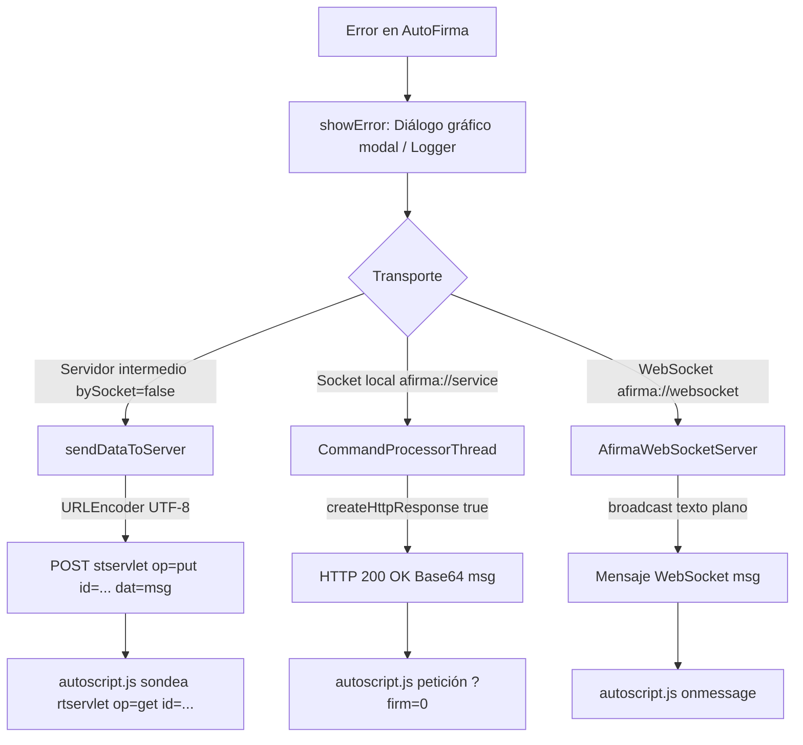

# 15. Catálogo de errores

Este capítulo documenta el sistema de gestión, notificación y propagación de
errores en las invocaciones por protocolo `afirma://` de AutoFirma 1.9.2. Se
detalla la arquitectura interna encabezada por
`ProtocolInvocationLauncherErrorManager`, el catálogo completo de códigos
`SAF_00` a `SAF_52`, la mecánica de transporte de cada error hacia la página
invocante según el canal utilizado (servidor intermedio, socket local TLS y
WebSocket TLS), las respuestas no numeradas (`CANCEL`, `MEMORY_ERROR`, `NULL`),
y el consumo de dichos errores por parte de `autoscript.js`.

Todas las citas corresponden al código fuente de
[ctt-gob-es/clienteafirma](https://github.com/ctt-gob-es/clienteafirma) en el tag
`v1.9.2` (commit `b4fe147c3`), con rutas relativas a la raíz de dicho repositorio.

---

## 1. Arquitectura de gestión de errores

La gestión de errores de invocación por protocolo en AutoFirma está centralizada
en la clase con visibilidad de paquete
`ProtocolInvocationLauncherErrorManager`
(`afirma-simple/src/main/java/es/gob/afirma/standalone/protocol/ProtocolInvocationLauncherErrorManager.java:23-186`).

### 1.1 El gestor central y el diccionario `ERRORS`

`ProtocolInvocationLauncherErrorManager` define como constantes públicas de
paquete los identificadores alfanuméricos de error `ERROR_*` con el prefijo
`SAF_` (`ProtocolInvocationLauncherErrorManager.java:31-83`). En su bloque de
inicialización estática (`87-141`), carga en una tabla de dispersión interna
`ERRORS` (`Hashtable<String, String>`, `85`) la correspondencia entre cada
código `SAF_nn` y su mensaje descriptivo en español, recuperado desde el paquete
de recursos de internacionalización `ProtocolMessages`
(`afirma-simple/src/main/resources/properties/protocolmessages.properties`).

Los mensajes expuestos hacia el exterior se componen mediante el método estático
`getErrorMessage(String code)` (`183-185`):

```java
static String getErrorMessage(final String code) {
    return code + ": " + ERRORS.get(code);
}
```

La cadena resultante sigue estrictamente el formato `SAF_nn: <Descripción>`.

### 1.2 Presentación gráfica modal y propiedad `HeadLess`

Siempre que se produce un error controlado o no recuperable durante la
ejecución de la aplicación nativa, se invoca a `showError` o `showErrorDetail`
(`ProtocolInvocationLauncherErrorManager.java:143-181`).

1. **Construcción del texto del diálogo**: El texto mostrado al usuario se forma
   concatenando el encabezado general `ProtocolLauncher.28` (*"Ha ocurrido un error realizando la operación."*)
   con el código y la descripción entre paréntesis:
   `desc = ProtocolMessages.getString("ProtocolLauncher.28") + "\n(" + code + ": " + message + ")"` (`152`).
2. **Evaluación de modo desatendido (`HEADLESS`)**: Se lee la propiedad de sistema
   `es.gob.afirma.protocolinvocation.HeadLess` mediante
   `Boolean.getBoolean("es.gob.afirma.protocolinvocation.HeadLess")` (`27-29`).
   Si dicha propiedad es `true`, no se abre ninguna ventana ni diálogo gráfico.
3. **Apertura de diálogo Swing**: Si `!HEADLESS`, se invoca a
   `AOUIFactory.showErrorMessage(desc, ProtocolMessages.getString("ProtocolLauncher.29"), AOUIFactory.ERROR_MESSAGE, t)`
   (`157-162`), mostrando una ventana modal de error con título `"Error"`
   (`ProtocolLauncher.29`) y el icono de error del sistema.
4. **Registro en log**: Tras la presentación en pantalla (o de forma exclusiva
   si es *headless*), se emite la traza en el log de la aplicación mediante
   `LOGGER.severe(desc)` (`164`).

### 1.3 Foco de ventana en macOS

En sistemas operativos macOS (`Platform.OS.MACOSX.equals(Platform.getOS())`),
antes de invocar el diálogo de error de `AOUIFactory`, el gestor fuerza el foco
hacia AutoFirma mediante `MacUtils.focusApplication()`
(`ProtocolInvocationLauncherErrorManager.java:154-156`,
`afirma-simple/src/main/java/es/gob/afirma/standalone/so/macos/MacUtils.java:31-41`).
Esto garantiza que la ventana modal no quede oculta tras el navegador web.

---

## 2. Propagación interna y formato de los mensajes

### 2.1 La excepción `SocketOperationException`

La clase `SocketOperationException`
(`afirma-simple/src/main/java/es/gob/afirma/standalone/protocol/SocketOperationException.java:18-47`)
es el vehículo principal para transferir códigos de error y excepciones internas
desde los procesadores específicos (`ProtocolInvocationLauncherSign`,
`ProtocolInvocationLauncherSignAndSave`, `ProtocolInvocationLauncherSelectCert`,
`ProtocolInvocationLauncherSave`, `ProtocolInvocationLauncherLoad`,
`ProtocolInvocationLauncherBatch`) hacia el despachador general
`ProtocolInvocationLauncher.launch()`.

Pese a su nombre, la excepción se utiliza de forma invertida respecto a lo
sugerido en su Javadoc:
> *«Error usado para indicar que es necesaria la comunicación por socket para realizar una operación.»*
> (`SocketOperationException.java:18-19`).

El propio despachador aclara esta contradicción en un comentario de diseño:
> *«TODO: Esta excepción actualmente se utiliza para gestionar los errores cuando la comunicación NO es por sockets (contrariamente a lo indicado en el javadoc de los métodos y la excepción). Debería cambiarse.»*
> (`ProtocolInvocationLauncher.java:217-222`).

La excepción encapsula un campo `errorCode` (`String`) y sobreescribe `getMessage()`:
```java
@Override
public String getMessage() {
    return super.getMessage() != null ? super.getMessage() : this.errorCode;
}
```
Si se utiliza el constructor simple `new SocketOperationException(code)`,
`super.getMessage()` es `null`, por lo que `getMessage()` devuelve el propio `code`.

### 2.2 Construcción del mensaje de error devuelto en `launch`

En las operaciones de firma (`sign`, `cosign`, `countersign`) y de firma con
guardado (`signandsave`), el bloque `catch (SocketOperationException e)` de
`ProtocolInvocationLauncher.java:697-716` y `588-607` construye el mensaje final
siguiendo esta cascada de tres ramas:

```java
String msg;
final String errorCode = e.getErrorCode();
if (RESULT_CANCEL.equals(errorCode)) {
    msg = errorCode; // "CANCEL"
} else if (!errorCode.equals(e.getMessage())) {
    msg = errorCode + ": " + e.getMessage();
} else {
    msg = ProtocolInvocationLauncherErrorManager.getErrorMessage(errorCode);
}
```

Consecuencias directas en el protocolo:
1. **Cancelación**: Si el código es `"CANCEL"`, el valor de `msg` es exactamente `"CANCEL"`.
2. **Mensaje causal personalizado**: Si la excepción subyacente contenía un mensaje
   propio (por ejemplo, una excepción criptográfica o de validación), `e.getMessage()`
   difiere de `errorCode`. En ese caso, la respuesta devuelta es
   `SAF_nn: <mensaje_de_la_excepción_Java>`, sustituyendo al texto oficial de
   `protocolmessages.properties`.
3. **Mensaje estándar**: Solo cuando `e.getMessage()` coincide con `errorCode`
   (o no hubo causa con mensaje), se devuelve la cadena oficial
   `SAF_nn: <Texto_ProtocolLauncher>`.

La distinción entre la segunda y la tercera rama la decide por completo el
constructor empleado al elevar la excepción: `new SocketOperationException(code)`
deja `super.getMessage()` a `null` y la sobreescritura de `getMessage()` devuelve
el propio `code`, activando la rama estándar; cualquiera de los otros dos
constructores propaga el mensaje de la causa (`SocketOperationException.java:21-34,
44-47`). El propio despachador reconoce esta heurística como provisional:
> *«TODO: Comprobar si realmente no tiene mensaje, en lugar de si el mensaje y el código son distintos»*
> (`ProtocolInvocationLauncher.java:705`).

Dos consecuencias delimitan lo que puede esperar un cliente del protocolo:

* **El prefijo `SAF_nn` se conserva siempre.** La sustitución afecta únicamente
  al texto descriptivo que sigue a los dos puntos, nunca al código: las tres
  ramas emiten `CANCEL` o una cadena que empieza por el `errorCode`. La
  comprobación `data.substr(0, 4) == "SAF_"` de `autoscript.js` (§6.1) no puede
  romperse por esta vía.
* **El texto que sigue al código no es parte del catálogo ni está traducido.**
  Cuando la excepción interna aporta mensaje, el literal de
  `protocolmessages.properties` no llega al llamante y en su lugar viaja el
  mensaje de la excepción Java subyacente, redactado por la biblioteca que la
  originó y sin paso alguno por el mecanismo de localización. Un cliente
  compatible debe discriminar por el código `SAF_nn` y tratar el resto de la
  cadena como diagnóstico opaco.

#### La rama de `getRequestorText()` es código muerto

Los tres procesadores que gestionan `RuntimeConfigNeededException` cierran su
cadena de `if` con un `else` que eleva
`new SocketOperationException(e.getRequestorText(), e.getMessage(), e)`
(`ProtocolInvocationLauncherSign.java:468, 832`,
`ProtocolInvocationLauncherSignAndSave.java:460, 855`). El valor de
`getRequestorText()` es una clave de recurso (`pdfShadowAttackSuspect`,
`signingLts`, `signingCertifiedPdf`, …), no un código `SAF_nn`, de modo que su
emisión rompería el reconocimiento de errores en la sede.

**Esa rama es inalcanzable en 1.9.2.** Se ejecuta solo si `getRequestType()`
devuelve un valor distinto de `CONFIRM` y de `PASSWORD`, y el enumerado
`RuntimeConfigNeededException.RequestType` declara exactamente esos dos valores
(`RuntimeConfigNeededException.java:80-85`). El campo es `final` y se fija en el
constructor (`:14, 29-51`), y las ocho subclases existentes pasan siempre una de
las dos constantes: `CONFIRM` en `SuspectedPSAException.java:17`,
`PdfIsCertifiedException.java:28`, `PdfHasUnregisteredSignaturesException.java:32`,
`PdfFormModifiedException.java:28`, `SigningLTSException.java:32, 42-43, 54-55` y
`AGEPolicyIncompatibilityException.java:51, 71`; `PASSWORD` en
`RuntimePasswordNeededException.java:21, 32, 45`, de la que derivan
`BadPdfPasswordException` y `PdfIsPasswordProtectedException`. Ninguna admite
`null`.

En consecuencia, una solicitud de configuración en tiempo de ejecución solo
puede desembocar en tres resultados observables por el protocolo: reintento de
la firma tras la confirmación o la contraseña, `CANCEL` si la persona usuaria
rechaza el diálogo, o `SAF_50` (`ERROR_CONFIRMATION_NEEDED`) si `headless=true`
impedía mostrarlo (`ProtocolInvocationLauncherSign.java:432-434, 793-795`,
`ProtocolInvocationLauncherSignAndSave.java:424-426, 821-823`).

### 2.3 Errores con detalle técnico (`showErrorDetail`)

Cuando se detecta un error de sintaxis o de parámetros (`ParameterException`),
el despachador no llama a `showError`, sino a
`ProtocolInvocationLauncherErrorManager.showErrorDetail(ERROR_PARAMS, e)`
(`ProtocolInvocationLauncher.java:359, 432, 519, 631, 741, 826`).
Este método concatena el mensaje de error general con el detalle de la excepción:
`message + "\n" + detail` (`ProtocolInvocationLauncherErrorManager.java:171-173`).
En el diálogo gráfico se muestran ambas líneas, mientras que hacia el llamador
se devuelve únicamente `ProtocolInvocationLauncherErrorManager.getErrorMessage(ERROR_PARAMS)`
(`"SAF_03: Error en los parámetros de entrada"`).

---

## 3. Propagación según el medio de transporte

La entrega de la respuesta de error a la aplicación invocante varía según el
transporte activo:



### 3.1 Transporte por servidor intermedio (`bySocket == false`)

En el transporte por servidor intermedio (invocación directa por URI del sistema):

1. **Codificación y subida**: El mensaje de error resultante (`msg`) se codifica
   en UTF-8 mediante `URLEncoder.encode(msg, StandardCharsets.UTF_8.toString())`
   y se envía al servlet de almacenamiento mediante
   `sendDataToServer(msg, params.getStorageServletUrl().toString(), params.getId())`
   (`ProtocolInvocationLauncher.java:601-604, 710-713`).
2. **Serialización y cancelación de espera activa**: `sendDataToServer` interrumpe
   el hilo de espera activa `activeWaitingThread` si estaba en marcha y adquiere
   el semáforo de `IntermediateServerUtil.getUniqueSemaphoreInstance()`
   (`ProtocolInvocationLauncher.java:870-889`).
3. **Fallo en la subida**: Si `IntermediateServerUtil.sendData` lanza una
   `IOException`, se muestra un diálogo de error adicional con código `SAF_11`
   (`ERROR_SENDING_RESULT`) (`ProtocolInvocationLauncher.java:882-885`).
4. **Cierre del proceso**: Tras enviar los datos y retornar `launch()`,
   `SimpleAfirma.main` invoca `forceCloseApplication(0)`, que llama a
   `Runtime.getRuntime().halt(0)` (`SimpleAfirma.java:978-980`, `454-456`).

El envío al servidor intermedio **solo se produce desde dos puntos** de cada
bloque de operación: el `catch (SocketOperationException e)` que recoge los
errores de la operación ya en curso y la entrega del resultado correcto
(`ProtocolInvocationLauncher.java:353, 426, 501, 603, 612, 712, 721, 808`).
Todo error detectado **antes** de llegar a esos puntos —URI nula, esquema
desconocido, operación no reconocida, sintaxis de parámetros, acceso local
bloqueado, versión mínima insatisfecha y fallo de recuperación o descifrado de
la configuración remota— se muestra en un diálogo local y se devuelve como valor
de retorno de `launch()`, valor que en este transporte nadie consume. Los
códigos afectados son `SAF_01`, `SAF_02`, `SAF_03`, `SAF_04`, `SAF_13`, `SAF_14`,
`SAF_15` y `SAF_16`, y en ningún caso alcanzan `stservlet`; es el defecto
[BUG-26](A1-bugs-autofirma.md#bug-26-los-errores-anteriores-al-inicio-de-la-operación-no-se-suben-al-servidor-intermedio-y-la-sede-los-percibe-como-autofirma-no-instalada).

### 3.2 Transporte por socket local (`afirma://service`, `bySocket == true`)

En la comunicación mediante socket local TCP con TLS:

1. **Códigos de estado HTTP**: Toda respuesta enviada por
   `CommandProcessorThread.createHttpResponse(boolean ok, String response)`
   utiliza la cabecera `HTTP/1.1 200 OK` incluso cuando transporta un error
   (`CommandProcessorThread.java:493-512`). El código `500 Internal Server Error`
   solo se generaría si `ok` fuera `false`, pero todas las llamadas del hilo
   pasan `ok = true` (`470, 483, 337, 340, 348`).
2. **Cuerpo codificado en Base64**: La cadena del error se codifica en Base64
   en una sola línea con `Base64.encode(response.getBytes(StandardCharsets.UTF_8), true)`.
3. **Entrega mediante fragmentación**:
   - En la petición `cmd=`, `launch()` devuelve el mensaje de error.
   - `CommandProcessorThread` calcula el número de partes con
     `calculateNumberPartsResponse(operationResult)` (`347`). Como los mensajes
     de error son cortos, `parts` vale `1`.
   - El socket responde primero con el número de partes (`"1"`).
   - En la subsiguiente petición HTTP `?firm=0`, se entrega el contenido del
     error codificado en Base64.
4. **Errores del propio canal socket**:
   - Falta de memoria (`OutOfMemoryError`): responde con el literal no numerado
     `MEMORY_ERROR` (`CommandProcessorThread.java:143, 481-487`).
   - Sesión incorrecta, lectura fallida u orden desconocida: responde con
     `SAF_03: Error en los parámetros de entrada` (`110, 116, 135`).
   - Cualquier fallo dentro de la orden —un `cmd=` que no es una operación
     `afirma://`, un `send=` fuera de rango, un `save` fallido o un error de
     envío—: responde con `SAF_11`, porque `processCommand` lo envuelve en
     `IOException` (`139`, `226-229`) (capítulo 04, §7.1).
   - El `SAF_09` del `catch (Exception)` final (`147`) no se alcanza en la
     práctica.
5. **Intento de subida al servidor intermedio pese a operar por socket**: En las
   operaciones `batch`, `selectcert`, `save` y `load`, el `catch
   (SocketOperationException e)` invoca `sendDataToServer` sin comprobar
   `bySocket`, sobre unos parámetros que en este transporte no llevan
   `stservlet`; el error real queda sustituido por un `NullPointerException`. Es
   el defecto
   [BUG-08](A1-bugs-autofirma.md#bug-08-invocación-incondicional-de-senddatatoserver-en-socketoperationexception-provoca-nullpointerexception-en-conexiones-por-socket).

### 3.3 Transporte por WebSocket (`afirma://websocket`, `bySocket == true`)

En la comunicación mediante WebSocket TLS:

1. **Emisión directa en texto plano**: El resultado devuelto por `launch()` se
   transmite sin codificación Base64 ni cabeceras HTTP adicionales mediante
   `broadcast(ProtocolInvocationLauncher.launch(message, PROTOCOL_VERSION, true), Collections.singletonList(ws))`
   (`AfirmaWebSocketServer.java:113-114`, `AfirmaWebSocketServerV4.java:91-92`).
2. **Validación de origen y sesión (WebSocket v4)**:
   - **IP remota no local**: Si `!isLocalAddress(remoteAddress)`, emite de
     inmediato `SAF_47: Peticion al socket desde IP externa o sin identificar`
     y descarta el mensaje (`AfirmaWebSocketServerV4.java:64-69`).
   - **ID de sesión no coincidente**: Si `sessionId` no coincide con el extraído
     del mensaje, emite `SAF_46: Id de sesión inválido` y descarta el mensaje
     (`AfirmaWebSocketServerV4.java:73-78`).
3. **Fallo en apertura de puertos al arrancar**: Si
   `AfirmaWebSocketServerManager.startService` no puede construir el servidor en
   ningún puerto (un puerto en uso no llega aquí, BUG-33),
   `launch()` captura `SocketOperationException`, muestra `SAF_45`
   (`ERROR_CANNOT_OPEN_SOCKET`) y fuerza el cierre inmediato del proceso con
   `forceCloseApplication(0)` (`ProtocolInvocationLauncher.java:246-251`).

### 3.4 Lotes monofásicos (`LocalBatchSigner`)

En la firma de lotes locales monofásicos (`LocalBatchSigner.java:47-91`):

1. Los errores ocurridos en documentos individuales dentro del lote no detienen
   necesariamente el proceso global, a menos que `batchConfig.isStopOnError()`
   sea `true` (`LocalBatchSigner.java:55, 66-72`).
2. El error de cada documento individual se captura como `SocketOperationException`
   y se almacena en un objeto `LocalSingleBatchResult` con resultado `ERROR_SIGN`
   (`"ERROR_PRE"`, `LocalBatchSigner.java:38`) y descripción igual a `e.getMessage()`
   (`LocalBatchSigner.java:74-75, 298-301`). Ese mensaje es el de la causa
   (`SocketOperationException.java:26-28`), no el código: los `SAF_33`, `SAF_34` y
   `SAF_35`, que solo emite este camino, no llegan a la sede ni al log
   (`LocalBatchSigner.java:64`). La sede recibe `ERROR_PRE` con el texto de la
   excepción de iText, como «El PDF esta certificado».
3. El resultado global del lote es un JSON construido por `JSONBatchManager.buildBatchResultJson`
   que reporta el estado individual de cada firma.

---

## 4. Catálogo completo de errores (`SAF_00` – `SAF_52`)

A continuación se detalla la totalidad de los 53 códigos de error definidos en
`ProtocolInvocationLauncherErrorManager.java:31-83`.

### 4.1 Tabla sinóptica de códigos SAF

| Código | Constante en código | Clave de recurso | Mensaje oficial en español | Ámbito / Operación | Referencias principales en código |
|---|---|---|---|---|---|
| `SAF_00` | `ERROR_CANNOT_READ_DATA` | `ProtocolLauncher.0` | No se han podido leer los datos a firmar | `sign`, `signandsave` | `ProtocolInvocationLauncherSign.java:374`, `ProtocolInvocationLauncherSignAndSave.java:366` |
| `SAF_01` | `ERROR_NULL_URI` | `ProtocolLauncher.1` | La URL recibida es nula | *Sin emisor*: ni la URI ni las opciones llegan nunca nulas (§4.2) | `ProtocolInvocationLauncher.java:168`, `ProtocolInvocationLauncherSignAndSave.java:125`, `ProtocolInvocationLauncherSelectCert.java:66` |
| `SAF_02` | `ERROR_UNSUPPORTED_PROTOCOL` | `ProtocolLauncher.2` | Protocolo no soportado | Despachador común | `ProtocolInvocationLauncher.java:175` |
| `SAF_03` | `ERROR_PARAMS` | `ProtocolLauncher.3` | Error en los parámetros de entrada | Común a todas las operaciones y socket | `ProtocolInvocationLauncher.java:274, 359, 432, 519, 631, 741, 826`, `CommandProcessorThread.java:110, 116, 135` |
| `SAF_04` | `ERROR_UNSUPPORTED_OPERATION` | `ProtocolLauncher.4` | Operación no soportada. Compruebe que dispone de la última versión de Autofirma. | Despachador común, `sign`, `signandsave`, `batch` | `ProtocolInvocationLauncher.java:841`, `ProtocolInvocationLauncherSign.java:733, 840`, `ProtocolInvocationLauncherSignAndSave.java:761, 863` |
| `SAF_05` | `ERROR_CANNOT_SAVE_DATA` | `ProtocolLauncher.5` | No se ha podido guardar los datos | *Sin emisor*: el fallo de escritura se captura en el diálogo, que avisa y vuelve a pedir destino (`JSEUIManager.java:808-824`) | `ProtocolInvocationLauncherSave.java:102`, `ProtocolInvocationLauncherSignAndSave.java:563` |
| `SAF_06` | `ERROR_UNSUPPORTED_FORMAT` | `ProtocolLauncher.6` | Formato de firma no soportado | `sign`, `signandsave`, `batch` | `ProtocolInvocationLauncherSign.java:269`, `ProtocolInvocationLauncherSignAndSave.java:261`, `LocalBatchSigner.java:113` |
| `SAF_07` | `ERROR_CANNOT_FIND_KEYSTORE` | `ProtocolLauncher.7` | No se ha podido determinar el almacén de claves a utilizar | *Huérfano* (no referenciado) | `ProtocolInvocationLauncherErrorManager.java:38, 95` |
| `SAF_08` | `ERROR_CANNOT_ACCESS_KEYSTORE` | `ProtocolLauncher.8` | Error accediendo al almacén de claves y certificados | `sign`, `signandsave`, `batch`, `selectcert` | `ProtocolInvocationLauncherSign.java:584, 626`, `ProtocolInvocationLauncherSignAndSave.java:613, 655`, `ProtocolInvocationLauncherSelectCert.java:158, 219`, `ProtocolInvocationLauncherBatch.java:259, 311` |
| `SAF_09` | `ERROR_SIGNATURE_FAILED` | `ProtocolLauncher.9` | Error realizando la firma electrónica | `sign`, `signandsave`, `batch`, socket | `ProtocolInvocationLauncherSign.java:854, 859`, `ProtocolInvocationLauncherSignAndSave.java:877, 882`, `LocalBatchSigner.java:256, 261`, `CommandProcessorThread.java:147` |
| `SAF_10` | `ERROR_NO_CERTIFICATES_SYSTEM` | `ProtocolLauncher.10` | No hay certificados de firma instalados en el sistema | *Huérfano* (no referenciado) | `ProtocolInvocationLauncherErrorManager.java:41, 98` |
| `SAF_11` | `ERROR_SENDING_RESULT` | `ProtocolLauncher.11` | Error en el envio del resultado de la operación. | Servidor intermedio, `save`, `selectcert`, `batch`, socket | `ProtocolInvocationLauncher.java:883`, `CommandProcessorThread.java:139`, `ProtocolInvocationLauncherBatch.java:210`, `ProtocolInvocationLauncherSave.java:124`, `ProtocolInvocationLauncherSelectCert.java:279` |
| `SAF_12` | `ERROR_ENCRIPTING_DATA` | `ProtocolLauncher.12` | Error en el cifrado de los datos a enviar | `sign`, `signandsave`, `batch`, `selectcert` | `ProtocolInvocationLauncherSign.java:200`, `ProtocolInvocationLauncherSignAndSave.java:198`, `ProtocolInvocationLauncherBatch.java:177`, `ProtocolInvocationLauncherSelectCert.java:251` |
| `SAF_13` | `ERROR_LOCAL_ACCESS_BLOCKED` | `ProtocolLauncher.13` | Se ha pedido acceso a una dirección local, pero por seguridad se ha bloqueado el acceso | Común (`save`, `signandsave`, `sign`, `load`) | `ProtocolInvocationLauncher.java:513, 625, 735, 820` |
| `SAF_14` | `ERROR_OBSOLETE_APP` | `ProtocolLauncher.14` | &lt;html&gt;La aplicación está obsoleta y no puede procesarse la petición.&lt;br&gt;Por favor, instale una versión actualizada y reintente el proceso de nuevo.&lt;/html&gt; | *Sin emisor*: solo en `catch` de una excepción que nadie lanza (§4.7) | `ProtocolInvocationLauncher.java:507, 619, 729, 814` |
| `SAF_15` | `ERROR_DECRYPTING_DATA` | `ProtocolLauncher.15` | Error en el descifrado de los datos | Descarga `rtservlet` (todas las operaciones con `fileid`) | `ProtocolInvocationLauncher.java:320, 397, 473, 563, 674, 781` |
| `SAF_16` | `ERROR_RECOVERING_DATA` | `ProtocolLauncher.16` | Error al recuperar los datos del servidor intermedio | Descarga `rtservlet` (todas las operaciones con `fileid`) | `ProtocolInvocationLauncher.java:314, 391, 467, 557, 668, 775` |
| `SAF_17` | `ERROR_UNKNOWN_SIGNER` | `ProtocolLauncher.17` | Los datos proporcionados no son una firma electrónica reconocida | `sign`, `signandsave`, `batch` (`cosign`, `countersign`) | `ProtocolInvocationLauncherSign.java:386`, `ProtocolInvocationLauncherSignAndSave.java:378`, `LocalBatchSigner.java:125` |
| `SAF_18` | `ERROR_DECODING_CERTIFICATE` | `ProtocolLauncher.18` | Error al descodificar el certificado de firma | *Sin emisor*: `getEncoded()` de un certificado ya cargado (§4.4) | `ProtocolInvocationLauncherSign.java:545`, `ProtocolInvocationLauncherSignAndSave.java:574`, `ProtocolInvocationLauncherSelectCert.java:236`, `ProtocolInvocationLauncherBatch.java:157, 348` |
| `SAF_19` | `ERROR_NO_CERTIFICATES_KEYSTORE` | `ProtocolLauncher.19` | No hay ningun certificado válido en su almacén. Compruebe las fechas de caducidad e instale un certificado válido. | `sign`, `signandsave`, `batch`, `selectcert` | `ProtocolInvocationLauncherSign.java:621`, `ProtocolInvocationLauncherSignAndSave.java:650`, `ProtocolInvocationLauncherSelectCert.java:210`, `ProtocolInvocationLauncherBatch.java:305` |
| `SAF_20` | `ERROR_LOCAL_BATCH_SIGN` | `ProtocolLauncher.20` | Error en el procesado del lote de firma. | `batch` local | `ProtocolInvocationLauncherBatch.java:386` |
| `SAF_21` | `ERROR_UNSUPPORTED_PROCEDURE` | `ProtocolLauncher.21` | La versión de Autofirma instalada no es compatible con este trámite.<br>Actualice a la última versión disponible. | Versión de protocolo > 4, o versiones socket/ws incompatibles | `ProtocolInvocationLauncher.java:242, 284`, `ProtocolInvocationLauncherSign.java:138`, `ProtocolInvocationLauncherBatch.java:81`, `ProtocolInvocationLauncherSelectCert.java:80`, `ProtocolInvocationLauncherSave.java:53`, `ProtocolInvocationLauncherLoad.java:64` |
| `SAF_22` | `ERROR_UNSOPPORTED_WEB_PROCEDURE` | `ProtocolLauncher.22` | El trámite web no es compatible con la versión de Autofirma instalada.<br>Consulte las instrucciones del trámite para saber que versión debe instalar. | *Huérfano* (no referenciado) | `ProtocolInvocationLauncherErrorManager.java:53, 110` |
| `SAF_23` | `ERROR_INVALID_POLICY` | `ProtocolLauncher.33` | Se ha establecido una política de firma no válida o parámetros no compatibles con ella. | `sign`, `signandsave` | `ProtocolInvocationLauncherSign.java:494`, `ProtocolInvocationLauncherSignAndSave.java:486` |
| `SAF_24` | `ERROR_RECOVERING_LOG` | `ProtocolLauncher.34` | Error al obtener el registro de log acumulado hasta la ejecución actual. | *Huérfano* (no referenciado) | `ProtocolInvocationLauncherErrorManager.java:55, 112` |
| `SAF_25` | `ERROR_CANNOT_LOAD_DATA` | `ProtocolLauncher.35` | Error en la lectura de los datos a cargar. | `load` | `ProtocolInvocationLauncherLoad.java:143` |
| `SAF_26` | `ERROR_CONTACT_BATCH_SERVICE` | `ProtocolLauncher.36` | Error en la comunicación con el servicio de firma de lotes. | `batch` trifásico / remoto | `ProtocolInvocationLauncherBatch.java:367` |
| `SAF_27` | `ERROR_BATCH_SIGNATURE` | `ProtocolLauncher.37` | El servicio informó de un error durante la firma del lote. | `batch` trifásico / remoto | `ProtocolInvocationLauncherBatch.java:371, 380, 387` |
| `SAF_28` | `ERROR_INVALID_PDF` | `ProtocolLauncher.38` | El fichero no es un PDF o es un PDF no soportado. | PAdES en `sign`, `signandsave`, `batch` | `ProtocolInvocationLauncherSign.java:756`, `ProtocolInvocationLauncherSignAndSave.java:784`, `LocalBatchSigner.java:196` |
| `SAF_29` | `ERROR_INVALID_XML` | `ProtocolLauncher.39` | Las firmas XAdES Enveloped solo pueden realizarse sobre datos XML. | XAdES Enveloped en `sign`, `signandsave`, `batch` | `ProtocolInvocationLauncherSign.java:761`, `ProtocolInvocationLauncherSignAndSave.java:789`, `LocalBatchSigner.java:201` |
| `SAF_30` | `ERROR_INVALID_DATA` | `ProtocolLauncher.40` | El formato de los datos a firmar no es adecuado para el tipo de firma seleccionado. | `sign`, `signandsave`, `batch` | `ProtocolInvocationLauncherSign.java:766`, `ProtocolInvocationLauncherSignAndSave.java:794`, `LocalBatchSigner.java:206` |
| `SAF_31` | `ERROR_NO_SIGN_DATA` | `ProtocolLauncher.41` | Los datos introducidos no se corresponden con un objeto de firma. | `sign`, `signandsave`, `batch` | `ProtocolInvocationLauncherSign.java:786`, `ProtocolInvocationLauncherSignAndSave.java:814`, `LocalBatchSigner.java:226` |
| `SAF_32` | `ERROR_FACE_ALREADY_SIGNED` | `ProtocolLauncher.42` | La factura ya tiene una firma electrónica y no admite firmas adicionales. | FacturaE en `sign`, `signandsave`, `batch` | `ProtocolInvocationLauncherSign.java:776`, `ProtocolInvocationLauncherSignAndSave.java:804`, `LocalBatchSigner.java:216` |
| `SAF_33` | `ERROR_PDF_WRONG_PASSWORD` | `ProtocolLauncher.43` | La contraseña proporcionada no es válida para el PDF actual o no se proporcionó ninguna contraseña. | *No llega a la sede*: PDF con clave en `batch` (§3.4) | `LocalBatchSigner.java:241` |
| `SAF_34` | `ERROR_PDF_UNREG_SIGN` | `ProtocolLauncher.44` | El PDF contiene firmas no registradas. | *No llega a la sede*: PDF en `batch` (§3.4) | `LocalBatchSigner.java:231` |
| `SAF_35` | `ERROR_PDF_CERTIFIED` | `ProtocolLauncher.45` | El PDF está certificado. | *No llega a la sede*: PDF en `batch` (§3.4) | `LocalBatchSigner.java:236` |
| `SAF_36` | `ERROR_CANNOT_FIND_SSL_KEYSTORE` | `ProtocolLauncher.46` | No se ha podido encontrar el almacén de claves SSL para la comunicación segura. Restaure la instalación de Autofirma para generar uno nuevo. | *Huérfano* (comentado en código) | `ProtocolInvocationLauncher.java:255` |
| `SAF_37` | `ERROR_CANNOT_ACCESS_SSL_KEYSTORE` | `ProtocolLauncher.47` | No se ha podido acceder al almacén de claves SSL para la comunicación segura. Restaure la instalación de Autofirma para generar uno nuevo. | *Huérfano* (comentado en código) | `ProtocolInvocationLauncher.java:256` |
| `SAF_38` | `ERROR_INVALID_FACTURAE` | `ProtocolLauncher.48` | El archivo que intenta firmar no es una factura electrónica reconocida. | FacturaE en `sign`, `signandsave`, `batch` | `ProtocolInvocationLauncherSign.java:771`, `ProtocolInvocationLauncherSignAndSave.java:799`, `LocalBatchSigner.java:211` |
| `SAF_39` | `ERROR_INVALID_SIGNATURE` | `ProtocolLauncher.49` | La firma de entrada no es válida. | Multifirma en `sign`, `signandsave`, `batch` | `ProtocolInvocationLauncherSign.java:479, 845`, `ProtocolInvocationLauncherSignAndSave.java:471, 868`, `LocalBatchSigner.java:251` |
| `SAF_40` | `ERROR_RECOVER_SERVER_DOCUMENT` | `ProtocolLauncher.50` | Error al recuperar el documento | Firma trifásica en `sign`, `signandsave`, `batch` | `ProtocolInvocationLauncherSign.java:751`, `ProtocolInvocationLauncherSignAndSave.java:779`, `LocalBatchSigner.java:191` |
| `SAF_41` | `ERROR_MINIMUM_VERSION_NON_SATISTIED` | `ProtocolLauncher.53` | El uso de este trámite web requiere una versión más reciente de Autofirma.<br>Actualice a la última versión disponible. | Parámetro `mcv` en todas las operaciones | `ProtocolInvocationLauncherSign.java:147`, `ProtocolInvocationLauncherSignAndSave.java:144`, `ProtocolInvocationLauncherSelectCert.java:93`, `ProtocolInvocationLauncherSave.java:66`, `ProtocolInvocationLauncherLoad.java:77`, `ProtocolInvocationLauncherBatch.java:94` |
| `SAF_42` | `ERROR_POSTPROCESSING_DATA` | `ProtocolLauncher.54` | Error al postprocesar una firma, probablemente debido a un plugin que afecte al sistema de firma. | *Solo con un plugin*: postproceso de firma en `sign`, `signandsave` (§4.5) | `ProtocolInvocationLauncherSign.java:205`, `ProtocolInvocationLauncherSignAndSave.java:203` |
| `SAF_43` | `ERROR_VISIBLE_SIGNATURE` | `ProtocolLauncher.55` | Error durante la firma visible del PDF. | Firma visible obligatoria en `sign`, `signandsave` | `ProtocolInvocationLauncherSign.java:181`, `ProtocolInvocationLauncherSignAndSave.java:179` |
| `SAF_44` | `ERROR_SIGN_WITHOUT_DATA` | `ProtocolLauncher.56` | La firma no contiene los datos y no se compatible con la configuración seleccionada | Multifirma detached en `sign`, `signandsave`, `batch` | `ProtocolInvocationLauncherSign.java:781`, `ProtocolInvocationLauncherSignAndSave.java:809`, `LocalBatchSigner.java:221` |
| `SAF_45` | `ERROR_CANNOT_OPEN_SOCKET` | `ProtocolLauncher.57` | No se pudo abrir un socket para la comunicación con la aplicación | *No llega a la sede*: sin servidor WebSocket no hay canal por el que responder (§3.3) | `ProtocolInvocationLauncher.java:248` |
| `SAF_46` | `ERROR_INVALID_SESSION_ID` | `ProtocolLauncher.58` | Id de sesión inválido | WebSocket v4 (`idsession` mismatch) | `AfirmaWebSocketServerV4.java:75` |
| `SAF_47` | `ERROR_EXTERNAL_REQUEST_TO_SOCKET` | `ProtocolLauncher.59` | Peticion al socket desde IP externa o sin identificar | WebSocket v4 (IP no local) | `AfirmaWebSocketServerV4.java:65` |
| `SAF_48` | `ERROR_PDF_SHADOW_ATTACK` | `ProtocolLauncher.63` | Posible PDF Shadow Attack | *Huérfano* (no referenciado) | `ProtocolInvocationLauncherErrorManager.java:79, 136` |
| `SAF_49` | `ERROR_SIGNING_LTS_SIGNATURE` | `ProtocolLauncher.64` | Multifirma de firma de archivo | *Huérfano* (no referenciado) | `ProtocolInvocationLauncherErrorManager.java:80, 137` |
| `SAF_50` | `ERROR_CONFIRMATION_NEEDED` | `ProtocolLauncher.65` | La operación puede generar firmas no validas, por lo que no se puede continuar sin confirmacion de usuario. | Headless o advertencia de shadow attack / solapamiento | `ProtocolInvocationLauncherSign.java:434, 795`, `ProtocolInvocationLauncherSignAndSave.java:426, 823` |
| `SAF_51` | `ERROR_INCOMPATIBLE_KEY_TYPE` | `ProtocolLauncher.66` | El tipo de clave del certificado no está soportado. | Incompatibilidad clave-algoritmo en `sign`, `signandsave`, `batch` | `ProtocolInvocationLauncherSign.java:638`, `ProtocolInvocationLauncherSignAndSave.java:667`, `LocalBatchSigner.java:99` |
| `SAF_52` | `ERROR_LOCKED_KEYSTORE` | `ProtocolLauncher.67` | El almacén de claves esta bloqueado. Siga las instrucciones del proveedor del almacén o tarjeta para desbloquearlo. | Bloqueo PIN tarjeta en `sign`, `signandsave`, `batch` | `ProtocolInvocationLauncherSign.java:656`, `ProtocolInvocationLauncherSignAndSave.java:684`, `ProtocolInvocationLauncherBatch.java:357` |

---

### 4.2 Errores de invocación y parseo de URI

* **`SAF_01` (`ERROR_NULL_URI`)**: Se genera cuando la URI completa recibida es nula
  (`ProtocolInvocationLauncher.java:166-171`), o cuando el objeto de opciones
  parseado resulta ser nulo en `signandsave` (`ProtocolInvocationLauncherSignAndSave.java:123-127`)
  o `selectcert` (`ProtocolInvocationLauncherSelectCert.java:64-73`).
  **La rama del despachador es código muerto:** ninguno de sus llamantes le
  pasa `null`. `SimpleAfirma.main` solo lo invoca si `args[0]` empieza por
  `afirma://` (`SimpleAfirma.java:957-962`); los servidores WebSocket le pasan
  el `message` recibido, que ya han desreferenciado antes con
  `message.startsWith(ECHO_REQUEST_PREFIX)` (`AfirmaWebSocketServer.java:103, 113`,
  `AfirmaWebSocketServerV4.java:81, 91`); y el canal de sockets, el resultado de
  un `toString()` (`CommandProcessorThread.java:293, 308, 334, 350`). Una
  petición vacía llega como cadena vacía y la rechaza `SAF_02`, no `SAF_01`.
  Las guardas de `signandsave` y `selectcert` tampoco saltan: el analizador
  siempre construye las opciones con `new`
  (`ProtocolInvocationUriParserUtil.java:158, 173`).
* **`SAF_02` (`ERROR_UNSUPPORTED_PROTOCOL`)**: Se arroja cuando la URI no
  comienza estrictamente por el prefijo `afirma://` en minúsculas
  (`ProtocolInvocationLauncher.java:172-178`).
* **`SAF_03` (`ERROR_PARAMS`)**: Es el código comodín de error de parámetros. Se produce ante:
  - Excepciones `ParameterException` en el parseo sintáctico de la query string de
    cualquier operación (`ProtocolInvocationLauncher.java:356, 429, 517, 629, 739, 824`).
  - Ausencia de la lista de puertos en la invocación de `afirma://service` (`ProtocolInvocationLauncher.java:272-277`).
  - Inconsistencias en los parámetros del lote (`batchpresignerurl` / `batchpostsignerurl`
    o datos requeridos) (`ProtocolInvocationLauncherBatch.java:343, 363`).
  - Peticiones HTTP en `CommandProcessorThread` con parámetros truncados, ID de sesión
    erróneo o que no representan una URI `afirma://` (`CommandProcessorThread.java:110, 116, 135`).
  - Argumentos ilegales (`IllegalArgumentException`) durante la configuración de firma
    (`ProtocolInvocationLauncherSign.java:746`, `ProtocolInvocationLauncherSignAndSave.java:774`).
* **`SAF_04` (`ERROR_UNSUPPORTED_OPERATION`)**: Se emite cuando el host/operación de la
  URI no coincide con ninguno de los prefijos reconocidos
  (`ProtocolInvocationLauncher.java:837-843`), o cuando la biblioteca criptográfica
  arroja `UnsupportedOperationException` (`ProtocolInvocationLauncherSign.java:838-841`,
  `ProtocolInvocationLauncherSignAndSave.java:861-864`). Las ramas `default` que lo
  asignan a una suboperación (`op` o `cop`) desconocida
  (`ProtocolInvocationLauncherSign.java:733`, `ProtocolInvocationLauncherSignAndSave.java:761`)
  no se alcanzan: esa suboperación llega como `null`, el `switch` lanza
  `NullPointerException` y la respuesta es `SAF_09`, tras pedir certificado y PIN
  ([BUG-15](A1-bugs-autofirma.md#bug-15-ausencia-de-validación-de-cop-en-signandsave-provoca-nullpointerexception-y-reporte-engañoso-con-saf_09)).
* **`SAF_13` (`ERROR_LOCAL_ACCESS_BLOCKED`)**: Disparado por la excepción
  `ParameterLocalAccessRequestedException` cuando se detecta que los servlets
  `stservlet` o `rtservlet` apuntan a direcciones locales prohibidas
  (`localhost`, `127.0.0.1`, `::1`)
  (`UrlParameters.java:279-281`, `ProtocolInvocationLauncher.java:512, 624, 734, 819`).
  La rama `batch` no lo emite: un pre/postsigner local acaba en `SAF_03`
  ([BUG-28](A1-bugs-autofirma.md#bug-28-un-servlet-del-lote-en-el-loopback-se-rechaza-con-saf_03-en-lugar-de-saf_13)).
* **`SAF_14` (`ERROR_OBSOLETE_APP`)**: Reservado para la excepción
  `ParameterNeedsUpdatedVersionException` (`ProtocolInvocationLauncher.java:504-509,
  616-621, 726-731, 811-816`), pero en la 1.9.2 no se emite: ver §4.7.
* **`SAF_21` (`ERROR_UNSUPPORTED_PROCEDURE`)**: Versión de protocolo de comunicación
  no admitida. Ocurre cuando `requestedProtocolVersion` es superior a `VERSION_4`
  (`ProtocolInvocationLauncherSign.java:133-140`, `ProtocolInvocationLauncherSave.java:49-58`, etc.),
  o cuando se solicita una versión no soportada por el servidor de socket local
  (distinta de 1, 2, 3) o WebSocket (distinta de 3, 4)
  (`ProtocolInvocationLauncher.java:240-245, 281-288`).
* **`SAF_41` (`ERROR_MINIMUM_VERSION_NON_SATISTIED`)**: Versión mínima de cliente no
  satisfecha. Ocurre cuando el parámetro `mcv` contiene una versión superior a la
  reportada por `SimpleAfirma.getVersion()` (`ProtocolInvocationLauncherSign.java:142-152`,
  `ProtocolInvocationLauncherSignAndSave.java:139-149`,
  `ProtocolInvocationLauncherSelectCert.java:88-98`, `ProtocolInvocationLauncherSave.java:61-71`,
  `ProtocolInvocationLauncherLoad.java:72-82`, `ProtocolInvocationLauncherBatch.java:89-99`).

---

### 4.3 Errores de comunicación y transporte

* **`SAF_11` (`ERROR_SENDING_RESULT`)**: Falla el envío de la respuesta al servidor
  intermedio (`IntermediateServerUtil.sendData` lanza `IOException`,
  `ProtocolInvocationLauncher.java:883`) o a través del socket local
  (`CommandProcessorThread.java:139`).
* **`SAF_12` (`ERROR_ENCRIPTING_DATA`)**: Error criptográfico (`GeneralSecurityException` o
  `IOException`) al intentar cifrar simétricamente con `key` el resultado de la operación
  antes de subirlo al servidor intermedio (`ProtocolInvocationLauncherSign.java:198-202`,
  `ProtocolInvocationLauncherSignAndSave.java:196-200`,
  `ProtocolInvocationLauncherSelectCert.java:249-256`,
  `ProtocolInvocationLauncherBatch.java:175-182`).
  La sede lo provoca con una `key` de ocho caracteres que no son ocho bytes, como
  ocho eñes: `verifyCipherKey` cuenta caracteres (`UrlParameters.java:327-344`) y
  `DesCipher` recibe sus dieciséis bytes en UTF-8, que la JDK rechaza como clave
  DES (`DesCipher.java:37`); es el BUG-34.
* **`SAF_15` (`ERROR_DECRYPTING_DATA`)**: Error al descifrar los datos descargados desde
  `rtservlet` mediante la clave simétrica proporcionada (`key`)
  (`ProtocolInvocationLauncher.java:319, 396, 472, 562, 673, 780`).
* **`SAF_16` (`ERROR_RECOVERING_DATA`)**: Error al realizar la petición HTTP GET contra
  `rtservlet` para recuperar los datos asociados al identificador `fileid`
  (`ProtocolInvocationLauncher.java:313, 390, 466, 556, 667, 774`).
* **`SAF_45` (`ERROR_CANNOT_OPEN_SOCKET`)**: El servidor WebSocket no pudo construirse
  en ninguno de los puertos pasados en `ports` ni en el puerto por defecto `63117`
  (`ProtocolInvocationLauncher.java:246-251`); un puerto en uso no llega aquí (BUG-33).
* **`SAF_46` (`ERROR_INVALID_SESSION_ID`)**: En WebSocket v4, el ID de sesión del mensaje
  no coincide con el `idsession` establecido durante el apretón de manos
  (`AfirmaWebSocketServerV4.java:73-78`).
* **`SAF_47` (`ERROR_EXTERNAL_REQUEST_TO_SOCKET`)**: En WebSocket v4, la dirección IP
  remota del cliente que envía el mensaje no es una dirección IP local de bucle invertido
  (`AfirmaWebSocketServerV4.java:63-70`).

---

### 4.4 Errores de almacén de claves y certificados

* **`SAF_08` (`ERROR_CANNOT_ACCESS_KEYSTORE`)**: Error al inicializar o acceder al almacén
  de certificados (`AOKeyStoreManagerFactory.getAOKeyStoreManager` o `getAliases()`),
  típicamente por fallo de inicialización de la biblioteca PKCS#11, token ausente, o
  PIN incorrecto (`ProtocolInvocationLauncherSign.java:584, 626`,
  `ProtocolInvocationLauncherSignAndSave.java:613, 655`,
  `ProtocolInvocationLauncherSelectCert.java:158, 219`,
  `ProtocolInvocationLauncherBatch.java:259, 311`).
* **`SAF_18` (`ERROR_DECODING_CERTIFICATE`)**: Falla la reconstrucción del objeto
  `X509Certificate` a partir de los bytes o de la cadena codificada del certificado
  (`CertificateException`) (`ProtocolInvocationLauncherSign.java:545`,
  `ProtocolInvocationLauncherSignAndSave.java:574`,
  `ProtocolInvocationLauncherSelectCert.java:236`,
  `ProtocolInvocationLauncherBatch.java:157, 348`).
  **En la práctica no tiene emisor:** la única llamada que lo produce es
  `getEncoded()` sobre el certificado que ya firmó, y un certificado que no se
  codifica falla antes, al cargar el almacén, con `SAF_08`.
* **`SAF_19` (`ERROR_NO_CERTIFICATES_KEYSTORE`)**: El almacén se abrió con éxito, pero
  no contiene ningún certificado, o ninguno de los disponibles cumple con los filtros
  especificados (`filters`, `filter`) o no es apto para firma
  (`ProtocolInvocationLauncherSign.java:621`,
  `ProtocolInvocationLauncherSignAndSave.java:650`,
  `ProtocolInvocationLauncherSelectCert.java:210`,
  `ProtocolInvocationLauncherBatch.java:305`).
* **`SAF_51` (`ERROR_INCOMPATIBLE_KEY_TYPE`)**: El tipo de clave privada del certificado
  seleccionado (p. ej. EC) es incompatible con el algoritmo solicitado (p. ej. `SHA256withRSA`),
  arrojando `AOIncompatibleKeyTypeException` (`ProtocolInvocationLauncherSign.java:638`,
  `ProtocolInvocationLauncherSignAndSave.java:667`, `LocalBatchSigner.java:99`).
* **`SAF_52` (`ERROR_LOCKED_KEYSTORE`)**: El dispositivo criptográfico hardware
  (tarjeta inteligente o token PKCS#11) ha quedado bloqueado por agotar los reintentos
  del PIN (`LockedKeyStoreException`) (`ProtocolInvocationLauncherSign.java:656`,
  `ProtocolInvocationLauncherSignAndSave.java:684`, `ProtocolInvocationLauncherBatch.java:357`).
  La excepción solo la lanzan los firmadores cuando JMulticard informa de
  `AuthenticationModeLockedException` (`AOPkcs1Signer.java:117-120`): hace falta una
  tarjeta DNIe o CERES bloqueada. Un token PKCS#11 bloqueado por SunPKCS11 falla al
  abrir sesión y da `SAF_08`.

---

### 4.5 Errores de operaciones de firma y formatos documentales

* **`SAF_00` (`ERROR_CANNOT_READ_DATA`)**: Error de E/S al leer los datos a firmar desde
  el sistema de ficheros local cuando se especificó una ruta con `filePath`
  (`ProtocolInvocationLauncherSign.java:374`, `ProtocolInvocationLauncherSignAndSave.java:366`).
* **`SAF_06` (`ERROR_UNSUPPORTED_FORMAT`)**: Formato de firma no soportado por el motor
  criptográfico (`AOSignerFactory.getSigner(format)` devuelve `null`)
  (`ProtocolInvocationLauncherSign.java:269`, `ProtocolInvocationLauncherSignAndSave.java:261`,
  `LocalBatchSigner.java:113`).
* **`SAF_09` (`ERROR_SIGNATURE_FAILED`)**: Fallo general en la generación de la firma
  electrónica (`AOSignatureException`, `GeneralSecurityException`), incluyendo fallos
  en el proveedor criptográfico o la tarjeta (`ProtocolInvocationLauncherSign.java:854, 859`,
  `ProtocolInvocationLauncherSignAndSave.java:877, 882`, `LocalBatchSigner.java:256, 261`).
* **`SAF_17` (`ERROR_UNKNOWN_SIGNER`)**: Los datos sobre los que se solicitó una cofirma
  o contrafirma no contienen una firma electrónica reconocida: con `format=auto`, `identifyFormatFromData`
  no devuelve formato para la firma previa (`ProtocolInvocationLauncherSign.java:386`,
  `ProtocolInvocationLauncherSignAndSave.java:378`, `LocalBatchSigner.java:125`). En la
  1.9.2 esas guardas no se alcanzan: el firmador nulo revienta antes con
  `NullPointerException` y la petición acaba en `SAF_03`
  ([BUG-27](A1-bugs-autofirma.md#bug-27-una-multifirma-con-formatauto-sobre-datos-que-no-son-una-firma-revienta-con-nullpointerexception-y-se-reporta-como-saf_03-en-lugar-de-saf_17)).
* **`SAF_23` (`ERROR_INVALID_POLICY`)**: Parámetros de política de firma inválidos o
  incompatibles con el formato seleccionado (`AOInvalidPolicyException`)
  (`ProtocolInvocationLauncherSign.java:494`, `ProtocolInvocationLauncherSignAndSave.java:486`).
* **`SAF_28` (`ERROR_INVALID_PDF`)**: El documento proporcionado para firma PAdES no es un
  fichero PDF válido o se encuentra gravemente corrupto (`InvalidPdfException`)
  (`ProtocolInvocationLauncherSign.java:756`, `ProtocolInvocationLauncherSignAndSave.java:784`,
  `LocalBatchSigner.java:196`).
* **`SAF_29` (`ERROR_INVALID_XML`)**: Se solicitó una firma XAdES Enveloped pero los datos
  proporcionados no son un XML parseable (`InvalidXMLException`)
  (`ProtocolInvocationLauncherSign.java:761`, `ProtocolInvocationLauncherSignAndSave.java:789`,
  `LocalBatchSigner.java:201`).
* **`SAF_30` (`ERROR_INVALID_DATA`)**: Los datos no se ajustan a la estructura exigida
  por el formato seleccionado (`AOException` genérica de formato)
  (`ProtocolInvocationLauncherSign.java:766`, `ProtocolInvocationLauncherSignAndSave.java:794`,
  `LocalBatchSigner.java:206`).
* **`SAF_31` (`ERROR_NO_SIGN_DATA`)**: No se encontraron firmas previas sobre las que
  aplicar una multifirma (`AOException` por falta de firmas)
  (`ProtocolInvocationLauncherSign.java:786`, `ProtocolInvocationLauncherSignAndSave.java:814`,
  `LocalBatchSigner.java:226`).
* **`SAF_32` (`ERROR_FACE_ALREADY_SIGNED`)**: El documento FacturaE ya contiene una firma
  electrónica y no admite firmas adicionales (`AOException` de factura ya firmada)
  (`ProtocolInvocationLauncherSign.java:776`, `ProtocolInvocationLauncherSignAndSave.java:804`,
  `LocalBatchSigner.java:216`).
* **`SAF_33` (`ERROR_PDF_WRONG_PASSWORD`)**: El PDF requiere contraseña y no se suministró,
  o la contraseña introducida es incorrecta (`PdfWrongPasswordException`)
  (`LocalBatchSigner.java:241`).
* **`SAF_34` (`ERROR_PDF_UNREG_SIGN`)**: El documento PDF contiene firmas electrónicas
  no registradas en los campos de formulario (`PdfUnregisteredSignException`)
  (`LocalBatchSigner.java:231`).
* **`SAF_35` (`ERROR_PDF_CERTIFIED`)**: El PDF se encuentra certificado y sus permisos
  prohíben la adición de nuevas firmas (`PdfIsCertifiedException`)
  (`LocalBatchSigner.java:236`).
* **`SAF_38` (`ERROR_INVALID_FACTURAE`)**: El fichero que se pretende firmar no se ajusta
  al esquema XML de FacturaE (`InvalidFacturaeException`)
  (`ProtocolInvocationLauncherSign.java:771`, `ProtocolInvocationLauncherSignAndSave.java:799`,
  `LocalBatchSigner.java:211`).
* **`SAF_39` (`ERROR_INVALID_SIGNATURE`)**: La estructura de la firma de entrada está dañada
  o es inválida para añadir una multifirma (`InvalidSignatureException`, `AOInvalidSignatureException`)
  (`ProtocolInvocationLauncherSign.java:479, 845`, `ProtocolInvocationLauncherSignAndSave.java:471, 868`,
  `LocalBatchSigner.java:251`).
* **`SAF_40` (`ERROR_RECOVER_SERVER_DOCUMENT`)**: Error en la recuperación remota del
  documento desde el servidor trifásico (`AOTriphaseException` durante la fase previa de descarga)
  (`ProtocolInvocationLauncherSign.java:751`, `ProtocolInvocationLauncherSignAndSave.java:779`,
  `LocalBatchSigner.java:191`).
* **`SAF_42` (`ERROR_POSTPROCESSING_DATA`)**: Fallo al ejecutar los complementos de
  postprocesado de la firma (`PostSignProcessor` / plugins)
  (`ProtocolInvocationLauncherSign.java:205`, `ProtocolInvocationLauncherSignAndSave.java:203`).
  **Solo lo alcanza un plugin:** el procesador nativo solo lanza `EncryptingException`,
  que es `SAF_12` (`NativeSignDataProcessor.java:82-83`); el `catch (Exception)` que da
  `SAF_42` es para el procesador en línea de un plugin (`ProtocolInvocationLauncherSign.java:223-244`),
  y una instalación sin plugins no lo emite.
* **`SAF_43` (`ERROR_VISIBLE_SIGNATURE`)**: Ocurre cuando la firma visible PDF está configurada
  como obligatoria y el usuario cancela la definición del área o falla su estampación
  (`VisibleSignatureMandatoryException`)
  (`ProtocolInvocationLauncherSign.java:181`, `ProtocolInvocationLauncherSignAndSave.java:179`).
* **`SAF_44` (`ERROR_SIGN_WITHOUT_DATA`)**: La firma previa es explícita (*detached*) y el
  cofirmante no encuentra ni el contenido encapsulado ni un atributo `messageDigest` generado
  con el mismo algoritmo de huella que el solicitado, por lo que no puede reconstruir aquello
  que debe firmar (`ContainsNoDataException`,
  `afirma-crypto-cades-multi/src/main/java/es/gob/afirma/signers/multi/cades/CAdESCoSigner.java:268-270`)
  (`ProtocolInvocationLauncherSign.java:781`, `ProtocolInvocationLauncherSignAndSave.java:809`,
  `LocalBatchSigner.java:221`). El mecanismo completo y el motivo por el que el protocolo no
  admite aportar los datos en una cofirma se detallan en el
  capítulo [06](06-operaciones-firma.md#61-despacho-de-la-operación-criptográfica).
* **`SAF_50` (`ERROR_CONFIRMATION_NEEDED`)**: Ocurre cuando la validación previa detecta
  un posible PDF Shadow Attack o solapamiento de firmas que requiere confirmación expresa
  del usuario (`RuntimeConfigNeededException` con `RequestType.CONFIRM`), pero la
  aplicación se ejecuta en modo desatendido (`headless=true`), abortando la operación
  sin poder mostrar el diálogo modal (`ProtocolInvocationLauncherSign.java:434, 795`,
  `ProtocolInvocationLauncherSignAndSave.java:426, 823`).

---

### 4.6 Errores de operaciones de guardado, carga y lotes

* **`SAF_05` (`ERROR_CANNOT_SAVE_DATA`)**: Cualquier excepción no cancelada del guardado
  (`ProtocolInvocationLauncherSave.java:102`, `ProtocolInvocationLauncherSignAndSave.java:563`).
  Un fallo de escritura no llega: `JSEUIManager.saveDataToFile` lo captura, muestra un
  error y vuelve a pedir destino (`JSEUIManager.java:808-824`); si la persona cancela,
  la sede recibe `CANCEL`.
* **`SAF_20` (`ERROR_LOCAL_BATCH_SIGN`)**: Fallo general en la orquestación del lote local
  monofásico (`ProtocolInvocationLauncherBatch.java:386`).
* **`SAF_25` (`ERROR_CANNOT_LOAD_DATA`)**: Error al leer los datos de los ficheros
  seleccionados en el diálogo de carga (`IOException`)
  (`ProtocolInvocationLauncherLoad.java:143`).
* **`SAF_26` (`ERROR_CONTACT_BATCH_SERVICE`)**: El servicio remoto de prelote o
  postlote (`batchpresignerurl` / `batchpostsignerurl`) responde con un error HTTP 4xx
  distinto de 400 (`ProtocolInvocationLauncherBatch.java:367`). Si no acepta la
  conexión, la 1.9.2 emite `SAF_27`
  ([BUG-29](A1-bugs-autofirma.md#bug-29-un-servicio-de-lotes-inalcanzable-se-reporta-como-saf_27-el-servicio-informó-de-un-error-en-lugar-de-saf_26)).
* **`SAF_27` (`ERROR_BATCH_SIGNATURE`)**: El servidor remoto de lotes devolvió un error
  lógico explícito en la respuesta del proceso de lote
  (`ProtocolInvocationLauncherBatch.java:371, 380, 387`).

---

### 4.7 Códigos huérfanos sin uso en código activo

Ocho de los 53 códigos definidos en `ProtocolInvocationLauncherErrorManager` no son
lanzados jamás por ninguna ruta de ejecución activa en AutoFirma 1.9.2. Las ocho
constantes se declaran (`ProtocolInvocationLauncherErrorManager.java:38, 41, 53,
55, 67, 68, 79, 80`) y se registran en el diccionario `ERRORS` (`:95, 98, 110,
112, 124, 125, 136, 137`), pero **ninguna instrucción ejecutable de ningún módulo
las referencia**: la única aparición de dos de ellas fuera del gestor está dentro
de un bloque comentado. Un cliente compatible no necesita contemplarlas.

1. **`SAF_07` (`ERROR_CANNOT_FIND_KEYSTORE`)** — *«No se ha podido determinar el
   almacén de claves a utilizar»*. La imposibilidad de resolver o abrir un almacén
   se notifica en su lugar con `SAF_08` (`ERROR_CANNOT_ACCESS_KEYSTORE`), emitido
   por los cinco procesadores de operación
   (`ProtocolInvocationLauncherSign.java:584, 626`,
   `ProtocolInvocationLauncherSignAndSave.java:613, 655`,
   `ProtocolInvocationLauncherSelectCert.java:158, 219`,
   `ProtocolInvocationLauncherBatch.java:259, 311`).
2. **`SAF_10` (`ERROR_NO_CERTIFICATES_SYSTEM`)** — *«No hay certificados de firma
   instalados en el sistema»*. El caso real —almacén abierto pero sin certificados
   admisibles— se notifica con `SAF_19` (`ERROR_NO_CERTIFICATES_KEYSTORE`)
   (`ProtocolInvocationLauncherSign.java:621`,
   `ProtocolInvocationLauncherSignAndSave.java:650`,
   `ProtocolInvocationLauncherSelectCert.java:210`,
   `ProtocolInvocationLauncherBatch.java:305`).
3. **`SAF_22` (`ERROR_UNSOPPORTED_WEB_PROCEDURE`)** — *«El trámite web no es
   compatible con la versión de Autofirma instalada»*. Es el código complementario
   de `SAF_21` para el caso en que el desactualizado es el trámite y no la
   aplicación. El único punto del programa donde su emisión estaba prevista es la
   rama negativa del operador ternario de `ProtocolInvocationLauncher.java:283-285`,
   que por error de copia repite `SAF_21`; véase
   [BUG-25](A1-bugs-autofirma.md#bug-25-colapso-de-la-distinción-entre-protocolo-obsoleto-y-protocolo-no-soportado-en-el-arranque-de-canales-locales).
4. **`SAF_24` (`ERROR_RECOVERING_LOG`)** — *«Error al obtener el registro de log
   acumulado hasta la ejecución actual»* (`protocolmessages.properties:ProtocolLauncher.34`).
   El protocolo `afirma://` de 1.9.2 no define ninguna operación de recuperación
   del log, por lo que no existe ruta que pueda emitirlo.
5. **`SAF_36` (`ERROR_CANNOT_FIND_SSL_KEYSTORE`)** — *«No se ha podido encontrar el
   almacén de claves SSL para la comunicación segura»*. El bloque
   `catch (GeneralSecurityException | IOException)` del arranque del canal WebSocket
   que lo emitía está comentado íntegramente
   (`ProtocolInvocationLauncher.java:252-259`).
6. **`SAF_37` (`ERROR_CANNOT_ACCESS_SSL_KEYSTORE`)** — *«No se ha podido acceder al
   almacén de claves SSL para la comunicación segura»*. Es la rama alternativa del
   mismo bloque comentado (`ProtocolInvocationLauncher.java:255-256`). Al no
   capturarse ya esas excepciones en el arranque del canal, los fallos del almacén
   SSL quedan absorbidos aguas abajo; véase
   [BUG-10](A1-bugs-autofirma.md#bug-10-silenciamiento-de-excepciones-en-serviceinvocationmanagerstartservice-y-retorno-erróneo-de-ok-tras-fallo-de-inicialización-del-socket).
7. **`SAF_48` (`ERROR_PDF_SHADOW_ATTACK`)** — *«Posible PDF Shadow Attack»*
   (`protocolmessages.properties:ProtocolLauncher.63`). La detección existe y está
   activa —`configurePdfSignature` fuerza `pagesToCheckShadowAttack=10` cuando no
   se autorizó explícitamente el ataque
   (`ProtocolInvocationLauncherSign.java:866-871`)—, pero se materializa como
   `SuspectedPSAException`, subclase de `RuntimeConfigNeededException` con
   `RequestType.CONFIRM` (`SuspectedPSAException.java:9-18`). Su desenlace es por
   tanto el descrito en §2.2: confirmación, `CANCEL` o `SAF_50` en modo desatendido.
8. **`SAF_49` (`ERROR_SIGNING_LTS_SIGNATURE`)** — *«Multifirma de firma de archivo»*
   (`protocolmessages.properties:ProtocolLauncher.64`). Igual que el anterior: la
   cofirma o contrafirma de una firma con sellos de archivo eleva
   `SigningLTSException`, también subclase de `RuntimeConfigNeededException` con
   `RequestType.CONFIRM` (`SigningLTSException.java:17-56`), que se resuelve por la
   vía de confirmación y nunca por un código propio.

Los dos últimos comparten causa: la incorporación en versiones posteriores del
mecanismo de configuración en tiempo de ejecución sustituyó el error terminal por
un diálogo de confirmación, y los códigos previstos para la vía terminal quedaron
en el diccionario sin emisor.

`SAF_14` (`ERROR_OBSOLETE_APP`) no está en la lista porque sí lo referencian
instrucciones ejecutables, pero tampoco llega nunca al cable: solo lo emiten los
cuatro `catch (ParameterNeedsUpdatedVersionException)` del despachador
(`ProtocolInvocationLauncher.java:504, 616, 726, 811`), y esa excepción no la
lanza nadie. nadie la instancia: su constructor es de paquete (`ParameterNeedsUpdatedVersionException.java:18`) y no hay ningún `new` en el repositorio.

---

## 5. Respuestas de error no numeradas y especiales

Junto a los códigos `SAF_nn`, existen respuestas literales no numeradas:

### 5.1 Respuesta `CANCEL`

Indica que el usuario abortó voluntariamente la operación interactiva en curso.

* **Origen**: Se genera cuando el usuario pulsa «Cancelar» o cierra el diálogo de:
  - Selección de certificado (`ProtocolInvocationLauncherSelectCert.java:294`,
    `ProtocolInvocationLauncherSign.java:617`, `ProtocolInvocationLauncherSignAndSave.java:646`).
  - Petición de PIN o contraseña de almacén / tarjeta (`ProtocolInvocationLauncherSign.java:836, 850`).
  - Diálogo para seleccionar el fichero o sobreescritura en guardado (`ProtocolInvocationLauncherSave.java:96, 98, 143`,
    `ProtocolInvocationLauncherSignAndSave.java:559`).
  - Diálogo de selección de fichero en carga (`ProtocolInvocationLauncherLoad.java:155`).
  - Diálogo de advertencia de shadow attack o solapamiento (`ProtocolInvocationLauncherSign.java:445`,
    `ProtocolInvocationLauncherSignAndSave.java:437`).
  - Cancelación de selección de fichero de lote (`ProtocolInvocationLauncherBatch.java:137, 139, 427`).
* **Formato**: Literal `"CANCEL"` (o `"CANCEL\r\n"` / `"CANCEL\n"`).
* **Mapeo en `autoscript.js`**:
  `autoscript.js:2330, 3360, 3405, 4471` evalúa:
  ```javascript
  if (data == undefined || data == null || data == "CANCEL") {
      errorCallback("es.gob.afirma.core.AOCancelledOperationException", "Operacion cancelada por el usuario");
      return;
  }
  ```

### 5.2 Respuesta `MEMORY_ERROR`

* **Origen**: Producido exclusivamente en el transporte por socket local cuando
  `CommandProcessorThread` captura un `java.lang.OutOfMemoryError` durante la
  recepción o tratamiento de comandos (`CommandProcessorThread.java:142-145, 481-487`).
* **Formato**: Literal `"MEMORY_ERROR"` enviado en el cuerpo de una respuesta HTTP 200
  codificada en Base64 (`CommandProcessorThread.java:483, 508`).
* **Mapeo en `autoscript.js`**:
  `autoscript.js:2312, 3131, 3199, 3251, 3292, 3405`:
  ```javascript
  if (data == "MEMORY_ERROR") {
      processErrorResponse("es.gob.afirma.core.OutOfMemoryError",
          "El fichero que se pretende firmar o guardar excede de la memoria disponible para aplicacion");
      return;
  }
  ```

### 5.3 Tratamiento de `NULL` en el cliente JavaScript

El literal `"NULL"` no es generado activamente por el código Java de AutoFirma,
pero `autoscript.js` lo contempla como salvaguarda defensiva ante respuestas
vacías de servlets intermediarios o fallos del navegador
(`autoscript.js:2324, 3372, 3417, 3518`):
```javascript
if (data == "NULL") {
    processErrorResponse("java.lang.Exception", "Error desconocido");
    return;
}
```

### 5.4 Errores propios de los servlets del servidor intermedio (`ERR-01` a `ERR-11`)

Cuando la comunicación utiliza un servidor intermedio (`StorageService` y
`RetrieveService` en los módulos `afirma-signature-storage` y `afirma-signature-retriever`),
los propios servlets HTTP pueden emitir errores no relacionados con AutoFirma
escritorio si falla la manipulación en el servidor:

| Código de servlet | Significado en el servidor intermedio | Cita en código |
|---|---|---|
| `ERR-01` | Código de operación no soportado (`ERROR_UNSUPPORTED_OPERATION_NAME`) | `StorageService.java:135`, `RetrieveService.java:86` |
| `ERR-02` | Falta la sintaxis requerida del parámetro de operación (`ERROR_SYNTAX_ERROR`) | `StorageService.java:141`, `RetrieveService.java:93` |
| `ERR-03` | Parámetros obligatorios ausentes (`ERROR_MISSING_DATA`) | `StorageService.java:147`, `RetrieveService.java:100` |
| `ERR-04` | No se pudieron almacenar los datos (`ERROR_CANNOT_STORE_DATA`) | `StorageService.java:154` |
| `ERR-05` | El identificador de datos no existe o expiró (`ERROR_EXPIRED_DATA`) | `RetrieveService.java:107` |
| `ERR-06` | El identificador para los datos es inválido (`ERROR_INVALID_DATA_ID`) | `RetrieveService.java:133` |
| `ERR-07` | Los datos solicitados o enviados son inválidos (`ERROR_INVALID_DATA`) | `StorageService.java:174`, `RetrieveService.java:149` |
| `ERR-08` | Fallo de base de datos o sistema de almacenamiento (`ERROR_INTERNAL_DATABASE`) | `StorageService.java:181`, `RetrieveService.java:156` |
| `ERR-09` | Tamaño de datos superior al límite permitido (`ERROR_DATA_EXCEEDS_MAX_SIZE`) | `StorageService.java:188` |
| `ERR-10` | Error de autenticación / acceso no autorizado (`ERROR_UNAUTHORIZED`) | `StorageService.java:195`, `RetrieveService.java:163` |
| `ERR-11` | El registro solicitado ya se encuentra completado (`ERROR_RECORD_COMPLETED`) | `StorageService.java:202` |

---

## 6. Consumo de errores en el cliente JavaScript (`autoscript.js`)

El script de despliegue `autoscript.js` centraliza la captura de respuestas
erróneas en las funciones de procesamiento de cada cliente:

* `AppAfirmaWebSocketClient.onMessage` (`autoscript.js:2310-2340`)
* `AppAfirmaJSSocket.send` / `onSocketResponse` (`autoscript.js:3355-3385, 3400-3430`)
* `AppAfirmaJSWebService.onServiceResponse` (`autoscript.js:4470-4500`)

### 6.1 Detección del prefijo `SAF_`

En todos los clientes, la condición para identificar un error emitido por
AutoFirma es idéntica:
```javascript
if (data.length > 4 && data.substr(0, 4) == "SAF_") {
    processErrorResponse("java.lang.Exception", data);
    return;
}
```
`autoscript.js` no parsea el número específico del código `SAF_nn` ni traduce su
texto: traslada la cadena íntegra devuelta por AutoFirma al callback de error
definido por la sede web (`errorCallback`).

### 6.2 Mapeo de tipos de excepción reportados

El callback de error de la sede web recibe dos argumentos:
`errorCallback(exceptionClass, message)`. Los nombres de clase Java emulados son:

1. `java.lang.Exception`: Utilizado para todos los errores `SAF_nn` y para errores
   desconocidos (`"NULL"`). El mensaje contiene la cadena completa `SAF_nn: <detalle>`.
2. `es.gob.afirma.core.AOCancelledOperationException`: Utilizado cuando el resultado
   es `"CANCEL"`, con mensaje `"Operacion cancelada por el usuario"`.
3. `es.gob.afirma.core.OutOfMemoryError`: Utilizado cuando el socket devuelve
   `"MEMORY_ERROR"`, con mensaje
   `"El fichero que se pretende firmar o guardar excede de la memoria disponible para aplicacion"`.
4. `es.gob.afirma.standalone.ApplicationNotFoundException`: Generado localmente en
   el navegador cuando expiran los reintentos de conexión por socket o WebSocket
   sin que AutoFirma haya respondido al `echo=` (`autoscript.js:2182, 3014`).
