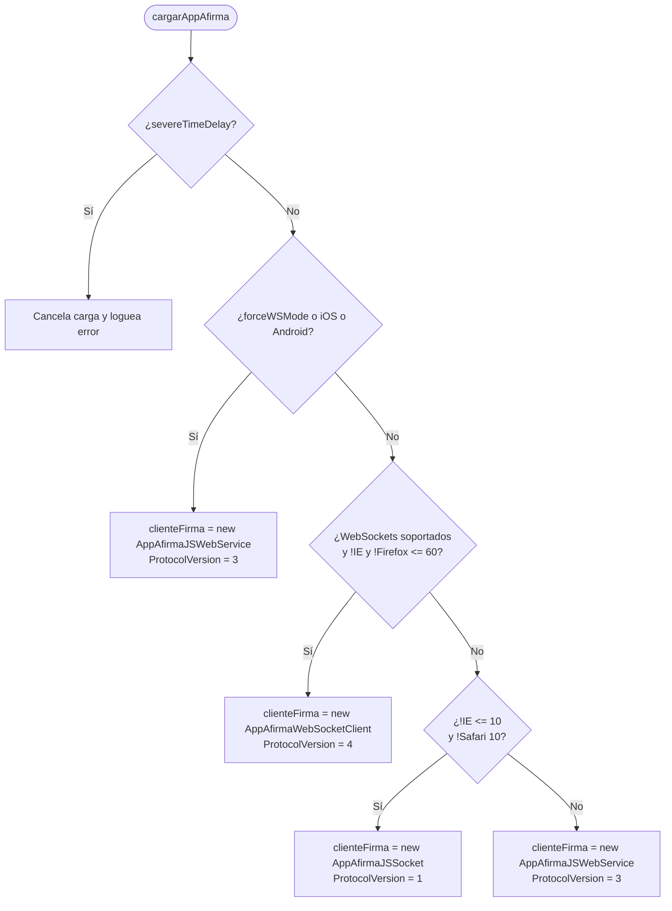
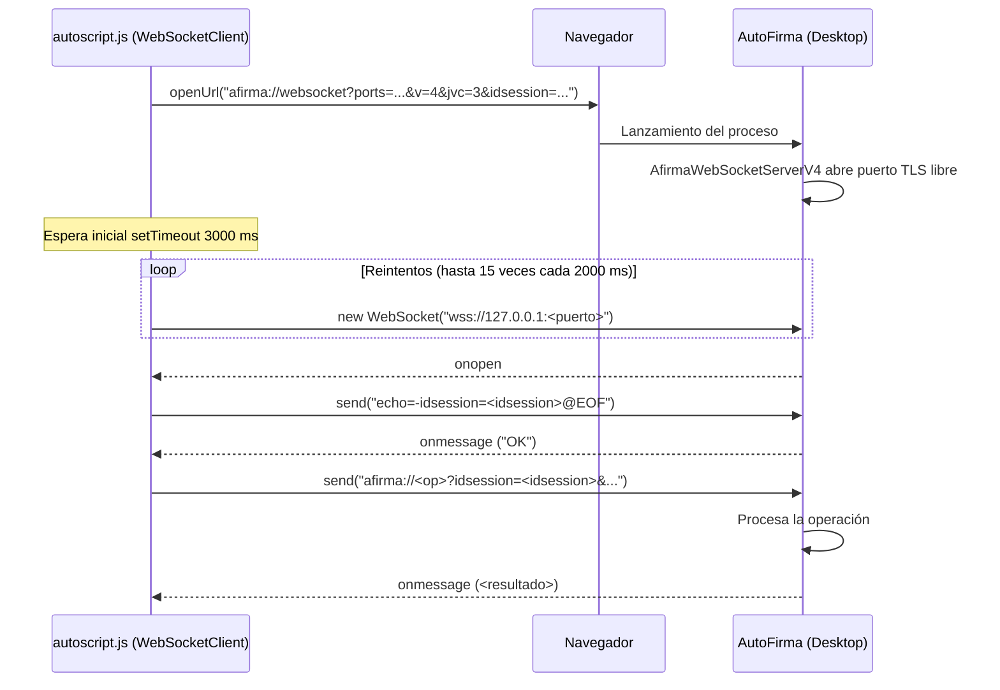

# 16. El cliente JavaScript de referencia

Este capítulo describe en detalle el funcionamiento del cliente JavaScript oficial
de AutoFirma, implementado en el fichero `autoscript.js`
(`afirma-ui-miniapplet-deploy/src/main/webapp/js/autoscript.js:1-5441`), incluido
en el tag `v1.9.2` (commit `b4fe147c3`). Se analiza cómo la biblioteca web
detecta el entorno del usuario, selecciona el transporte adecuado, construye las
peticiones URI `afirma://`, gestiona la sesión criptográfica y los puertos
locales, orquesta la fragmentación y reintentos, parsea las respuestas de la
aplicación de escritorio y traduce los errores a excepciones reconocibles por la
página web integradora.

Todas las citas de código hacen referencia a las líneas exactas de
`afirma-ui-miniapplet-deploy/src/main/webapp/js/autoscript.js` dentro del
repositorio [ctt-gob-es/clienteafirma](https://github.com/ctt-gob-es/clienteafirma).

---

## 1. Arquitectura y ciclo de vida de `autoscript.js`

El fichero `autoscript.js` actúa como fachada y capa de abstracción entre las
aplicaciones web de las sedes electrónicas y la aplicación de escritorio AutoFirma.
Históricamente evolucionó a partir del antiguo `miniapplet.js`, manteniendo
compatibilidad regresiva mediante el alias global `window.MiniApplet = AutoScript`
(`autoscript.js:4977`).

### 1.1 Estructura modular del script

Todo el código de `AutoScript` se encapsula dentro de una función autoejecutable
(IIFE) que expone un único objeto al ámbito global (`24-4970`). Internamente, el
script contiene los siguientes submódulos funcionales:

| Módulo interno | Ámbito / Líneas | Responsabilidad |
|---|---|---|
| `Platform` | `1087-1194` | Detección de navegador y sistema operativo a través del `userAgent` y capacidades de la ventana. |
| `Dialog` / `SupportDialog` | `1199-1589` | Inyección en el DOM de diálogos modales HTML/CSS para avisos de carga, errores de comunicación e instrucciones de instalación. |
| `AfirmaUtils` | `1594-1738` | Generador de identificadores de sesión aleatorios, cálculo de ternas de puertos pseudoaleatorios y validación de identificadores de lote. |
| `AppAfirmaWebSocketClient` | `1745-2606` | Implementación del canal de comunicación bidireccional local mediante WebSocket seguro (`wss://127.0.0.1:<puerto>`). |
| `AppAfirmaJSSocket` | `2608-3700` | Implementación del canal mediante peticiones HTTP/TLS contra el socket local (`https://127.0.0.1:<puerto>/afirma`). |
| `AppAfirmaJSWebService` | `3709-4888` | Implementación del canal asíncrono desacoplado mediante servidor intermedio (`StorageService` y `RetrieveService`). |
| `Base64` | `4981-5196` | Codificador/decodificador Base64 compatible con variantes estándar y URL-Safe, soportando cadenas de texto, `ArrayBuffer` y arrays de bytes. |
| `Cipher` | `5198-5441` | Motor criptográfico en JavaScript puro para el cifrado y descifrado simétrico DES y Triple DES (DESede) en modo CBC. |

### 1.2 Parámetros globales y constantes de despliegue

Al cargarse en memoria, `AutoScript` inicializa las siguientes constantes y variables
de configuración:

* `VERSION = "1.9.0"` (`26`): Versión declarada de la biblioteca JavaScript.
* `VERSION_CODE = 3` (`27`): Código numérico de versión del JavaScript que viaja en el parámetro de protocolo `jvc`.
* `AUTOFIRMA_LAUNCHING_TIME = 2000` (`149`): Tiempo de espera (en milisegundos) entre reintentos sucesivos de conexión con el cliente nativo.
* `AUTOFIRMA_CONNECTION_RETRIES = 15` (`152`): Número máximo de intentos antes de declarar fallida la conexión y mostrar el diálogo de cliente no encontrado.
* `DOMAIN_NAME` (`48-54`): Nombre de host del sitio web invocante (`window.location.hostname`), utilizado por defecto como identificador `appname`.
* `forceWSMode = false` (`156`): Bandera configurable mediante `setForceWSMode(force)` (`329-331`) para forzar el uso del transporte por servidor intermedio.

---

## 2. Detección de entorno y selección de transporte

El punto de entrada para iniciar la comunicación es la función `cargarAppAfirma`
(`883-944`):

```javascript
AutoScript.cargarAppAfirma(clientAddress, keystore);
```

### 2.1 La cascada de decisión de `cargarAppAfirma`

La selección del objeto subyacente que asumirá la variable `clienteFirma` (`34`)
sigue una rigurosa cascada de cuatro niveles evaluada en orden estricto (`901-938`):



1. **Servidor intermedio forzado o plataforma móvil (`901-909`):**
   Si `forceWSMode == true`, o si `Platform.isIOS() == true`, o si `Platform.isAndroid() == true`, se instancia `AppAfirmaJSWebService`. Si se especificaron direcciones de servlets, se configuran mediante `clienteFirma.setServlets(...)` (`904`).
2. **WebSocket local (`914-920`):**
   Si el navegador soporta la API WebSocket (`isWebSocketsSupported()`, `'WebSocket' in window || 'MozWebSocket' in window`, `197-199`), **y** no es Internet Explorer (`!Platform.isInternetExplorer()`, `1113-1117`), **y** no es una versión antigua de Firefox $\le 60$ (`!Platform.isFirefox60orLower()`, `1156-1174`), se instancia `AppAfirmaWebSocketClient`.
3. **Socket HTTP/TLS local (`922-928`):**
   Si no se cumple lo anterior, pero el navegador no es Internet Explorer $\le 10$ (`!Platform.isInternetExplorer10orLower()`, `1120-1122`) y no es Safari versión 10 (`!Platform.isSafari10()`, `1131-1148`), se selecciona `AppAfirmaJSSocket`.
4. **Degradación residual (`930-938`):**
   En cualquier otro caso (navegadores obsoletos o restringidos), se degrada a `AppAfirmaJSWebService`.

Una vez instanciado el cliente, si el integrador no especificó almacén de certificados,
se invoca `getDefaultKeystore()` (`940-942`, `439-444`), que devuelve `KEYSTORE_MOZILLA`
(`"Mozilla"`) si el navegador es Firefox, o `null` para el almacén nativo del sistema
en los demás entornos.

### 2.2 El módulo `Platform`

El objeto `Platform` (`1087-1194`) clasifica la plataforma analizando
`navigator.userAgent`, `navigator.appVersion`, `navigator.platform` y
`navigator.maxTouchPoints`:

* **Android (`1089-1100`):** Comprueba las cadenas `"ANDROID"`, `"SILK/"`, `"KFJWI"`, `"KFJWA"`, `"KFTT"`, `"KFOT"`, `"KINDLE FIRE"`.
* **iOS (`1103-1110`):** Comprueba `"IPAD"`, `"IPOD"`, `"IPHONE"`, y detecta iPadOS $\ge 13$ mediante `navigator.platform === 'MacIntel' && navigator.maxTouchPoints > 1`.
* **Internet Explorer (`1113-1128`):** Distingue versiones antiguas mediante patrones regex `/MSIE/`, `/Trident.*rv[ :]*11\./`, y extrae el entero para versiones $\le 7$ y $\le 10$.
* **Safari 10 y Firefox $\le 60$ (`1131-1174`):** Implementa un analizador que parsea la tupla de navegador y número mayor de versión extraído de `navigator.userAgent`.
* **Chrome (`1177-1180`):** Comprueba `"CHROME/"` o `"CHROMIUM"`.

---

### 2.3 El transporte se elige una vez y no degrada solo

La cascada anterior es el **único** punto de todo `autoscript.js` donde se asigna
`clienteFirma` (`902`, `915`, `923`, `931`). No existe ninguna vía por la que un
transporte local que fracasa ceda el turno a otro: si la aplicación de escritorio no
responde, el cliente agota sus reintentos y aborta, **sin conmutar al servidor
intermedio**.

* **En WebSocket (`2162-2186`):** `waitAppAndProcessRequest` reintenta hasta
  `AUTOFIRMA_CONNECTION_RETRIES` (15) veces cada `AUTOFIRMA_LAUNCHING_TIME` (2000 ms).
  Agotados los intentos, cierra el diálogo de espera, genera una terna de puertos nueva
  y muestra un diálogo modal de error (`Dialog.showErrorDialog(ERROR_CONNECTING_AFIRMA, ...)`,
  `2178`) cuyas dos únicas salidas son **reintentar con el mismo transporte**
  (`execAppIntent(url, successCB, errorCB)`) o **abandonar** invocando el callback de
  error con `es.gob.afirma.standalone.ApplicationNotFoundException` (`2180`).
* **En Socket HTTP/TLS (`3042-3072`):** el comportamiento es idéntico, con un escalón
  intermedio: si ya hubo conexión previa y se lleva sin responder más de la mitad de los
  intentos (`timeoutResetCounter < AUTOFIRMA_CONNECTION_RETRIES/2`, `3047`), se supone que
  el proceso murió y se relanza la aplicación desde cero (`port = ""`, `3048`). Solo cuando
  `timeoutResetCounter == 0` aparece el mismo diálogo de dos salidas (`3062-3068`).

Conmutar a servidor intermedio es, por tanto, una decisión que **solo puede tomar la
página integradora**, y el camino no pasa por recargar la página: basta con invocar
`AutoScript.setForceWSMode(true)` (`329-331`), que se limita a levantar la bandera
global `forceWSMode` (`156`), y volver a llamar a `AutoScript.cargarAppAfirma(...)`, que
reevalúa la cascada y sustituye la instancia de `clienteFirma` por una de
`AppAfirmaJSWebService`. Como la bandera se consulta también en `setServlets` (`624`), la
sede debe declarar antes las direcciones de los servlets para que el nuevo cliente los
reciba (`903-905`).

---

## 3. Identificadores de sesión y selección de puertos

Para los transportes que requieren interacción local (WebSocket y Socket), `autoscript.js`
coordina la apertura de puertos efímeros en la máquina del usuario y garantiza que
las peticiones no interfieran entre pestañas o navegadores concurrentes.

### 3.1 Generación de `idsession` (`1612-1632`)

La función `AfirmaUtils.generateNewIdSession()` genera una cadena pseudoaleatoria de
20 caracteres alfanuméricos:

1. Intenta utilizar la API criptográfica nativa del navegador:
   `window.crypto.getRandomValues(new Uint32Array(20))` (`1616-1618`).
2. Si no está disponible, degrada a un generador congruencial lineal implementado en
   `rnd()` (`1639-1646`), usando como semilla `new Date().getMilliseconds() * 1000 * Math.random()`
   y la recurrencia `seed = (seed * 9301 + 49297) % 233280`.
3. Cada valor entero se mapea mediante módulo contra el diccionario:
   ```javascript
   var VALID_CHARS_TO_ID = "1234567890abcdefghijklmnopqrstuwxyzABCDEFGHIJKLMNOPQRSTUVWXYZ";
   ```
   *(Cita textual `1600`. Nótese la omisión involuntaria de la letra `v` minúscula en el código original).*

### 3.2 Selección de la terna de puertos (`1653-1677`)

AutoFirma no escucha por defecto en un único puerto fijo predecible para evitar
conflictos y riesgos de secuestro de puertos. `AfirmaUtils.getRandomPorts(port1, port2)`
selecciona **3 puertos aleatorios únicos**:

* Rango por defecto: `MIN_PORT = 1024` (`1603`), `DEFAULT_MIN_PORT = 49152` (`1606`) y `MAX_PORT = 65535` (`1609`).
* Salvo que el integrador configure un rango acotado mediante `setPortRange(min, max)` (`771-787`), se generan tres números enteros distintos en el intervalo $[49152, 65535]$.
* Si el rango configurado contiene exactamente 1 o 2 puertos posibles, el array resultante ajusta su longitud al número de puertos disponibles (`1663-1675`).

---

## 4. Invocación de la aplicación de escritorio (`openUrl`)

Una vez construida la URI de arranque, el navegador debe transferirla al sistema
operativo para que este ejecute AutoFirma pasándole la URI como argumento
(`args[0]`). Esto lo realiza la función `openUrl(url)` (`793-837`):

```javascript
function openUrl (url) {
    if (Platform.isChrome() || Platform.isIOS() || (Platform.isAndroid() && Platform.isFirefox())) {
        document.location = url;
    } else {
        if (document.getElementById("iframeAfirma") != null) { ... }
        if (navigator.msLaunchUri) {
            navigator.msLaunchUri(url, null, function() { wrongInstallation = true; });
        } else {
            openUrlWithIframe(url);
        }
    }
}
```

* **Redirección de documento (`document.location = url`, `798-801`):** Se utiliza
  en navegadores basados en Chromium (Chrome, Edge), en iOS y en Firefox sobre
  Android. Se prefiere `document.location` sobre `window.location` por compatibilidad.
* **Modern UI en Windows 8/10 (`navigator.msLaunchUri`, `821-829`):** En Internet
  Explorer para Windows con soporte de comprobación de esquema de aplicación, se
  llama a `navigator.msLaunchUri()`, capturando en su callback de fallo la ausencia
  de la aplicación (`wrongInstallation = true`).
* **Inyección de IFrame invisible (`openUrlWithIframe`, `843-870`):** En el resto
  de navegadores (Firefox en escritorio, Safari macOS), se crea un elemento
  `<iframe id="iframeAfirma" src="..." height="1" width="1" style="display: none;">`
  insertado al final del `document.body` (`869`). Si ya existía una instancia previa
  del iframe en el DOM, se elimina antes de volver a crearlo (`807-815`).

---

## 5. Transporte WebSocket (`AppAfirmaWebSocketClient`)

El transporte WebSocket (`1745-2606`) proporciona un canal full-duplex de baja
latencia y persistente entre la página y AutoFirma.

### 5.1 Parámetros de arranque y apretón de manos

El cliente WebSocket declara internamente `PROTOCOL_VERSION = 4` (`1747`) y
construye la URI de arranque en `openNativeApp(ports)` (`2138-2158`):

```
afirma://websocket?ports=<p1,p2,p3>&v=4&jvc=3&idsession=<idsession>
```



### 5.2 Ciclo de conexión y temporizadores

1. Tras invocar `openUrl`, `execAppIntent` agenda una llamada retrasada mediante
   `setTimeout(waitAppAndProcessRequest, 3000, ...)` (`2115`). Espera 3 segundos
   iniciales para que el sistema operativo arranque la JVM y levante el servidor.
2. En `waitAppAndProcessRequest` (`2162-2192`), si no se ha conectado, itera sobre
   los puertos intentando instanciar `new WebSocket("wss://127.0.0.1:" + port)`
   (`2201`).
3. Si la conexión falla, se reprograma recursivamente cada `AUTOFIRMA_LAUNCHING_TIME`
   (2000 ms) hasta un máximo de `AUTOFIRMA_CONNECTION_RETRIES` (15 intentos, `2165-2171`).
4. Si se agotan los reintentos sin éxito, se cierra el diálogo de carga y se muestra
   el diálogo de error `ERROR_CONNECTING_AFIRMA`, invocando el callback de error
   con `es.gob.afirma.standalone.ApplicationNotFoundException` (`2177-2184`).

### 5.3 El apretón de manos de eco (`sendEcho`)

Una vez que el socket emite el evento `onopen` (`2208-2214`), se fija `connected = true`
y `ws = this`. En `processRequest` (`2242-2256`) se valida el canal enviando una trama de eco:

```
echo=-idsession=<idsession>@EOF
```

(`2286`). Si el socket aún no está listo (`ws.readyState !== 1`), o ante una
excepción de envío, se reintenta cada 2000 ms (`2291`, `2296`).

Al recibir la respuesta de eco, `onMessageEchoFunction` (`2259-2268`) reconfigura
inmediatamente `ws.onmessage` para apuntar a `processResponse` y envía la URI
completa de la operación solicitada:

```javascript
ws.send(currentOperationUrl);
```

(`2267`).

### 5.4 Construcción de URIs de operación en WebSocket

Las peticiones son construidas por `buildUrl(paramsObject)` (`2065-2091`). A
diferencia de los otros transportes, `AppAfirmaWebSocketClient` normaliza los datos
binarios a Base64 URL-Safe antes del empaquetado:

* `data.dat`: Se procesa con `normalizeBase64Data(dataB64)` (`1856`, `1936-1938`),
  reemplazando `+` por `-` y `/` por `_`.
* `data.properties` y `data.ksb64`: Se codifican mediante `Base64.encode(valor, true)`
  (`1945-1946`, `1962-1963`), produciendo cadenas URL-Safe que se marcan con
  `avoidEncoding = true` en `createKeyValuePair` (`2552-2562`) para evitar que
  `encodeURIComponent` altere los caracteres ya seguros.
* La URI resultante adopta la forma:
  `afirma://<op>?idsession=<idsession>&algorithm=...&format=...&dat=...` (`2081-2090`).

### 5.5 Deserialización de respuestas en WebSocket (`processResponse`)

Todas las respuestas que llegan por el socket son interceptadas por `processResponse(data)`
(`2304-2359`):

1. **Cancelación:** Si `data == "CANCEL"`, o `null`, o `undefined`, se emite
   `es.gob.afirma.core.AOCancelledOperationException` con el mensaje
   `"Operacion cancelada por el usuario"` (`2306-2309`).
2. **Error de memoria:** Si `data == "MEMORY_ERROR"`, se emite
   `es.gob.afirma.core.OutOfMemoryError` (`2312-2315`).
3. **Código de error `SAF_`:** Si `data.substr(0, 4) == "SAF_"`, se emite
   `java.lang.Exception` pasando la cadena `data` íntegra (`2318-2321`).
4. **Error no tipificado:** Si `data == "NULL"`, se emite
   `java.lang.Exception` con `"Error desconocido"` (`2324-2327`).
5. **Operaciones específicas:**
   * **`sign` / `cosign` / `countersign` (`processSignResponse`, `2512-2549`):**
     La respuesta de firma puede contener hasta tres fragmentos separados por el
     carácter tubería (`|`):
     $$\text{certificado}\mid\text{firma}\mid\text{extraInfo}$$
     o bien sólo la firma si no se separó certificado (`2526-2538`). Los datos
     se normalizan restituyendo `-` por `+` y `_` por `/`.
   * **`batch` (`processBatchResponse`, `2476-2507`):**
     La respuesta separa $\text{resultado}\mid\text{certificado}$ mediante `|`. El
     resultado se parsea automáticamente desde JSON si procede (`AfirmaUtils.parseJSONData`,
     `2490`). Se invoca `successCallback(result, certificate)`.
   * **`selectcert` (`processSelectCertificateResponse`, `2462-2471`):**
     Devuelve el certificado en Base64 con sustitución de caracteres URL-Safe.
   * **`load` / `multiload` (`processLoadResponse`, `2377-2434`):**
     La respuesta concatena pares con formato `nombreFichero:contenidoBase64`,
     separados entre sí por `|`. Se devuelven los arrays `filenames` y `datasB64`.
   * **`save` (`processResponseWithoutReturn`, `2439-2456`):**
     Valida que la respuesta sea `"OK"` o `"SAVE_OK"` e invoca `successCallback(data)`.

---

## 6. Transporte Socket Local HTTP/TLS (`AppAfirmaJSSocket`)

El transporte por socket local (`2608-3700`) se apoya en un servidor HTTP sobre
TLS levantado por AutoFirma en el bucle local (`https://127.0.0.1:<puerto>/afirma`).
Declara `PROTOCOL_VERSION = 1` (`2621`).

### 6.1 Secuencia de arranque y descubrimiento de puerto

1. En la primera ejecución (`port == ""`), `execAppIntent(url)` (`2887-2912`) calcula
   la terna de puertos con `AfirmaUtils.getRandomPorts(minPort, maxPort)` y lanza
   la URI mediante `openNativeApp(ports)` (`2915-2936`):
   ```
   afirma://service?ports=<p1,p2,p3>&v=1&jvc=3&idsession=<idsession>
   ```
2. Tras esperar `AUTOFIRMA_LAUNCHING_TIME` (2000 ms), invoca
   `executeEchoByServiceByPort(ports, url)` (`2999-3006`).
3. Para cada puerto de la terna, lanza de forma asíncrona peticiones HTTP POST de eco
   (`executeEchoByService`, `3014-3084`), compartiendo un semáforo
   `semaphore.locked` (`3001-3002`) para evitar condiciones de carrera:
   ```http
   POST https://127.0.0.1:<puerto>/afirma HTTP/1.1
   Content-Type: application/x-www-form-urlencoded

   echo=-idsession=<idsession>@EOF
   ```
4. El primer puerto que responde HTTP 200 con cuerpo Base64 decodificable como `"OK"`
   bloquea el semáforo (`semaphore.locked = true`), fija la variable de sesión
   `port = currentPort`, y dispara la ejecución de la operación solicitada
   (`executeOperationByService()`, `3027-3041`).
5. Si un puerto no responde, se decrementa el contador `timeoutResetCounter`. Si el
   puerto ya era conocido de una operación previa pero falla durante la mitad de los
   reintentos (`timeoutResetCounter < AUTOFIRMA_CONNECTION_RETRIES / 2`, `3047`), se
   asume que el proceso murió y se reinicia desde cero (`port = ""` y relanzamiento).

### 6.2 Fragmentación del comando de entrada (`executeOperationByService`)

Los navegadores y pilas HTTP locales imponen límites al tamaño de las peticiones
GET/POST procesadas en búferes locales. `AppAfirmaJSSocket` calcula `URL_MAX_SIZE`
dinámicamente (`2650`):

$$URL\_MAX\_SIZE = \begin{cases}
12\,000 \text{ bytes} & \text{si es Internet Explorer} \\
458\,752 \text{ bytes} & \text{si es Firefox } (\ge 49) \\
1\,048\,576 \text{ bytes (1 MB)} & \text{en los demás navegadores}
\end{cases}$$

* **Envío monolítico (`3107-3162`):** Si `url.length <= URL_MAX_SIZE`, se envía una
  única petición:
  ```
  cmd=<Base64URLSafe(url)>idsession=<idsession>@EOF
  ```
  *(Cita `3161`. Nótese que no hay ampersand `&` entre el Base64 y `idsession`).*
* **Envío fragmentado (`executeOperationRecursive`, `3168-3226`):** Si excede el
  límite, se divide la cadena `url` en fragmentos de tamaño `URL_MAX_SIZE`:
  ```
  fragment=@<i>@<iFinal>@<Base64URLSafe(trozo)>idsession=<idsession>@EOF
  ```
  Cada fragmento espera la respuesta del servidor:
  * Si responde `"MORE_DATA_NEED"`, se despacha el siguiente fragmento (`3184-3189`).
  * Al llegar al fragmento final (`i == iFinal`), el servidor responde `"OK"`.
  * A continuación, el cliente dispara la orden de ejecución invocando `doFirm()`
    (`3196`, `3231-3281`), que envía:
    ```
    firm=idsession=<idsession>@EOF
    ```

### 6.3 Recepción de la respuesta fragmentada (`addFragmentRequest`)

La respuesta generada por AutoFirma no se devuelve completa en la respuesta a `cmd=`
o `firm=`, sino que devuelve un número entero que indica en cuántas partes se ha
dividido el resultado (`15-errores.md`, capítulo 04).

El cliente JS ejecuta un bucle de peticiones mediante `addFragmentRequest(part, totalParts)`
(`3286-3350`):

```http
POST https://127.0.0.1:<puerto>/afirma HTTP/1.1
Content-Type: application/x-www-form-urlencoded

send=@<part>@<totalParts>idsession=<idsession>@EOF
```

Cada parte recibida se decodifica de Base64 URL-Safe y se concatena en
`totalResponseRequest` (`3297`). Al alcanzar `part == totalParts`, se cierra el
diálogo modal de soporte (`Dialog.disposeSupportDialog()`, `3302`) y se despacha
la cadena agregada al método de éxito correspondiente:
* `successBatchResponseFunction(totalResponseRequest)` para lotes (`3306`).
* `successSelectCertServiceResponseFunction(totalResponseRequest)` para selección de certificados (`3311`).
* `successServiceResponseFunction(totalResponseRequest)` para firma, guardado y carga (`3316`).

---

## 7. Transporte por Servidor Intermedio (`AppAfirmaJSWebService`)

Cuando el cliente no puede comunicarse localmente con la máquina (entornos móviles
Android e iOS, o navegadores donde se fuerza `setForceWSMode(true)`), se utiliza el
transporte por servidor intermedio (`3709-4888`). Este transporte es asíncrono y se
apoya en los servlets `StorageService` (`stservlet`) y `RetrieveService` (`rtservlet`).
Declara `PROTOCOL_VERSION = 3` (`3715`).

### 7.1 Configuración de servlets y resolución de rutas

Las direcciones de los servlets se resuelven a partir de `clientAddress` (`3745-3757`):

* Si no se proporciona dirección, toma el origen de la ventana:
  `window.location.origin + "/afirma-signature-storage/StorageService"` y
  `window.location.origin + "/afirma-signature-retriever/RetrieveService"`.
* Antes de operar, `checkComunicationServices` (`641-763`) realiza peticiones `GET`
  con `?op=check` contra ambos servlets para verificar que están en línea y
  accesibles. Si fallan en un dispositivo móvil, muestra el diálogo
  `ERROR_NO_COMPATIBLE_PROCEDURE` (`670`, `684`).

### 7.2 Generación de la clave de cifrado simétrico (`generateCipherKey`)

Dado que los datos de firma transitan a través de un servidor intermedio accesible
por red, el cliente cifra los datos mediante una clave simétrica aleatoria
(`generateCipherKey`, `4220-4232`):

```javascript
function generateCipherKey() {
    var random;
    if (typeof window.crypto != "undefined" && typeof window.crypto.getRandomValues != "undefined") {
        var randomInts = new Uint32Array(1);
        window.crypto.getRandomValues(randomInts);
        random = zeroFill(randomInts[0] % 100000000, 8);
    } else {
        random = zeroFill(Math.floor((AfirmaUtils.getRandom() + 1) % 100000000), 8);
    }
    return random;
}
```

La clave generada es una cadena numérica de **exactamente 8 dígitos** (rellenada con
ceros a la izquierda mediante `zeroFill`, `4235-4242`). Esta clave de 8 caracteres ASCII
(64 bits) actúa como clave para el algoritmo DES / Triple DES.

### 7.3 Mecanismo de cifrado y descifrado (`Cipher.des`)

El cifrado se realiza con `cipher(dataB64, key)` (`4848-4856`) y el descifrado con
`decipher(cipheredData, key, intermediate)` (`4833-4840`):

* **Algoritmo:** DES en modo CBC sin padding nativo (`Cipher.des(key, data, encrypt, 1, null, 0)`).
* **Relleno manual:** Se calcula el padding necesario para que la longitud sea múltiplo
  de 8 bytes: `var padding = (8 - (data.length % 8)) % 8;` (`4851`).
* **Formato de la trama cifrada:** Se prefija el número de bytes de padding y un punto:
  $$\text{padding} + \text{"."} + \text{Base64URLSafe}(\text{datosCifrados})$$
* **Descifrado:** `decipher` localiza el primer punto (`.`), extrae el número de padding,
  aplica `Cipher.des` en modo descifrado y recorta los bytes de relleno al final
  (`4835-4839`).

### 7.4 Subida previa de datos (`sendDataAndExecAppIntent`)

Las URLs del protocolo `afirma://` no pueden superar la longitud máxima admisible
por el navegador (`MAX_LONG_GENERAL_URL = 2000` caracteres, `3712`, `4215-4217`).
Si la URI construida sobrepasa ese umbral (`isURLTooLong(url)`):

1. Se genera un identificador de fichero único: `fileId = AfirmaUtils.generateNewIdSession()` (`4262`).
2. Se empaquetan todos los parámetros en un documento XML estructurado (`buildXML`, `4392-4401`):
   ```xml
   <op>
     <e k="clave1" v="valor1"/>
     <e k="clave2" v="valor2"/>
   </op>
   ```
3. El XML se codifica en Base64, se cifra con la clave simétrica y se sube mediante
   un POST síncrono al servlet de almacenamiento (`4313-4319`):
   ```http
   POST <storageServletAddress> HTTP/1.1
   Content-Type: application/x-www-form-urlencoded

   op=put&v=1_0&id=<fileId>&dat=<datosCifradosConPadding>
   ```
4. Se reconstruye una URI corta sin los datos voluminosos (`buildUrlWithoutData`, `4413-4424`),
   conteniendo únicamente:
   ```
   afirma://<op>?jvc=3&fileid=<fileId>&rtservlet=<retrieverServletAddress>&key=<cipherKey>
   ```
5. Se invoca a la aplicación nativa con esta URI reducida.

### 7.5 Bucle de sondeo (`retrieveRequest`) y espera activa

Tras lanzar AutoFirma con `openUrl`, el cliente JavaScript inicia un bucle de
sondeo periódico contra el servlet de recuperación (`getStoredFileFromServlet`,
`4716-4725`):

```http
POST <retrieverServletAddress> HTTP/1.1
Content-Type: application/x-www-form-urlencoded

op=get&v=1_0&id=<idSession>&it=<iterations>
```

* **Intervalo entre ciclos (`WAITING_CYCLE_MILLIS`, `3718`):** 4000 ms en Android e
  iOS; 3000 ms en sistemas de escritorio.
* **Límite de iteraciones (`NUM_MAX_ITERATIONS`, `3722`):** 15 ciclos en móviles; 10
  ciclos en escritorio.
* **Control de espera activa (`#WAIT`, `4452-4454`, `4777-4781`):**
  Cuando AutoFirma arranca con `aw=true` (`3795`), la aplicación lanza un hilo de
  fondo (`ActiveWaitingThread`) que publica periódicamente `#WAIT` en el servlet de
  almacenamiento. Cuando `autoscript.js` recupera `#WAIT`:
  * Reinicia el contador de iteraciones a cero (`iterations = 0`).
  * Marca `afirmaConnected = true`.
  * Reprograma el siguiente ciclo de sondeo, concediendo a AutoFirma tiempo ilimitado
    mientras el usuario interactúe con los diálogos locales.
* **Identificador no preparado (`ERR-06`, `4442-4444`):** Si el servlet responde con
  el código `ERR-06` (el fichero aún no ha sido depositado), la función retorna
  `true` y el bucle de sondeo continúa.

---

## 8. Catálogo y traducción de errores en `autoscript.js`

El cliente JavaScript estandariza las múltiples formas de error que devuelven los
tres transportes y las traduce a excepciones con nombres canónicos de la API Java:

| Respuesta en bruto | Transporte | Excepción devuelta al callback (`errorCB(type, msg)`) | Mensaje descriptivo |
|---|---|---|---|
| `CANCEL`, `CANCEL\r\n`, `CANCEL\n` | Todos | `es.gob.afirma.core.AOCancelledOperationException` | `"Operacion cancelada por el usuario"` (`2307`, `3361`, `3389`, `4473`) |
| `ERR-11:=<msg>` | WebService | `es.gob.afirma.core.AOCancelledOperationException` | Mensaje devuelto por el servidor (`4460`) |
| `MEMORY_ERROR` | Todos | `es.gob.afirma.core.OutOfMemoryError` | `"El fichero que se pretende firmar o guardar excede de la memoria disponible para aplicacion"` (`2313`, `3406`) |
| `SAF_nn: <desc>` | Todos | `java.lang.Exception` | Cadena completa del error `SAF_nn` emitida por AutoFirma (`2319`, `3367`, `3412`, `4489`) |
| `NULL` | Todos | `java.lang.Exception` | `"Error desconocido"` (`2325`, `3373`, `3418`) |
| Reintentos agotados al conectar | WebSocket / Socket | `es.gob.afirma.standalone.ApplicationNotFoundException` | Mensaje localizado de AutoFirma no instalada (`2183`, `3065`) |
| Timeout en sondeo de servlets | WebService | `java.util.concurrent.TimeoutException` | `"El tiempo para la recepcion de la firma por la pagina web ha expirado."` (`4746`) |
| Interrupción de socket | WebSocket | `java.lang.InterruptedException` | `"Autofirma se ha cerrado o ha cerrado el websocket de comunicacion"` (`2221`) |
| Carga de ficheros en servidor intermedio | WebService | `java.lang.UnsupportedOperationException` | `"La operacion de carga de fichero no esta disponible por servidor intermedio"` (`4150`) |

---

## 9. Funcionalidades adicionales del cliente JavaScript

### 9.1 Certificado pegajoso (`stickySignatory`)

AutoScript permite recordar el certificado seleccionado para que el usuario no tenga
que volver a elegirlo en firmas subsiguientes dentro del mismo trámite:

* Se activa con `AutoScript.setStickySignatory(true)` (`595-597`).
* Se desactiva explícitamente con `setKeyStore` (`451`) o tras cada operación pública,
  que restablece `resetStickySignatory = false` (`462`, `467`, `475`).
* **En WebSocket y Socket (`1964`, `2951`):** Viaja como parámetro de protocolo
  `sticky=true` (y opcionalmente `resetsticky=true`), siendo gestionado en memoria
  por la instancia viva de AutoFirma (`ProtocolInvocationLauncher.stickyKeyEntry`).
* **En Servidor Intermedio (`4644-4656`):** Como AutoFirma muere tras cada firma en este
  transporte, el cliente JS emula el comportamiento en escritorio: intercepta el
  certificado devuelto en la primera firma (`stickyCertificate = certificate`, `4612`),
  y en las siguientes invocaciones reescribe los `extraParams` inyectando dinámicamente:
  ```properties
  filters=encodedcert:<certificadoBase64>
  headless=true
  ```
  (`4675-4676`).

### 9.2 Comprobación de sincronización horaria (`checkTime`)

La función `checkTime(checkType, maxMillis, checkURL)` (`377-435`) previene errores
en firmas con sello de tiempo causados por un desfase en el reloj del cliente:

1. Realiza una petición `GET` síncrona contra `checkURL` (o contra una URL ficticia
   de la sede, `395`).
2. Lee la cabecera HTTP `Date` devuelta por el servidor web (`406`) y calcula la
   diferencia absoluta contra `new Date()` local (`416`).
3. Si el desfase supera `maxMillis` (por defecto 300 000 ms / 5 minutos, `385`):
   * Si `checkType == CHECKTIME_RECOMMENDED`, muestra un aviso modal de advertencia (`419`).
   * Si `checkType == CHECKTIME_OBLIGATORY`, marca `severeTimeDelay = true` y muestra un
     error bloqueante (`424`). En las siguientes llamadas, `cargarAppAfirma` aborta
     de inmediato (`891-897`).

---

### 9.3 La cofirma desde la API pública: el parámetro `dataB64` que nunca viaja

La fachada global exporta **dos puntos de entrada distintos para la misma operación**
`cosign` (`4929-4930`), que se diferencian en la aridad:

| Función exportada | Firma | Definición |
|---|---|---|
| `coSign` | `(signB64, dataB64, algorithm, format, params, successCallback, errorCallback)` | `470-476` |
| `cosign` | `(signB64, algorithm, format, params, successCallback, errorCallback)` | `478-481` |

`coSign` conserva la firma histórica del antiguo `MiniApplet`, con un segundo argumento
`dataB64` para aportar los datos originales. Ese argumento **se recibe y se descarta**: la
llamada al transporte subyacente lo omite y traslada únicamente `signB64`
(`clienteFirma.coSign(signB64, algorithm, format, params, ...)`, `474`). El propio código
lo advierte en un comentario (`471-473`):

> *El cliente de firma no soporta la cofirma en la que se proporcionan los datos. Esto
> impide que se pueda cofirmar una firma CAdES explicita con un algoritmo de firma
> distinto al de la firma original.*

No se trata de un olvido del JavaScript, sino del reflejo fiel de una **limitación del
protocolo**: la URI `afirma://` dispone de un único parámetro `dat`, que en `cosign`
transporta la firma previa, y el lanzador invoca la sobrecarga de una sola ranura
`signer.cosign(data, algorithm, ...)` (`ProtocolInvocationLauncherSign.java:710-717`). Los
tres transportes son coherentes con ello y aceptan un solo binario en su `coSign` interno
(`1834-1836` en WebSocket, `2735-2739` en socket, `3829-3831` en servidor intermedio). El
mecanismo de recuperación de la huella y el error `SAF_44` que resulta cuando falla se
detallan en el capítulo [06](06-operaciones-firma.md#61-despacho-de-la-operación-criptográfica).

Para la sede integradora la consecuencia práctica es doble: `coSign` y `cosign` son
equivalentes salvo por la posición de los argumentos, y pasar datos a `coSign` no produce
error alguno —ni excepción, ni aviso— sino que simplemente no surte efecto.

---

## 10. Resumen comparativo de transportes en `autoscript.js`

| Característica | `AppAfirmaWebSocketClient` | `AppAfirmaJSSocket` | `AppAfirmaJSWebService` |
|---|---|---|---|
| **Versión de protocolo (`v` / `ver`)** | `4` (`1747`) | `1` (`2621`) | `3` (`3715`) |
| **Punto de escucha / endpoint** | `wss://127.0.0.1:<puerto>` | `https://127.0.0.1:<puerto>/afirma` | Servlets HTTP remotos |
| **Formato del comando de arranque** | `afirma://websocket?ports=...&v=4` | `afirma://service?ports=...&v=1` | `afirma://<op>?fileid=...&rtservlet=...` |
| **Codificación de parámetros en tránsito** | Base64 URL-Safe directo | Base64 URL-Safe en `cmd=` / `fragment=` | XML cifrado con 3DES/CBC o parámetros URI |
| **Persistencia del proceso nativo** | Vivo mientras el socket esté abierto | Vivo hasta inactividad (90 s) | Muere tras cada operación |
| **Operaciones de carga (`load`/`multiload`)** | Soportadas (`2377`) | Soportadas (`3436`) | No soportadas (`4148`) |
| **Manejo de reintentos de conexión** | 15 intentos cada 2 s (`2165`) | 15 intentos cada 2 s (`3043`) | 10 a 15 ciclos de sondeo cada 3 a 4 s (`3718`) |
| **Degradación a otro transporte si falla** | Ninguna: diálogo de reintento o `ApplicationNotFoundException` (`2178-2183`) | Ninguna: diálogo de reintento o `ApplicationNotFoundException` (`3062-3068`) | No procede (es el transporte de último recurso) |

---
