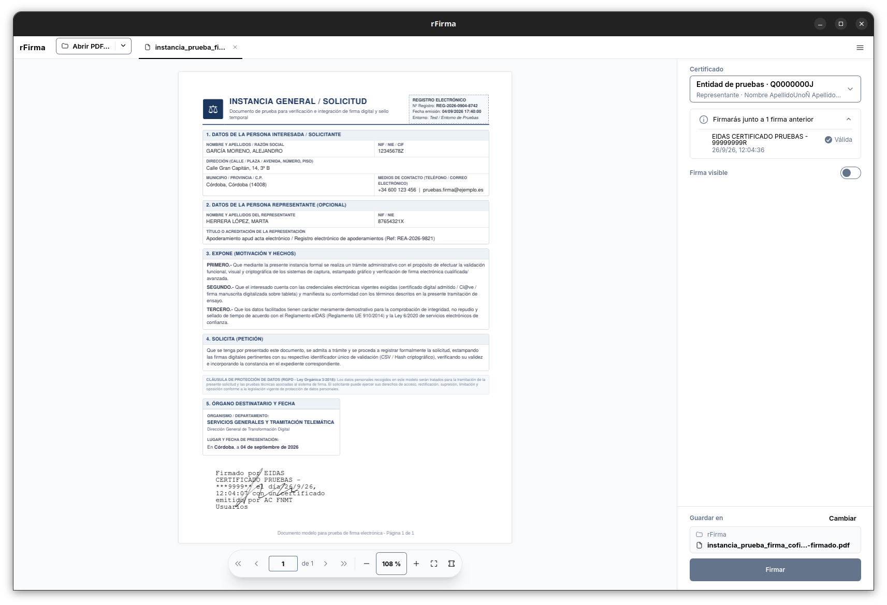
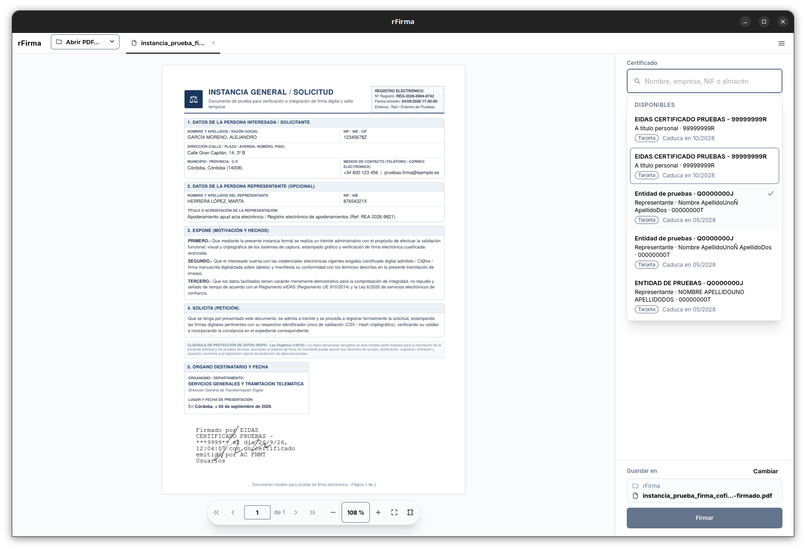
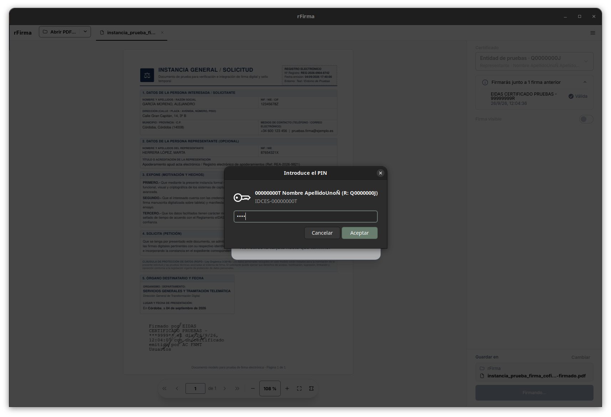
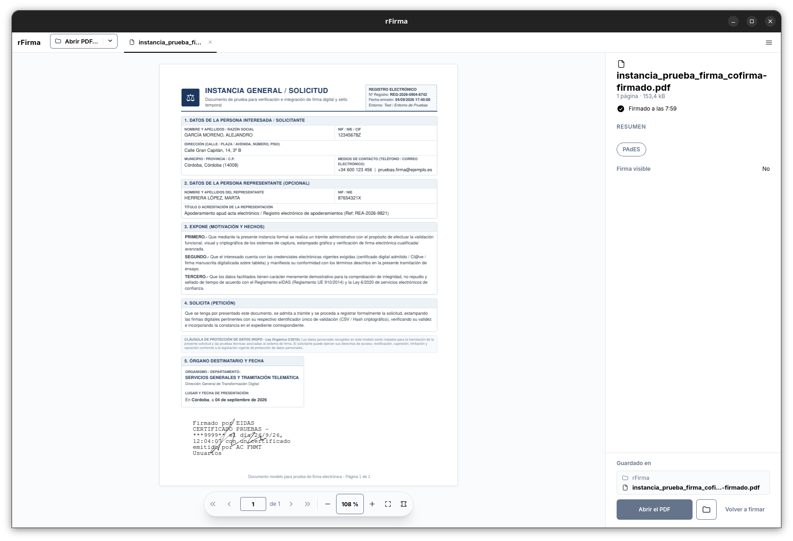

En rFirma, un PDF se firma en una sola ventana: abres el documento, eliges el
certificado y pulsas **Firmar**. El resultado es un PAdES, el formato de firma de los
PDF.

## 1. Abrir el documento

- Pulsa **Abrir PDF…** (o `Ctrl+O`) y elige el fichero. El selector se abre en la
  última carpeta que usaste.
- O arrastra el PDF sobre la ventana.
- Si has firmado antes, la flecha del botón y la ventana vacía enseñan los
  documentos recientes.

Cada documento abierto tiene su pestaña. A la derecha del visor, el panel de firma
recoge las decisiones previas a la firma.

Si el PDF ya trae firmas, el panel lo dice en una línea: cuántas hay y si alguna tiene
un problema. Firmar junto a ellas es lo normal; la tuya se añade a las anteriores.
Pulsa **Ver firmas →** para el detalle, que explica [Ver las
firmas](/manual/ver-las-firmas/).

## 2. Elegir el certificado

El selector es el primer bloque del panel. Reúne los certificados de todos los
almacenes que rFirma encuentra: los del sistema, los perfiles de los navegadores, los
módulos PKCS#11 de tus tokens y los ficheros `.p12` que hayas instalado en rFirma.
El mismo certificado en varios almacenes sale como una sola fila.

- Cada fila dice el titular (o la entidad, si es un certificado de representante), el
  NIF, el almacén y cuándo caduca.
- El buscador filtra por nombre, empresa, NIF o almacén.
- Un certificado caducado o aún no vigente aparece en la lista, con el motivo, pero no
  se puede elegir. rFirma todavía no comprueba si un certificado está revocado.
- Si no hay ninguno, el pie del panel ofrece **Añadir un certificado…**, para instalar
  un `.p12` (también se hace desde [Preferencias](/manual/preferencias/)).

rFirma recuerda el último certificado con el que firmaste y lo propone la vez siguiente
(puedes apagarlo en [Preferencias](/manual/preferencias/)).

## 3. La firma visible

Por omisión, la firma no se ve en el documento: es solo la firma electrónica. Si la
quieres dibujada en una página, enciende **Firma visible**. Hace falta haber elegido
antes un certificado.

Al encenderla aparece un recuadro en el visor, abajo a la derecha de la página que
estás mirando. Lo puedes arrastrar o dibujar de nuevo con el ratón. En el panel eliges:

- **En qué páginas**: **Una página**, **Varias** (escribe el rango como al imprimir:
  `1,6` o `1,60-70,184`) o **Todas**. Si el recuadro no cabe en alguna de las páginas
  elegidas, rFirma avisa antes de firmar de que esas se quedarán sin él.
- **El modelo**:
  - **Completa**: la frase habitual de AutoFirma, con firmante, fecha y emisor.
  - **Solo rúbrica**: la imagen ocupa todo el recuadro.
  - **Personalizada**: escribes tu frase y le añades datos (**Firmante**, **Emisor**,
    **Fecha**) con el botón **Dato**.
- **La rúbrica**: tu firma manuscrita como imagen. Se carga con **Cargar…** (PNG o
  JPEG), y con **Con rúbrica** la llevan las tarjetas de modelo y el recuadro. Con **Solo
  rúbrica** es obligatoria.

El DNI de la frase se oculta en parte, como hace AutoFirma. El visor enseña la firma
tal como quedará.

## 4. El PIN del token

Si tu certificado está en un token PKCS#11, rFirma pide su **PIN**; si está en un
fichero `.p12`, pide su **contraseña**. Lo pide una ventana del sistema, no la de la
aplicación: el secreto nunca pasa por la interfaz web de rFirma, y la clave privada
no sale del almacén.

- Con un token, el PIN se pide al buscar los certificados, antes de que haya lista.
- Con un `.p12`, la contraseña se pide al pulsar **Firmar**.
- Si el almacén no necesita sesión, no se pide nada.
- Si te equivocas, el campo se marca como erróneo y la ventana vuelve a pedirlo.
  rFirma no cuenta los intentos que quedan: no los conoce.

rFirma no admite todavía las tarjetas criptográficas, entre ellas el DNIe: hoy se firma
con los certificados de los almacenes del sistema, los de los navegadores, los de un
módulo PKCS#11 que ya tengas configurado y los `.p12`.

## 5. Firmar y encontrar el documento

Pulsa **Firmar**. Si alguna firma del documento está caducada o no es válida, o si el
documento se ha modificado tras firmarse, rFirma pregunta **¿Firmar de todos modos?**
antes de seguir. Cancelar te devuelve al panel sin tocar nada.

El documento firmado **no sustituye al original**. Se guarda con el sufijo `-firmado`
(y un número si ya existía), y el panel te dice dónde antes de firmar, en **Guardar en**:

- Por omisión, **junto al original**.
- Si lo prefieres, **en una carpeta fija**; se elige en [Preferencias](/manual/preferencias/).
- Con **Cambiar** eliges otra carpeta u otro nombre solo para esta firma.
- Bajo flatpak, o si el PDF llegó por el portal del sistema, cae en la carpeta elegida.

rFirma nunca borra ni sobrescribe nada tuyo. Al terminar, el panel enseña la hora, los
hallazgos y el resumen con todas las firmas del documento, y la tuya como **Nueva**.
**Abrir el PDF** y **Abrir la carpeta** llevan directamente al resultado.

Si algo falla, el error ocupa el panel, el documento original queda intacto y el pie
ofrece reintentar.
